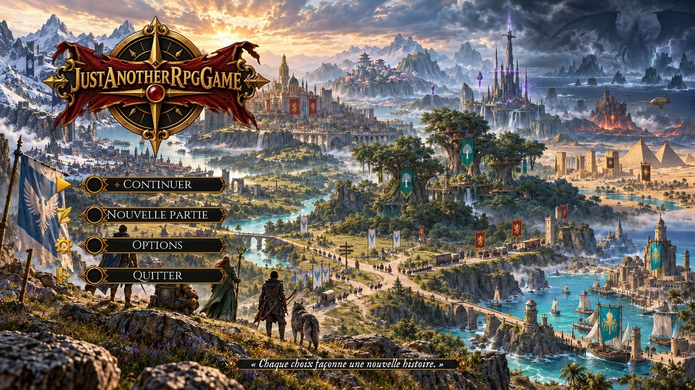
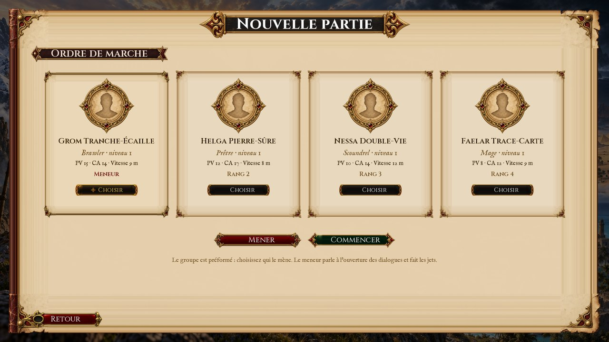
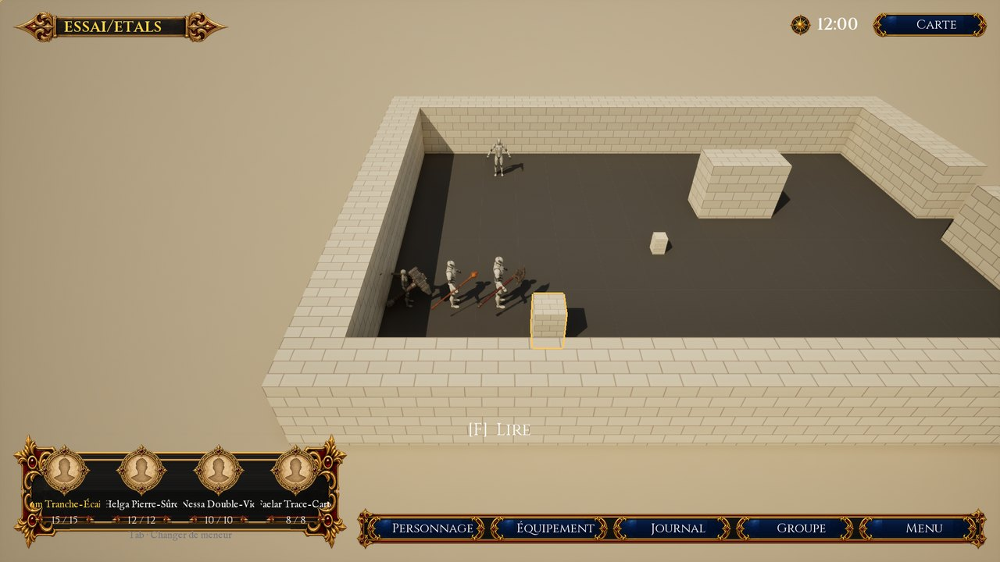
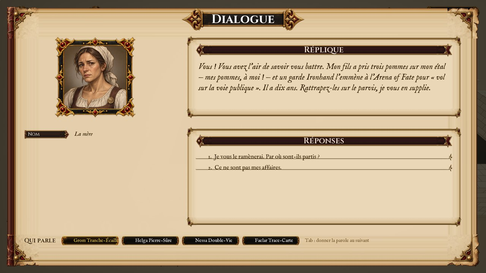
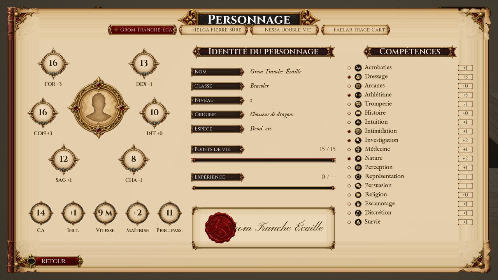
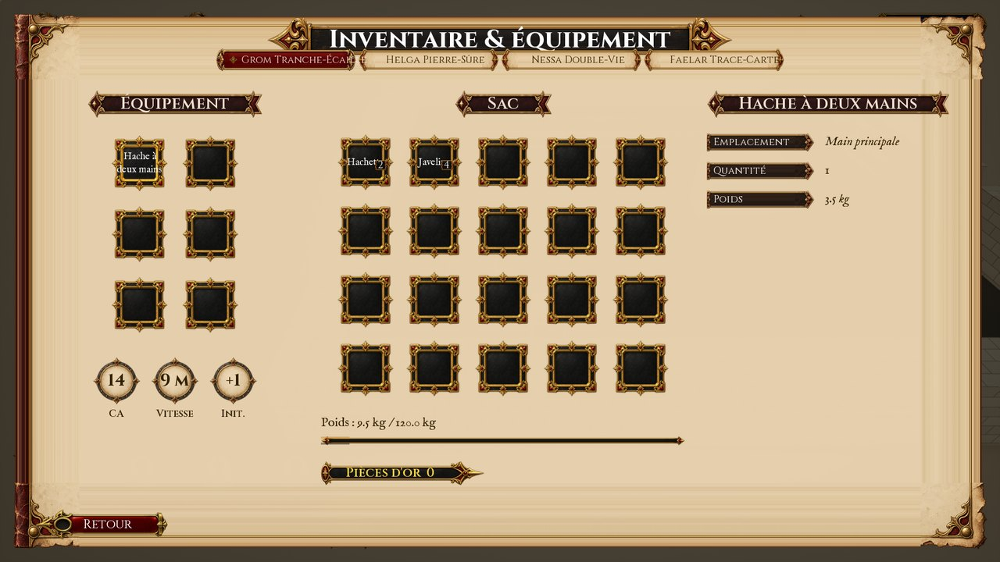
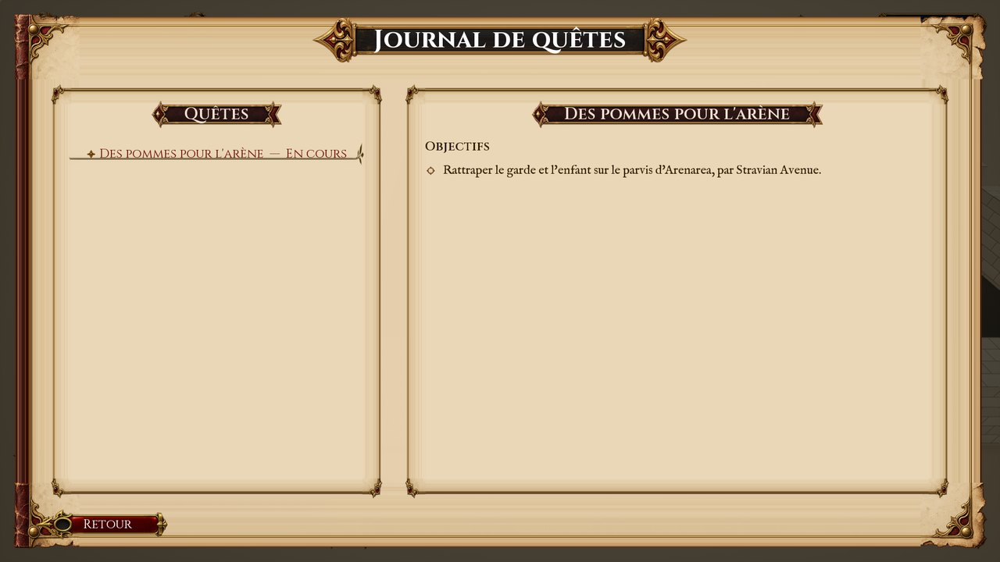
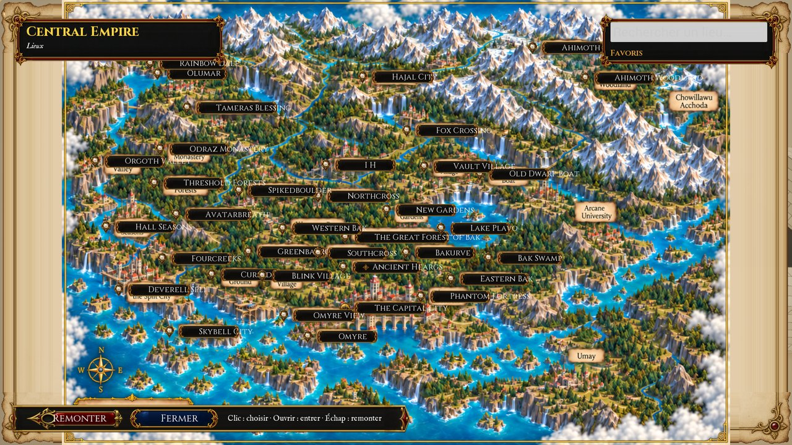
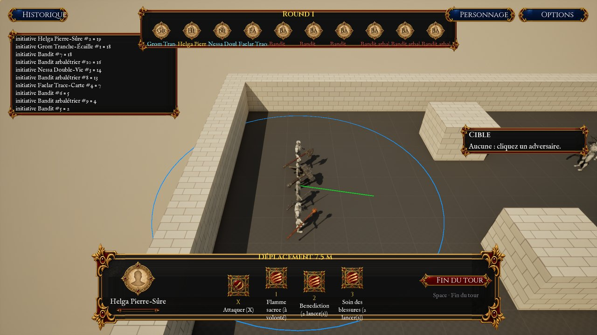
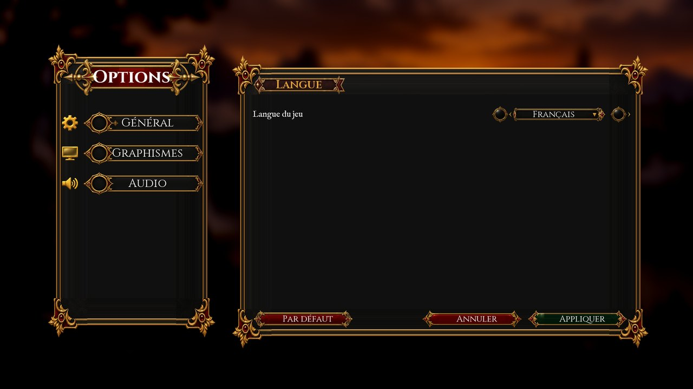

# Manuel du joueur

*Just Another RPG Game*, version 0.0.3 — la démonstration de l'Arena of Fate. Ce manuel dit
comment jouer ; les règles elles-mêmes sont dans le [guide des règles](../guide-regles.md). Ses
captures sont celles du tour des écrans (`scripts/build.ps1 -Unreal -Ecrans`, LOT-1020), prises
sur les cartes d'essai : elles se régénèrent avec le jeu.

## Commencer

Le jeu s'ouvre sur le **menu du titre**. *Nouvelle partie* ouvre le **groupe** : la compagnie est
préformée — un bagarreur, une prêtresse, une roublarde, un mage (D-28) — et vous choisissez qui la
**mène** (D-37). Le meneur parle le premier à l'ouverture d'un dialogue et fait les jets.

## Explorer

- **Marcher** : un clic gauche au sol mène le groupe ; sur un personnage, le meneur va lui parler.
- **Interagir** : `F` sollicite ce que le meneur a à portée ; l'invite au bas de l'écran le dit.
- **La caméra** : `A` et `E` la tournent, `R` et `V` l'inclinent, la molette la rapproche,
  `Z` `Q` `S` `D` ou les flèches déplacent le regard ; `C` ou le clic droit tenu la tournent à
  la souris ; `Début` la ramène sur le meneur.
- **Le meneur** : `Tab` passe la main au suivant du groupe.

## Parler

Les réponses se donnent au clic ou par leur chiffre (`1` à `6`). Une réponse qui annonce une
compétence et un degré de difficulté lance un **jet** : son résultat s'écrit sous le nom de
l'interlocuteur. **Qui parle** pour le groupe se choisit en bas de la page, ou par `Tab` : celui qui
parle jette les dés avec ses propres modificateurs (D-28).

## Les écrans

| Écran | Touche | Ce qu'il montre |
|---|---|---|
| Personnage | `P` | les caractéristiques, l'identité, les points de vie, l'expérience, les compétences |
| Équipement | `I` | ce que le membre porte, son sac, sa charge, sa bourse |
| Journal | `J` | les quêtes commencées, leur état, les étapes atteintes |
| Groupe | `G` | l'ordre de marche : choisir un membre, le mener, l'avancer, le reculer |
| Carte | `M` | l'atlas illustré du monde, ses régions et ses lieux |
| Menu | `Échap` | reprendre, les options, le retour au titre, quitter |

La même touche ouvre et referme un écran ; dans un écran, les **flèches** et `Tab` passent d'un
bouton à l'autre — le bouton choisi porte un fleuron d'or —, `Entrée` le valide, `Échap` ou
*Retour* referment. Tout se fait aussi à la souris.

**La carte** s'ouvre sur le monde. Un clic sur un lieu le choisit et dit ce qu'on en sait ;
*Ouvrir* descend sur sa carte, `Échap` ou *Remonter* remonte. La recherche trouve un lieu par son
nom ; un lieu se garde en **favori**.

## Combattre

Au tour d'un héros, un clic sur un adversaire le **cible**, un clic au sol choisit la
**destination** — l'aperçu trace le chemin et la portée. `X` attaque la cible ; les chiffres
choisissent une capacité, `W` (ou un second clic sur sa case) la lance ; `Espace` finit le tour.
*Historique* montre le journal du combat.

## Les options

*Général* règle la **langue** (français, anglais) ; *Graphismes* la définition, le plein écran,
la définition du rendu et les ombres ; *Audio* le volume. *Appliquer* les met en œuvre et les
garde pour le prochain lancement ; *Par défaut* reprend les valeurs d'usine.

## Les fins

La démonstration s'achève quand l'enfant est rendu à sa mère, par la parole ou par l'arène. Si le
groupe tombe en combat, la partie s'arrête sur l'écran de la défaite ; dans les deux cas, le jeu
revient au menu du titre.
