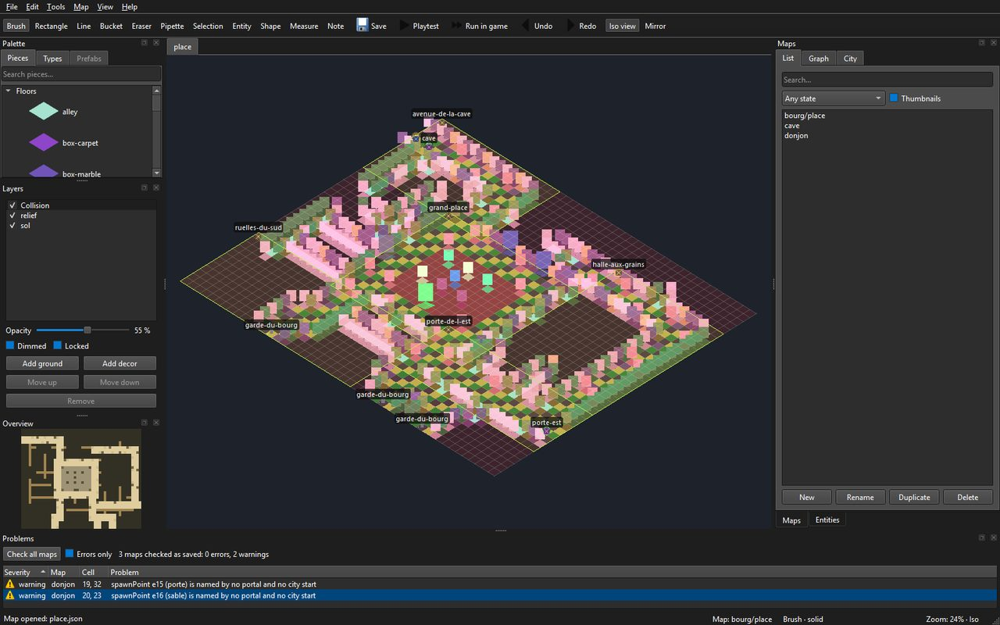

# Faire une carte dans l'éditeur

> Guide d'usage de l'auteur, écrit au [LOT-EDITOR-06](../../../Planning/versions/v0.0.0/v0.0.0-fondation/lots/LOT-EDITOR-06-fin-des-scripts.md). Depuis ce lot,
> **l'éditeur fait foi** pour les cartes faites à la main (décision D4) : aucun script ne les écrit
> plus. Le fonctionnement interne de l'outil est dans [Éditeur de niveaux](../guide-editeur.md) ; ses commandes, dans le
> README du module, `Source/Editor/README.md`.

Une carte se fait en sept temps : la créer avec son lieu, poser le sol, dresser le relief, placer
l'entrée, poser les entités, l'essayer, l'enregistrer et la contrôler. Exemple suivi : une petite
échoppe de Martpart, 12 × 8 cases.

## 0. Ouvrir l'éditeur sur le dépôt

Construire (`scripts/build.ps1`), puis lancer `build\ninja\bin\LevelEditor.exe`. L'éditeur ouvre
les données de **l'arbre des sources qui l'a construit** — `Source/Elements` —, et non la copie
que la construction refait à côté de l'exécutable : ce qu'on enregistre arrive dans le dépôt, et la
construction suivante ne l'écrase pas. Le titre de la fenêtre dit quel dossier est ouvert ;
`--data <dossier>` en ouvre un autre.



Six panneaux, qu'on retrouvera tout au long de cette page : **Palette** (les pièces),
**Layers** (les couches), le **canevas** au centre, **Maps** (les cartes du dépôt),
**Entities · Inspector** (ce qu'on a posé) et **Problems** (ce qui cloche). Ils se déplacent, se
détachent et se referment ; la disposition est retenue d'une session à l'autre.

## 1. Créer la carte, avec son lieu

Panneau **Maps**, onglet *List*, bouton **New** : un nom (`echoppe`), une taille en cases, un
**lieu** — la planche dont la carte prendra ses pièces, choisi dans l'arbre des lieux que la
boîte **New map** propose (`central-empire/capital/martpart`,
`central-empire/capital/arenarea`…) — et un **modèle**. Sans modèle, la carte naît comme les cartes livrées : une couche de sol `sol` qui
nomme le lieu, une couche de décor `relief`, et une collision déduite où tout, encore vide,
arrête la vue — sauf l'entrée, au coin bas gauche, posée sur une case de terre. Avec un modèle
(`LOT-EDITOR-08`) — **Interior**, **Street**, **Arena** —, elle naît avec sa taille, ses murs et
son entrée déjà posés ; choisir le modèle reprend sa taille, qu'on peut encore changer, et ce
qu'il ne couvre pas reste plein. Double-cliquer la carte dans la liste l'ouvre.

Sans lieu (« none »), on peint des types en couleurs sur une grille unique : c'est la
**maquette**, et c'est la première étape légitime d'une carte du jeu (décision D-22) — sa
physique se dessine et se joue avant ses textures ; les cartes de la démo sont nées ainsi, puis
*Change sheet…* (ci-dessous) leur a donné leur lieu et leurs pièces.

Une carte d'un quartier va dans le sous-dossier de son lieu (`central-empire/capital/…`) : la
boîte **New map** l'y range d'elle-même, et **Rename** (ci-dessous) prend l'identifiant
complet, `central-empire/capital/echoppe`, si le fichier doit changer de dossier.

## 2. Poser le sol

Panneau **Palette**, onglet *Pieces* : la planche du lieu, groupée par classe, avec une recherche.
Une pièce de sol va d'elle-même sur la couche `sol`. Les outils, à leur touche :

| Touche | Outil | Pour |
|---|---|---|
| `R` | rectangle | le sol d'une pièce, d'une rue, d'une place |
| `B` | pinceau | les variantes de pavé, une case à la fois |
| `G` | seau | remplir une surface d'un seul sol |
| `L` | ligne | une rangée droite |
| `E` | gomme | retirer une pièce entière, emprise comprise |
| `I`, ou `Alt` + clic | pipette | reprendre la pièce d'une case |

Un geste, du clic au relâchement, se défait d'un `Ctrl+Z`. La collision suit chaque geste : une case
qui reçoit un sol devient franchissable.

## 3. Dresser le relief

Toujours dans *Pieces* : murs, fenêtres, portes, angles, lanternes, étals. Une pièce debout va sur
`relief`. Une pièce **large** (une devanture, un grand étal) occupe deux cases, depuis la case où
on la pose ; poser une pièce sur une emprise déjà prise retire celle qui y était. Le **miroir**
(`M`, par la case survolée) pose la jumelle de chaque pièce de l'autre côté d'un axe : une façade
symétrique se dresse d'un seul trait.

**F9** bascule entre l'isométrie (ce que le jeu montrera) et la vue à plat, où l'on lit les types
et la collision ; **F8** rend le relief transparent pour voir le sol dessous.

## 4. Placer l'entrée

Panneau **Layers** : choisir la couche *Collision*, puis dans *Palette*, onglet *Types*, le
marqueur **Entry**, et cliquer la case où le héros apparaît. Une carte n'a qu'une entrée : la
reposer la déplace. Peindre la collision ailleurs **force** la case ; la gomme la rend à la
déduction. On ne force qu'en dernier recours : une case forcée ne suit plus les pièces.

## 5. Poser les entités

Outil **Entité** (`O`), puis une famille dans la liste *Place* du panneau **Entities** : un PNJ
(son dialogue, sa figurine), un coffre, un point d'arrivée (`spawnPoint`, nommé), un portail
(`portal` : la carte visée et le point d'arrivée de l'autre côté), une zone de combat qu'on tire
d'un coin à l'autre, une rencontre (`encounter`, les créatures qu'elle lève). Une rencontre
engage le **combat** sur la zone de combat de la carte, comme l'action de dialogue
`startEncounter` d'un PNJ ([LOT-118](../../../Planning/versions/v0.1.0/v0.0.1-demo/lots/LOT-118-combat-sur-la-carte.md)) :
c'est ce que le jeu joue quand *Run in game* l'ouvre.
L'inspecteur propose les valeurs que les catalogues connaissent ; ses avertissements disent ce qui
manque, et une zone de combat donne son verdict tactique pendant qu'on la tire. Une entité reçoit
un identifiant (`e12`) qu'elle garde : c'est par lui que l'éditeur la retrouve et la renomme
(*Map* › **Who cites the selected entity?**, **Rename entity id…**, `--who-cites entity`).

Pour relier deux cartes, le plus court est le **graphe du monde** (ci-dessous) : il pose les deux
paires d'un geste. À la main, poser un portail et un point d'arrivée de chaque côté.

## 6. Essayer

**P** lance l'essai immédiat depuis l'entrée, **Shift+P** depuis la case survolée : on marche, on
passe les portails, sans quitter la fenêtre. C'est l'outil de la marche et des portails.

Pour le **vrai jeu**, *Map* › *Run in game* (**F5**) lance `JustAnotherRpgGame` sur la carte
ouverte : il s'ouvre directement dessus, sans passer par ses menus, avec ses dialogues, ses écrans
et son rendu. **Maj+F5** part de la case survolée ; **Ctrl+F5** ouvre d'abord un dialogue où l'on
choisit la case de départ et l'**état de partie** — la même carte avant et après une quête.

### L'état de partie

*Map* › *World state…* règle l'état dont partent **P** et **F5** : une valeur pour chaque drapeau
qu'une quête déclare (`quete.pommes` : `inconnue`, `acceptee`…), les faits acquis à cocher, et
ceux qu'on écrit à la main. Coché *Show the map under this state*, le canevas montre la carte
dans cet état : ce qui en est absent — le garde avant `acceptee`, la porte ouverte après
`enfant-libere` — ne se dessine plus, et son marqueur est grisé. Rien n'est rechargé : on change
d'état, la carte suit.

Ce qu'une quête pose sur une carte s'écrit à l'inspecteur, sans toucher au JSON :

- une **condition de présence** sur toute entité (`presenceFlag`, `presenceTest`,
  `presenceValue`), dont les valeurs sont celles que la quête déclare ;
- un **décor qui change** : la famille `prop`, une pièce du lieu posée comme entité — choisir sa
  pièce lui donne son emprise, qui arrête le pas tant qu'elle est là ;
- un **portail condamné** (`sealed`) : l'escalier est posé, il ne mène nulle part, et le graphe
  le montre en pointillé ;
- un **déclencheur** de zone : un dialogue, un drapeau posé, un transfert vers une carte et un
  point d'arrivée, à l'entrée du héros.

Ce qui est joué, ce sont les **brouillons** de tous les onglets ouverts, écrits dans un dossier
temporaire hors du dépôt : la retouche qu'on vient de faire se voit sans enregistrer, et la carte
d'à côté aussi quand on passe son portail. Deux choses restent celles de la dernière
construction : les **catalogues** du jeu (dialogues, rencontres, figurines, villes, assets) et son
propre `Levels/` pour les cartes qu'aucun onglet ne porte. Un essai n'enregistre rien, et fermer
l'éditeur ferme le jeu.

Le canevas montre la carte **comme le jeu la jouera** : mêmes pièces, même ordre de dessin, même
projection. Ce n'est pas une vue d'édition qui ressemblerait au jeu — c'est le même code de
composition, ce qui interdit à l'éditeur de vous montrer quelque chose que le jeu démentira.


## 7. Enregistrer, contrôler, publier

`Ctrl+S` enregistre, après validation : une carte que le jeu refuserait ne s'écrit pas. Puis, dans
un terminal à la racine du dépôt :

```
build\ninja\bin\LevelEditor.exe --check
build\ninja\bin\LevelEditor.exe --render echoppe --scale 0.5 --output echoppe.png
build\ninja\bin\LevelEditor.exe --render echoppe --hour 21:30 --output echoppe-nuit.png
```

`--hour HH:MM` éclaire le rendu comme le jeu l'éclaire à cette heure ; sans elle, la carte se rend
sans éclairage. `LevelEditor --map=echoppe --hour=21:30` ouvre la fenêtre l'éclairage allumé.

`--check` contrôle **toutes** les cartes — format, pièces, collision, identifiants, puis ce qui se
joue : références des entités, rencontres, cases utiles hors d'atteinte, portails sans retour,
clés de traduction — et c'est ce que la CI exige. Dans la fenêtre, le même contrôle remplit le
panneau **Problems**, en bas : au lancement, à chaque enregistrement, et par *Map › Check all
maps*. Un double-clic sur un constat ouvre sa carte, sélectionne l'entité et cerne la case en
magenta. Le panneau lit les cartes **enregistrées** ; les avertissements en direct de la carte
ouverte restent dans le panneau *Entities*.

Le nom d'une carte n'est pas du texte mais une clé, `map.<identifiant>.name` : « New » l'écrit
dans `Source/Elements/Localization/fr.lang` et `en.lang` avec le nom tapé ; il reste à y mettre
le vrai nom, dans chaque langue. `--render` rend la carte en PNG, comme elle rendra dans la PR : la CI publie le
rendu de chaque carte qu'une PR change (artefact `map-renders`). La carte se relit alors en diff :
le fichier est canonique, une retouche ne change que ses cases.

## Retoucher en masse, sans la souris

Ce que la main fait se rejoue par fichier : `LevelEditor --apply gestes.json` appelle les mêmes
fonctions que les outils, dans le même ordre, et ne touche pas au fichier si un geste est refusé.
C'est la façon de faire une retouche relue en diff, ou de répéter un geste sur plusieurs cartes.
Les trois retouches du `LOT-EDITOR-06` en sont des exemples
(`Planning/versions/v0.0.0/v0.0.0-fondation/annexes/LOT-EDITOR-06-fin-des-scripts/retouches/`), le format est décrit dans
`Source/Editor/Logic/GestureScript.h`.

## Répéter ce qu'on a composé : tampons et préfabriqués

Une échoppe, un étal, une cour se composent une fois (`LOT-EDITOR-08`) :

- Outil **Sélection** (`S`), tirer autour de ce qu'on veut reprendre, puis `Ctrl+C`. Le **tampon**
  emporte tout : les types de chaque couche, les pièces qui y sont ancrées — entières, le
  rectangle s'agrandissant jusqu'à leur emprise —, les entités et les cases de collision forcées.
  La barre d'état dit ce qu'il porte (`3 × 2 · 2 pieces · 1 entity`).
- `Ctrl+V` le pose, coin haut gauche sur la case survolée, **en un pas** : un `Ctrl+Z` défait tout.
  Chaque entité posée reçoit un identifiant neuf ; l'entrée, elle, n'est jamais emportée.
  `Ctrl+Maj+V` pose le **reflet** du tampon : il passe de w × h à h × w et chaque pièce prend sa
  jumelle, comme le miroir du pinceau.
- Un tampon **remplace** ce qu'il couvre, cases vides comprises : serrer la sélection.
- `Ctrl+Maj+S` (*Edit* › *Save selection as prefab…*) l'enregistre comme **préfabriqué** du lieu,
  sous un nom de minuscules, de chiffres, de tirets et de tirets bas. L'onglet **Prefabs** de la
  palette montre alors la bibliothèque du lieu, chacun avec une vignette rendue de son propre
  contenu ; le choisir arme le tampon, `Ctrl+V` le pose. Les préfabriqués sont des fichiers, dans
  `Source/Elements/Editor/Prefabs/<lieu>/` : on les renomme et on les supprime à l'explorateur.
- Sans fenêtre : `LevelEditor --list-prefabs` et
  `LevelEditor --save-prefab central-empire/capital/martpart etal --from 21,24 --to 21,24`.

## Renommer, remplacer, changer de planche

Un nom qui change ne casse rien (`LOT-EDITOR-14`) :

- **Rename** (panneau *Maps* ou menu *File*) prend l'identifiant complet, dossier compris
  (`capital/echoppe`). Portails, variantes, villes et la clé du nom dans chaque catalogue suivent,
  l'annexe des notes aussi. Une boîte montre d'abord tout ce qui sera récrit.
- Menu *Map* : **Who cites this map?**, **Who cites the selected entity?** listent les citations ;
  un double-clic y mène. **Rename entity id…** et **Rename arrival point…** renomment l'entité
  sélectionnée et ce qui la cite.
- **Replace piece…** remplace une pièce par une autre de la planche, sur la carte ouverte (en un
  pas, `Ctrl+Z` le défait) ou sur toutes les cartes qui la posent.
- **Change sheet…** fait passer la carte à une autre planche : chaque pièce va à son homonyme, et
  la table du dialogue donne les autres ; on ne valide qu'une table sans trou. Un pas, lui aussi.

Tout ce qui récrit d'autres fichiers demande d'abord d'enregistrer la carte ouverte, et un refus
(nom pris, carte illisible, pièce sans correspondant) n'écrit rien. Les mêmes commandes existent
sans fenêtre : `--rename-map`, `--rename-arrival`, `--rename-id`, `--who-cites`,
`--replace-piece`, `--change-scene` (voir `Source/Editor/README.md`).

## Plusieurs cartes à la fois, et le monde autour (`LOT-EDITOR-09`)

- **Les cartes s'ouvrent en onglets.** Chacune garde son brouillon, son historique, son cadrage et
  sa sauvegarde automatique ; l'onglet porte le nom court de la carte, suivi d'une étoile tant
  qu'elle est modifiée. Ouvrir une carte déjà ouverte revient à son onglet. *File* › *Close tab*
  (`Ctrl+W`) ferme celui du dessus — le dernier reste, et fermer un onglet modifié demande d'abord
  quoi faire de son brouillon.
- **Relier deux cartes d'un geste.** Panneau *Maps*, onglet **Graph** : tirer d'une carte à une
  autre. L'éditeur montre ce qu'il va écrire — sur chacune, le portail qui mène à l'autre et le
  point d'arrivée que l'autre cite (`from-martpart`) —, puis l'écrit. La paire se pose au plus
  près de l'entrée, sur des cases libres et atteignables : `P` traverse aussitôt, dans les deux
  sens, et l'outil **Entité** déplace ensuite la porte où on la veut. Sans fenêtre :
  `LevelEditor --link-maps central-empire/capital/martpart central-empire/capital/arenarea`.
- **Voir une ville par quartiers.** Onglet **City** : le plan peint de la ville, les cadres de ses
  quartiers, leur nom ; un quartier tireté n'a pas (encore) sa carte, ou n'est qu'une porte
  gardée. Double-cliquer un quartier ouvre sa carte dans son onglet.
- **Dire ce qu'est une carte.** *Map* › **Map properties…** montre son lieu (la planche ; en
  changer, c'est *Change sheet…*), et édite sa **région**, son **ambiance**, son **heure fixe** —
  trois propriétés de la carte, enregistrées avec elle — et son **état** : générée, retouchée,
  finie. L'état est une note d'auteur : il va dans l'annexe `<carte>.editor.json`. L'heure fixe
  (*Fixed hour*, écrite `HH:MM`) montre toujours la carte à cette heure, quelle que soit celle du
  monde : un sous-sol reste dans la nuit de ses torches. Vide, la carte suit l'heure du monde.
- **Voir la carte de nuit.** Dans la barre d'outils, cocher **Lighting** éclaire le canevas comme
  le jeu l'éclaire — soleil, ombres, lumières de nuit —, et le curseur à côté règle l'heure, par
  quart d'heure. Décochée, la carte se montre telle que ses pièces sont peintes. **Playtest** part
  de l'heure du curseur ; l'essai, lui, est toujours éclairé.
- **Poser une lumière.** Un lampadaire, une lanterne, un brasero éclairent d'eux-mêmes : leur
  pièce le déclare. Pour ce qu'aucune pièce ne porte — la lueur d'une fenêtre, un feu —, l'outil
  **Entité** pose la famille **light** : sa couleur (`#rrggbb`), sa portée en cases (*radius*), sa
  hauteur en décimètres (*height*), son intensité en pour cent, si elle tremble (*flicker*) et si
  elle reste allumée en plein jour (*always*). Elle ne s'allume qu'au crépuscule, sauf *always*.
- **Voir où en est le monde.** Dans la liste des cartes, l'état paraît à côté du nom, le menu
  déroulant filtre par état, et **Thumbnails** montre chaque carte en vignette — le même rendu que
  `--render`.

## Écrire une quête : le panneau *Quests* (`LOT-144`)

Une quête s'écrit à côté des cartes qu'elle traverse, sans ouvrir son JSON. Le panneau **Quests**
est un onglet à côté de *Maps* et *Entities* ; on l'élargit ou on le détache à loisir.

- **Choisir, créer, renommer, retirer.** La liste en tête nomme les quêtes de `World/quests`.
  **New…** demande un identifiant (minuscules, chiffres, `-`, `_`) ; **Rename…** et **Delete…**
  montrent d'abord tout ce qu'ils récrivent — le fichier, les clés du journal, le dialogue qui la
  démarre — comme un renommage de carte.
- **Onglet Quest.** Le nom de travail, la source, le **titre du journal** dans chaque langue, et
  les **drapeaux déclarés** : un identifiant (`quete.pommes`), ses valeurs `a|b|c`, l'initiale.
  Un drapeau déjà enregistré ne se renomme pas dans la case : **Rename flag…** et **Rename
  value…** le suivent dans les cartes, les dialogues et les autres quêtes. **Uses** montre qui
  s'en sert.
- **Onglet Steps.** Les étapes dans l'ordre du récit (**Up**, **Down**). Pour l'étape choisie :
  son identifiant, **où elle se joue** (une entité `carte#id`, facultatif ; **Go** y mène), ses
  **conditions** — un drapeau, un test (`is set`, `is not set`, `equals`, `not equals`), des
  valeurs `a|b` prises parmi celles que le drapeau déclare —, ses **effets** (`setFlag`,
  `clearFlag`), l'**issue** qui clôt la quête et le **texte du journal** dans chaque langue.
- **Play this step** règle l'état de partie de tous les onglets sur des valeurs qui atteignent
  l'étape : sous « acceptee », le garde et l'enfant paraissent au parvis d'Arenarea. `P` et `F5`
  partent de là, comme de *Map* › *World state…*.
- **Onglet Uses.** Pour un drapeau, et au besoin une valeur : chaque entité, dialogue ou quête qui
  le déclare, le lit ou le pose. Un double-clic ouvre la carte sur l'entité.
- **Save** écrit la quête sous sa forme canonique et ses textes dans chaque catalogue. Ce que le
  jeu refuserait — une étape sans condition, une valeur que le drapeau ne déclare pas, un drapeau
  déjà déclaré ailleurs — ne s'enregistre pas, et le message nomme l'étape. **Revert** relit le
  fichier.

Sans fenêtre : `--who-cites flag`, `--rename-flag`, `--rename-flag-value`, `--rename-quest`,
`--save-quest`, `--quest-state` (voir `Source/Editor/README.md`). Les dialogues, eux, restent
écrits à la main (décision D-24) : le panneau montre ceux qui lisent ou posent un drapeau, il ne les
édite pas.

## Écrire la fiche d'un personnage : la fenêtre *Asset workshop* (`LOT-1008`)

Un personnage est une fiche qui lie un modèle, son portrait et son jeton
(`Planning/standards/personnages-3d.md`). *Assets* › *Asset workshop…* ouvre l'atelier, une
fenêtre à part de la carte, en trois colonnes :

- **Installed characters**, à gauche : les personnages en modèle de tous les niveaux. En choisir un
  rouvre sa fiche telle qu'elle est installée, les sources retrouvées dans l'atelier local
  (**Workshop folder…**, `Tools/Assets3D` par défaut).
- **La fiche d'atelier**, au centre. *Level* est le dossier `Characters` du niveau, *Name* le
  personnage (`bandit`, `Heroes/brawler`), *Skeleton* sa silhouette. *Linked model* est le `.glb`
  lié par la chaîne (`rig_character.py`), *Portrait (512)* et *Token (128)* ses images, déjà aux
  tailles du standard : l'atelier ne retaille rien, il range. Un champ vide garde ce qui est
  installé. **Save sheet** écrit la fiche en JSON à côté des sources (`<nom>.character.json`),
  **Install in the game** écrit le personnage sous `Assets/` et l'inscrit au manifeste de son
  niveau — exactement ce que fait `LevelEditor --apply <fiche>` sans fenêtre, à l'octet près.
  Une fiche refusée n'écrit rien, et le compte rendu, sous les boutons, dit pourquoi (un portrait
  qui n'est pas en 512 × 512, un modèle sans squelette, un clip que la silhouette déclare et que
  le modèle n'a pas).
- **L'aperçu**, à droite : le modèle, dessiné par le rendu du jeu sur un damier de maquette, clip
  par clip (*Clip*), **Play** le fait tourner, **Quarter turn** le fait pivoter. Ce qu'on y voit
  est ce qu'on jouera. **Light** choisit l'heure à laquelle il est éclairé — midi, l'aube, le
  crépuscule, la nuit — ou l'éteint (*Unlit*) : un modèle se juge éclairé (`LOT-1007`).

**Régler le squelette et les clips dans Blender** (décision D-44). Le groupe *Blender round trip*
demande le maillage **reçu** (celui que la chaîne lie) et la **fiche de liaison** du personnage.
**Edit in Blender** ouvre le modèle lié dans Blender — maillage, 53 os, une action par clip, à
60 images par seconde — et note, à côté du `.blend`, un repère de ce que Blender a lu. On y
déplace une articulation en mode Édition de l'armature, on y change les clés d'une action en mode
Pose, on enregistre (`Ctrl+S`). **Import from Blender** relit le fichier, le compare au repère et
ne retient que ce qui a changé : une articulation déplacée revient dans la fiche de liaison, un
clip modifié dans la fiche de retouche (`retouche.json`, à côté), puis le modèle est relié par la
chaîne et contrôlé — un écart au standard (sol traversé, pied qui glisse) refuse l'import et le
dit. Rien ne revient de Blender qu'en données : ni maillage, ni poids, ni `.glb` exporté par lui.
Ce qu'il ne sait pas dire au jeu — un os translaté ou mis à l'échelle, un doigt animé — est
signalé et ignoré. Le détail est dans `scripts/assetsGeneration/retouch_character.py`.

**Check installed characters** relit tout ce qui est installé : fiche, squelette, modèle et ses
clips, portrait et jeton aux bonnes tailles — ce que `LevelEditor --check` ajoute au contrôle des
cartes.

## Ce qui ne se fait pas encore dans l'éditeur

- Composer un ensemble de décor en maillages (la vue *Scenery* de l'atelier) : avec le kit en
  maillages, à la `0.0.3` (décision D-43, `LOT-151`).

- Semer une forêt ou une prairie sans perdre les retouches : `LOT-168` du planning (`LOT-EDITOR-11`, qui pilotait un générateur, est abandonné).

### Créer ou redimensionner sans fenêtre

`LevelEditor --data Source/Elements --new catacombs --scene central-empire/capital/arenarea/arena-of-fate/catacombs --width 34 --height 24`
crée une carte vide avec les couches et la clé de traduction habituelles, par la même opération
que la fenêtre. Un nom déjà présent est refusé. Le dossier suit le lieu indiqué par `--scene`.

`LevelEditor --data Source/Elements --resize central-empire/capital/arenarea/arena-of-fate/undercroft --width 34 --height 24`
agrandit toutes les couches en conservant leur contenu et les entités. Une réduction est refusée,
sauf avec `--crop` : ce qui tombe hors de la nouvelle grille — cases, entités, entrée — est alors
perdu, et la commande le dit. Les dimensions vont de 1 à 100 cases, comme dans la fenêtre. Ces
commandes se lancent séparément de `--apply` ; les gestes d'habillage se rejouent ensuite.

Le geste `{"tool":"layer","name":"statues","kind":"decor","floor":1}` crée une couche
et la sélectionne, ou reconfigure celle du même nom sans la dupliquer. `kind` vaut `ground`
ou `decor` ; seuls les décors acceptent les étages 1 à 4. Les gestes suivants peuvent désigner
explicitement `"layer":"statues"`. La hauteur d'étage est celle du manifeste de la scène. Une
couche de décor de plus au rez-de-chaussée (`floor` 0) garde ses pièces sur une case déjà
habillée : une statue dans sa niche, une enceinte sous les murs qu'elle entoure.
