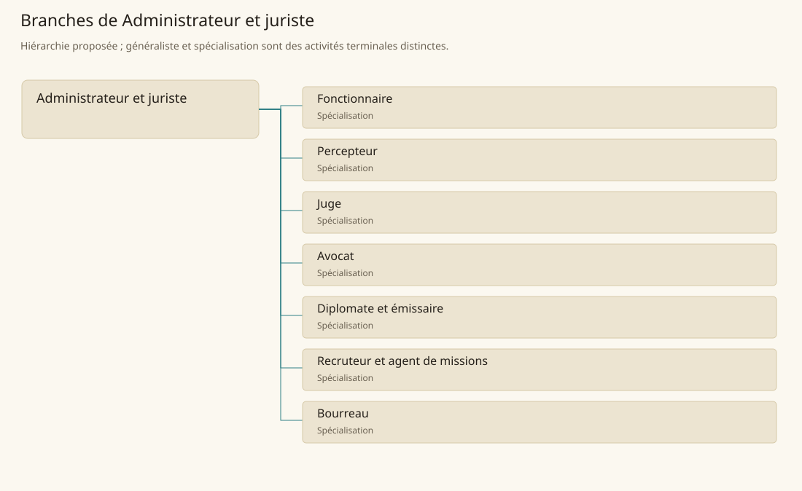

# Administrateur et juriste

[Accueil](../README.md) · [Arbre des métiers](../arbre-metiers.md)

Faire fonctionner les procédures, décisions et obligations d’une institution identifiable.

**Métier de base proposé.** Cette famille rassemble les disciplines communes de ses branches ; elle n’ajoute pas une profession à chaque personne. Un généraliste est une feuille précise, distincte de la somme statistique de la base.

## Fonctions

- Recevoir demandes et vérifier pièces nécessaires
- Instruire le dossier dans les règles du lieu
- Notifier la décision ou l’action et en conserver la trace

## Compétences nécessaires proposées

| Savoir-faire proposé | À quoi il sert | Acquisition |
|---|---|---|
| Lecture des règles | Trouver la disposition applicable | P : Étude de dossiers locaux |
| Instruction documentaire | Relier pièces, parties et objet du dossier | P : Travail relu en bureau |
| Expression juridique | Expliquer obligation et voie de recours locale | P : Rédaction de décisions commentées |
| Impartialité de procédure | Signaler conflit d’intérêt et pièce manquante | P : Cas supervisés |

Formation dans l’institution concernée ; mandat judiciaire, fiscal ou diplomatique explicite.

## Outils et chaînes de travail

Registres, Textes institutionnels, Sceaux et formulaires.

- Écriture
- Finance
- Sécurité
- Institutions locales

## Arbre de cette famille

| Branche | Nature | Fonction distinctive |
|---|---|---|
| [Fonctionnaire](../Specialisations/administration/fonctionnaire.md) | Spécialisation | Métier de bureau ; ne présume pas une autorité fiscale, judiciaire ou militaire. |
| [Percepteur](../Specialisations/administration/percepteur.md) | Spécialisation | Recouvre une obligation donnée ; ne fixe pas seul les règles d’imposition. |
| [Juge](../Specialisations/administration/juge.md) | Spécialisation | Les modes de règlement varient selon le lieu ; aucun système judiciaire uniforme n’est supposé. |
| [Avocat](../Specialisations/administration/avocat.md) | Spécialisation | Représente une partie ; la décision appartient à l’autorité compétente. |
| [Diplomate et émissaire](../Specialisations/administration/diplomate.md) | Spécialisation | Représentation par mandat ; ne confère ni rang noble ni autorité sur le pouvoir représenté. |
| [Recruteur et agent de missions](../Specialisations/administration/recruteur.md) | Spécialisation | Fonction déduite du contexte de missions ; le métier ne classe pas automatiquement les aventuriers par niveau. |
| [Bourreau](../Specialisations/administration/bourreau.md) | Spécialisation | N’instruit pas l’affaire et ne choisit pas la peine ; les modalités restent locales. |

## Implantation et parts de population

Les deux colonnes changent de dénominateur. Les effectifs régionaux proposés servent à dimensionner les filières ; ils ne prouvent pas une compétence individuelle. Les valeurs relatives ne donnent aucun effectif absolu.

| Région | % des habitants | % des actifs | Portée |
|---|---|---|---|
| [Empire central](../Regions/empire.md) | 1,413 % | 2,191 % | proportion proposée |
| [République des Freelands](../Regions/freelands.md) | 1,882 % | 2,937 % | proportion proposée |
| [Ben’net impérial](../Regions/bennet.md) | 0,955 % | 1,421 % | proportion proposée |
| [Royaume de Kolbjörn](../Regions/kolbjorn.md) | 0,770 % | 1,154 % | proportion proposée |
| [Magocratie de Mage Tower](../Regions/magocracy.md) | 0,744 % | 1,124 % | proportion proposée |
| [Seashores](../Regions/seashores.md) | 0,581 % | 0,878 % | proportion proposée |
| [Forêt de Sindile](../Regions/sindile.md) | 0,697 % | 1,037 % | proportion proposée |
| [Domaines stravians](../Regions/stravian.md) | 0,523 % | 0,790 % | proportion proposée |
| [Îles des Tempêtes](../Regions/storm.md) | 2,030 % | 2,820 % | proportion proposée |
| [Cités de Taii’Maku](../Regions/taiimaku.md) | 1,936 % | 4,442 % | proportion proposée |
| [Théocratie de Kepesh](../Regions/kepesh.md) | 0,659 % | 0,985 % | proportion proposée |
| [Tsvetan](../Regions/tsvetan.md) | 1,206 % | 1,804 % | proportion proposée |
| [Yama](../Regions/yama.md) | 1,124 % | 1,687 % | proportion proposée |
| [Undertanares](../Regions/undertanares.md) | 1,263 % | 1,971 % | scénario relatif |
| [Darkall](../Regions/darkall.md) | 2,061 % | 3,122 % | scénario relatif |
| [Mystical et Wasteland](../Regions/mystical.md) | non applicable | non applicable | absence de dénominateur civil |

## Choix et sources

P : famille professionnelle, fonctions, compétences, outils et formation proposés. Les sources des feuilles appuient des activités ou contextes précis ; elles ne prouvent ni une organisation générale de cette famille, ni une maîtrise de toutes ses spécialités.

La parenté entre branches et les savoir-faire de cette fiche sont des propositions de conception. Appui des activités : [Player’s Guide to Tanares p. 46](../Sources/pg.md#p-46), [Tanares Sourcebook p. 105](../Sources/sb.md#p-105), [Tanares Sourcebook p. 132](../Sources/sb.md#p-132), [Tanares Sourcebook p. 148](../Sources/sb.md#p-148), [Tanares Sourcebook p. 213](../Sources/sb.md#p-213), [Tanares Sourcebook p. 90](../Sources/sb.md#p-90).
