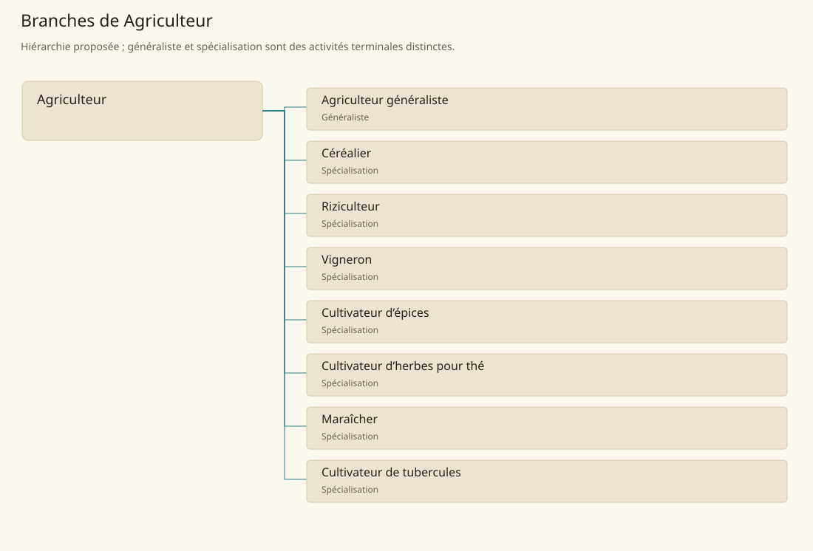

# Agriculteur

[Accueil](../README.md) · [Arbre des métiers](../arbre-metiers.md)

Produire des végétaux utiles en organisant la terre, l’eau et les successions de cultures.

**Métier de base proposé.** Cette famille rassemble les disciplines communes de ses branches ; elle n’ajoute pas une profession à chaque personne. Un généraliste est une feuille précise, distincte de la somme statistique de la base.

## Fonctions

- Préparer une parcelle et répartir les cultures selon le sol et la saison
- Conduire semis, irrigation, désherbage et protection des plants
- Récolter, trier et transmettre les produits et les semences

## Compétences nécessaires proposées

| Savoir-faire proposé | À quoi il sert | Acquisition |
|---|---|---|
| Lecture du sol | Préparer une parcelle et répartir les cultures selon le sol et la saison | Parcours proposé : Comparer des parcelles humides, compactées et drainantes |
| Conduite culturale | Conduire semis, irrigation, désherbage et protection des plants | Parcours proposé : Suivre un semis jusqu’à maturité |
| Récolte et sélection | Récolter, trier et transmettre les produits et les semences | Parcours proposé : Trier une récolte et réserver les semences saines |
| Organisation de campagne | Répartir semences, eau et jours de travail entre parcelles pour éviter de manquer une intervention de saison. | Parcours proposé : Établir un calendrier partagé avec irrigateurs et transporteurs |

Parcours proposé : Passer du travail d’une petite parcelle au suivi d’une campagne complète, puis choisir une culture dominante.

## Outils et chaînes de travail

Bêche et houe, Charrue adaptée au terrain, Outils de récolte, Contenants de semences.

- Accès aux terres
- Eau et semences
- Transport et stockage

## Arbre de cette famille

| Branche | Nature | Fonction distinctive |
|---|---|---|
| [Agriculteur généraliste](../Specialisations/agriculture/agriculture.md) | Généraliste | Feuille généraliste : La base réunit toutes les cultures ; cette feuille est l’emploi principal polyvalent, sans expertise automatique en riz, thé ou vigne. |
| [Céréalier](../Specialisations/agriculture/cerealier.md) | Spécialisation | La matière livrée est le grain brut ; la mouture appartient au meunier. |
| [Riziculteur](../Specialisations/agriculture/riziculteur.md) | Spécialisation | Il produit le paddy ; décorticage et cuisine ne créent pas de nouveaux producteurs primaires. |
| [Vigneron](../Specialisations/agriculture/vigneron.md) | Spécialisation | Le vigneron livre des raisins ; la fabrication de boisson est distincte. |
| [Cultivateur d’épices](../Specialisations/agriculture/epices.md) | Spécialisation | Les matières aromatiques ne sont pas assimilées à une production calorique principale. |
| [Cultivateur d’herbes pour thé](../Specialisations/agriculture/theiculteur.md) | Spécialisation | La matière végétale ne confère ni préparation rituelle ni activation magique du thé. |
| [Maraîcher](../Specialisations/agriculture/maraicher.md) | Spécialisation | Il se concentre sur les légumes frais ; le généraliste partage son travail entre cultures diverses. |
| [Cultivateur de tubercules](../Specialisations/agriculture/tuberculier.md) | Spécialisation | Les matières locales spéciales sont à apprendre ; aucun rendement supplémentaire ne découle du titre. |

## Implantation et parts de population

Les deux colonnes changent de dénominateur. Les effectifs régionaux proposés servent à dimensionner les filières ; ils ne prouvent pas une compétence individuelle. Les valeurs relatives ne donnent aucun effectif absolu.

| Région | % des habitants | % des actifs | Portée |
|---|---|---|---|
| [Empire central](../Regions/empire.md) | 26,138 % | 40,530 % | proportion proposée |
| [République des Freelands](../Regions/freelands.md) | 19,932 % | 31,097 % | proportion proposée |
| [Ben’net impérial](../Regions/bennet.md) | 21,011 % | 31,256 % | proportion proposée |
| [Royaume de Kolbjörn](../Regions/kolbjorn.md) | 25,170 % | 37,723 % | proportion proposée |
| [Magocratie de Mage Tower](../Regions/magocracy.md) | 24,083 % | 36,392 % | proportion proposée |
| [Seashores](../Regions/seashores.md) | 10,515 % | 15,890 % | proportion proposée |
| [Forêt de Sindile](../Regions/sindile.md) | 9,643 % | 14,350 % | proportion proposée |
| [Domaines stravians](../Regions/stravian.md) | 32,772 % | 49,489 % | proportion proposée |
| [Îles des Tempêtes](../Regions/storm.md) | 4,014 % | 5,576 % | proportion proposée |
| [Cités de Taii’Maku](../Regions/taiimaku.md) | 3,850 % | 8,834 % | proportion proposée |
| [Théocratie de Kepesh](../Regions/kepesh.md) | 25,293 % | 37,814 % | proportion proposée |
| [Tsvetan](../Regions/tsvetan.md) | 28,421 % | 42,507 % | proportion proposée |
| [Yama](../Regions/yama.md) | 34,889 % | 52,359 % | proportion proposée |
| [Undertanares](../Regions/undertanares.md) | 3,283 % | 5,123 % | scénario relatif |
| [Darkall](../Regions/darkall.md) | 11,448 % | 17,346 % | scénario relatif |
| [Mystical et Wasteland](../Regions/mystical.md) | non applicable | non applicable | absence de dénominateur civil |

## Choix et sources

Références du registre de base : SB90, SB198, MJ128, SB182, SB120, SB168. Leur portée concerne les activités, ressources et contextes des feuilles rattachées ; le regroupement en base, les fonctions détaillées, outils, compétences et formations sont proposés P, sans bonus ni nouvelle statistique.

La parenté entre branches et les savoir-faire de cette fiche sont des propositions de conception. Appui des activités : [Manuel des Joueurs p. 128](../Sources/mj.md#p-128), [Tanares Sourcebook p. 120](../Sources/sb.md#p-120), [Tanares Sourcebook p. 168](../Sources/sb.md#p-168), [Tanares Sourcebook p. 182](../Sources/sb.md#p-182), [Tanares Sourcebook p. 198](../Sources/sb.md#p-198), [Tanares Sourcebook p. 90](../Sources/sb.md#p-90).
