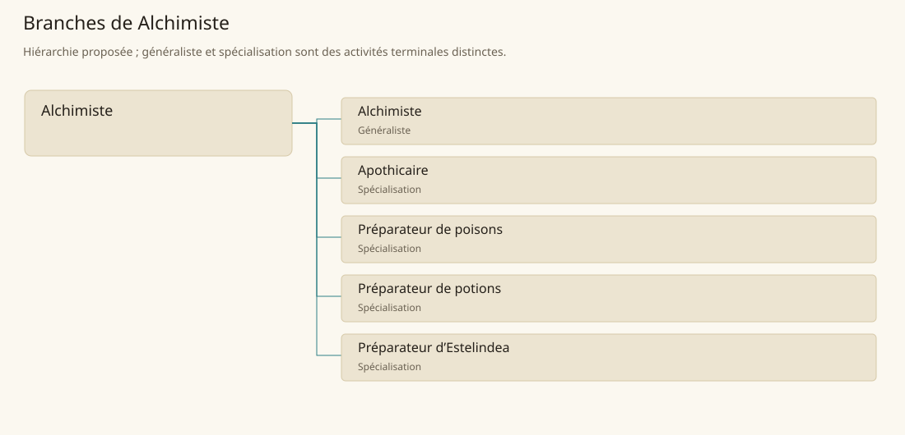

# Alchimiste

[Accueil](../README.md) · [Arbre des métiers](../arbre-metiers.md)

Préparer des substances à partir de matières identifiées et de procédures documentées, sans supposer un effet magique automatique.

**Métier de base proposé.** Cette famille rassemble les disciplines communes de ses branches ; elle n’ajoute pas une profession à chaque personne. Un généraliste est une feuille précise, distincte de la somme statistique de la base.

## Fonctions

- Identifier, peser et préparer les composants d’un lot
- Conduire les opérations autorisées et surveiller leur résultat
- Conditionner le produit et consigner composition, provenance et limites

## Compétences nécessaires proposées

| Savoir-faire proposé | À quoi il sert | Acquisition |
|---|---|---|
| Identification des composants | Identifier, peser et préparer les composants d’un lot | Parcours proposé : Comparer des composants avec une collection validée |
| Conduite d’opérations | Conduire les opérations autorisées et surveiller leur résultat | Parcours proposé : Répéter une préparation inerte approuvée par le maître |
| Traçabilité de préparation | Conditionner le produit et consigner composition, provenance et limites | Parcours proposé : Tenir un registre sur plusieurs lots semblables |
| Organisation de laboratoire | Organiser matières autorisées, matériel réservé et contrôles de laboratoire. | Parcours proposé : Planifier stockage séparé et disponibilité du matériel |

Parcours proposé : Apprentissage encadré sur substances inertes avant une filière de remède, poison ou potion ; aucune recette toxique n’est donnée ici.

## Outils et chaînes de travail

Balances, Mortier, Récipients de verre, Registre de laboratoire.

- Collecte et commerces de composants
- Atelier et contrôles
- Commanditaires et habilitations

## Arbre de cette famille

| Branche | Nature | Fonction distinctive |
|---|---|---|
| [Alchimiste](../Specialisations/alchimie/alchimiste.md) | Généraliste | La base réunit plusieurs filières ; ce généraliste n’est pas automatiquement apothicaire, empoisonneur ou préparateur de potions magiques. |
| [Apothicaire](../Specialisations/alchimie/apothicaire.md) | Spécialisation | Préparer un produit ne confère pas l’ensemble des actes du guérisseur ou médecin. |
| [Préparateur de poisons](../Specialisations/alchimie/empoisonneur.md) | Spécialisation | Les poisons de créatures de Tsvetan soutiennent la filière ; ils ne rendent pas tous les alchimistes fabricants de poisons. |
| [Préparateur de potions](../Specialisations/alchimie/potions.md) | Spécialisation | L’activité à Mage Tower est sourcée ; aucune recette, emplacement de sort ni effet inédit n’est ajouté. |
| [Préparateur d’Estelindea](../Specialisations/alchimie/estelindea.md) | Spécialisation | Le produit et son contexte sont attestés ; les gestes détaillés sont proposés et n’étendent pas ses effets. |

## Implantation et parts de population

Les deux colonnes changent de dénominateur. Les effectifs régionaux proposés servent à dimensionner les filières ; ils ne prouvent pas une compétence individuelle. Les valeurs relatives ne donnent aucun effectif absolu.

| Région | % des habitants | % des actifs | Portée |
|---|---|---|---|
| [Empire central](../Regions/empire.md) | 0,259 % | 0,401 % | proportion proposée |
| [République des Freelands](../Regions/freelands.md) | 0,438 % | 0,684 % | proportion proposée |
| [Ben’net impérial](../Regions/bennet.md) | 0,246 % | 0,366 % | proportion proposée |
| [Royaume de Kolbjörn](../Regions/kolbjorn.md) | 0,278 % | 0,417 % | proportion proposée |
| [Magocratie de Mage Tower](../Regions/magocracy.md) | 0,609 % | 0,920 % | proportion proposée |
| [Seashores](../Regions/seashores.md) | 0,291 % | 0,440 % | proportion proposée |
| [Forêt de Sindile](../Regions/sindile.md) | 0,323 % | 0,481 % | proportion proposée |
| [Domaines stravians](../Regions/stravian.md) | 0,290 % | 0,439 % | proportion proposée |
| [Îles des Tempêtes](../Regions/storm.md) | 1,678 % | 2,331 % | proportion proposée |
| [Cités de Taii’Maku](../Regions/taiimaku.md) | 0,197 % | 0,451 % | proportion proposée |
| [Théocratie de Kepesh](../Regions/kepesh.md) | 0,485 % | 0,724 % | proportion proposée |
| [Tsvetan](../Regions/tsvetan.md) | 0,140 % | 0,210 % | proportion proposée |
| [Yama](../Regions/yama.md) | 0,610 % | 0,915 % | proportion proposée |
| [Undertanares](../Regions/undertanares.md) | 0,304 % | 0,475 % | scénario relatif |
| [Darkall](../Regions/darkall.md) | 0,065 % | 0,099 % | scénario relatif |
| [Mystical et Wasteland](../Regions/mystical.md) | non applicable | non applicable | absence de dénominateur civil |

## Choix et sources

Références du registre de base : MJ128, BR55, SB193, SB138, SB153. Leur portée concerne les activités, ressources et contextes des feuilles rattachées ; le regroupement en base, les fonctions détaillées, outils, compétences et formations sont proposés P, sans bonus ni nouvelle statistique.

La parenté entre branches et les savoir-faire de cette fiche sont des propositions de conception. Appui des activités : [Basic Rules p. 55](../Sources/br.md#p-55), [Manuel des Joueurs p. 128](../Sources/mj.md#p-128), [Tanares Sourcebook p. 138](../Sources/sb.md#p-138), [Tanares Sourcebook p. 153](../Sources/sb.md#p-153), [Tanares Sourcebook p. 193](../Sources/sb.md#p-193).
