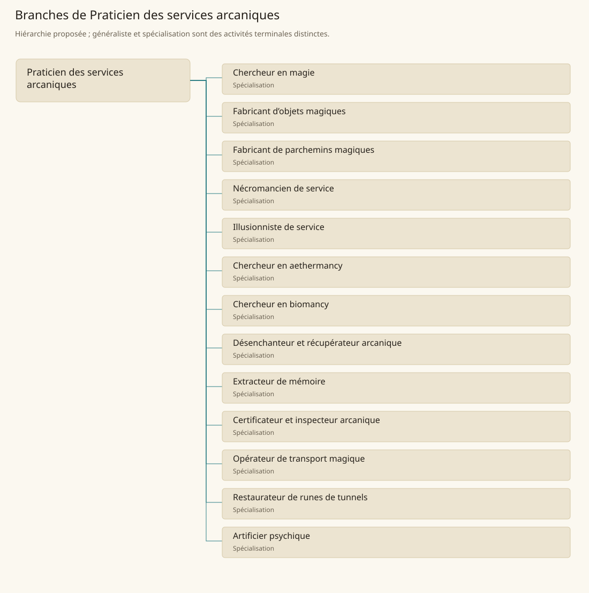

# Praticien des services arcaniques

[Accueil](../README.md) · [Arbre des métiers](../arbre-metiers.md)

Organiser des prestations et recherches magiques dans les limites de l’expertise réellement acquise.

**Métier de base proposé.** Cette famille rassemble les disciplines communes de ses branches ; elle n’ajoute pas une profession à chaque personne. Un généraliste est une feuille précise, distincte de la somme statistique de la base.

## Fonctions

- Qualifier la demande et vérifier qu’elle relève d’un praticien compétent
- Préparer moyens et procédures déjà connus du praticien
- Consigner les résultats, limites et incidents de la prestation

## Compétences nécessaires proposées

| Savoir-faire proposé | À quoi il sert | Acquisition |
|---|---|---|
| Lecture arcanique | Comprendre les documents de sa spécialité | P : Étude auprès d’un praticien compétent |
| Qualification d’une demande | Distinguer service disponible et résultat non établi | P : Revue de cas de la spécialité |
| Traçabilité des composants | Suivre provenance, conservation et usage | P : Tenue d’inventaires d’atelier |
| Compte rendu d’essai | Décrire effets observés sans promettre un pouvoir supplémentaire | P : Journaux de pratique relus |

Formation magique distincte de l’apprentissage commercial ; chaque service conserve ses prérequis et ses limites locales.

## Outils et chaînes de travail

Textes de référence, Registres de composants, Matériel attesté dans chaque spécialité.

- Enseignement magique
- Alchimie
- Artisanat des supports
- Autorités arcaniques

## Arbre de cette famille

| Branche | Nature | Fonction distinctive |
|---|---|---|
| [Chercheur en magie](../Specialisations/arcane/chercheur-magie.md) | Spécialisation | L’activité de recherche n’attribue aucun sort inédit au personnage. |
| [Fabricant d’objets magiques](../Specialisations/arcane/enchanteur.md) | Spécialisation | Fabrication distincte de certification ; aucun catalogue de pouvoirs nouveaux n’est proposé. |
| [Fabricant de parchemins magiques](../Specialisations/arcane/parchemins-magiques.md) | Spécialisation | Le support magique ne découle pas automatiquement du métier de scribe. |
| [Nécromancien de service](../Specialisations/arcane/necromancien.md) | Spécialisation | Métier déduit de contextes locaux ; ni tout défunt ni tout mort-vivant n’est une ressource de travail. |
| [Illusionniste de service](../Specialisations/arcane/illusionniste.md) | Spécialisation | Le contexte de spectacle n’atteste pas la capacité de créer n’importe quelle illusion. |
| [Chercheur en aethermancy](../Specialisations/arcane/aethermancie.md) | Spécialisation | Le métier ne donne ni accès automatique à l’aemomium ni pouvoir inédit sur l’Éthéré ou le Vide. |
| [Chercheur en biomancy](../Specialisations/arcane/biomancie.md) | Spécialisation | Recherche sur l’expansion de la force vitale ; aucune procédure médicale ou mutation nouvelle n’est déduite. |
| [Désenchanteur et récupérateur arcanique](../Specialisations/arcane/desenchanteur.md) | Spécialisation | La récupération d’objets épuisés et les unités de désenchantement ne prouvent pas un procédé universel. |
| [Extracteur de mémoire](../Specialisations/arcane/memoire.md) | Spécialisation | L’intitulé attesté ne décrit pas un accès illimité aux souvenirs ni une vérité garantie. |
| [Certificateur et inspecteur arcanique](../Specialisations/arcane/certificateur.md) | Spécialisation | La rune de certification locale n’est ni un métier universel ni une garantie de tout effet possible. |
| [Opérateur de transport magique](../Specialisations/arcane/portail.md) | Spécialisation | Métier déduit du transport magique de Mesoriver ; ce contexte seul ne prouve ni réseau général ni création de portails. |
| [Restaurateur de runes de tunnels](../Specialisations/arcane/runier.md) | Spécialisation | Restaurer des inscriptions existantes n’attribue pas la création de tout enchantement runique. |
| [Artificier psychique](../Specialisations/arcane/psychique.md) | Spécialisation | Fonction contextuelle ; aucune habilitation fondée sur l’espèce ni faculté psychique nouvelle n’est ajoutée. |

## Implantation et parts de population

Les deux colonnes changent de dénominateur. Les effectifs régionaux proposés servent à dimensionner les filières ; ils ne prouvent pas une compétence individuelle. Les valeurs relatives ne donnent aucun effectif absolu.

| Région | % des habitants | % des actifs | Portée |
|---|---|---|---|
| [Empire central](../Regions/empire.md) | 0,064 % | 0,099 % | proportion proposée |
| [République des Freelands](../Regions/freelands.md) | 0,200 % | 0,312 % | proportion proposée |
| [Ben’net impérial](../Regions/bennet.md) | 0,048 % | 0,071 % | proportion proposée |
| [Royaume de Kolbjörn](../Regions/kolbjorn.md) | 0,036 % | 0,053 % | proportion proposée |
| [Magocratie de Mage Tower](../Regions/magocracy.md) | 0,252 % | 0,380 % | proportion proposée |
| [Seashores](../Regions/seashores.md) | 0,052 % | 0,078 % | proportion proposée |
| [Forêt de Sindile](../Regions/sindile.md) | 0,021 % | 0,031 % | proportion proposée |
| [Domaines stravians](../Regions/stravian.md) | 0,030 % | 0,045 % | proportion proposée |
| [Îles des Tempêtes](../Regions/storm.md) | 1,371 % | 1,904 % | proportion proposée |
| [Cités de Taii’Maku](../Regions/taiimaku.md) | 0,641 % | 1,472 % | proportion proposée |
| [Théocratie de Kepesh](../Regions/kepesh.md) | 0,074 % | 0,111 % | proportion proposée |
| [Tsvetan](../Regions/tsvetan.md) | 0,050 % | 0,075 % | proportion proposée |
| [Yama](../Regions/yama.md) | 0,013 % | 0,020 % | proportion proposée |
| [Undertanares](../Regions/undertanares.md) | 0,217 % | 0,339 % | scénario relatif |
| [Darkall](../Regions/darkall.md) | 3,720 % | 5,636 % | scénario relatif |
| [Mystical et Wasteland](../Regions/mystical.md) | non applicable | non applicable | absence de dénominateur civil |

## Choix et sources

P : famille professionnelle, fonctions, compétences, outils et formation proposés. Les sources des feuilles appuient des activités ou contextes précis ; elles ne prouvent ni une organisation générale de cette famille, ni une maîtrise de toutes ses spécialités.

La parenté entre branches et les savoir-faire de cette fiche sont des propositions de conception. Appui des activités : [Player’s Guide to Tanares p. 8](../Sources/pg.md#p-8), [Tanares Sourcebook p. 107](../Sources/sb.md#p-107), [Tanares Sourcebook p. 108](../Sources/sb.md#p-108), [Tanares Sourcebook p. 138](../Sources/sb.md#p-138), [Tanares Sourcebook p. 139](../Sources/sb.md#p-139), [Tanares Sourcebook p. 140](../Sources/sb.md#p-140), [Tanares Sourcebook p. 142](../Sources/sb.md#p-142), [Tanares Sourcebook p. 161](../Sources/sb.md#p-161), [Tanares Sourcebook p. 170](../Sources/sb.md#p-170).
