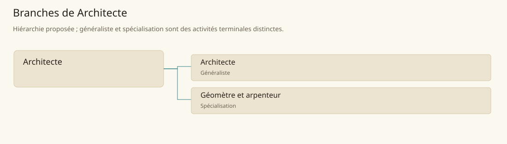

# Architecte

[Accueil](../README.md) · [Arbre des métiers](../arbre-metiers.md)

Concevoir des bâtiments implantés correctement et constructibles avec les ressources locales.

**Métier de base proposé.** Cette famille rassemble les disciplines communes de ses branches ; elle n’ajoute pas une profession à chaque personne. Un généraliste est une feuille précise, distincte de la somme statistique de la base.

## Fonctions

- Recueillir usages, site et contraintes du commanditaire
- Définir plans, volumes, accès et solutions constructives
- Coordonner relevés, estimation et échanges avec le chantier

## Compétences nécessaires proposées

| Savoir-faire proposé | À quoi il sert | Acquisition |
|---|---|---|
| Relevé du site | Traduire terrain et bâtiments existants en documents utilisables | Mesurer des sites puis confronter les relevés |
| Conception des circulations | Organiser accès des habitants, biens et secours | Comparer plans et usages observés |
| Lecture constructive | Choisir une structure compatible avec matériaux et portées | Étudier des ouvrages avec artisans et maquettes |
| Coordination technique | Résoudre raccords entre corps de métier | Suivre un chantier et annoter les difficultés |

P : enseignement du dessin et des mesures, observation de chantiers puis projet supervisé.

## Outils et chaînes de travail

Plans, Règles, Équerres, Instruments de relevé, Maquettes.

- Arpenteurs
- Maçons et charpentiers
- Fournisseurs de matériaux
- Autorités d’implantation et commanditaires

## Arbre de cette famille

| Branche | Nature | Fonction distinctive |
|---|---|---|
| [Architecte](../Specialisations/architecture/architecte.md) | Généraliste | Le généraliste conçoit un ouvrage déterminé ; la base architecture articule aussi implantation et mesure du terrain. |
| [Géomètre et arpenteur](../Specialisations/architecture/arpenteur.md) | Spécialisation | Il fournit les repères mesurés ; il ne transforme pas à lui seul une limite observée en droit de propriété. |

## Implantation et parts de population

Les deux colonnes changent de dénominateur. Les effectifs régionaux proposés servent à dimensionner les filières ; ils ne prouvent pas une compétence individuelle. Les valeurs relatives ne donnent aucun effectif absolu.

| Région | % des habitants | % des actifs | Portée |
|---|---|---|---|
| [Empire central](../Regions/empire.md) | 0,101 % | 0,157 % | proportion proposée |
| [République des Freelands](../Regions/freelands.md) | 0,139 % | 0,217 % | proportion proposée |
| [Ben’net impérial](../Regions/bennet.md) | 0,065 % | 0,097 % | proportion proposée |
| [Royaume de Kolbjörn](../Regions/kolbjorn.md) | 0,052 % | 0,078 % | proportion proposée |
| [Magocratie de Mage Tower](../Regions/magocracy.md) | 0,041 % | 0,061 % | proportion proposée |
| [Seashores](../Regions/seashores.md) | 0,116 % | 0,176 % | proportion proposée |
| [Forêt de Sindile](../Regions/sindile.md) | 0,029 % | 0,044 % | proportion proposée |
| [Domaines stravians](../Regions/stravian.md) | 0,040 % | 0,061 % | proportion proposée |
| [Îles des Tempêtes](../Regions/storm.md) | 0,032 % | 0,045 % | proportion proposée |
| [Cités de Taii’Maku](../Regions/taiimaku.md) | 0,756 % | 1,735 % | proportion proposée |
| [Théocratie de Kepesh](../Regions/kepesh.md) | 0,071 % | 0,106 % | proportion proposée |
| [Tsvetan](../Regions/tsvetan.md) | 0,092 % | 0,137 % | proportion proposée |
| [Yama](../Regions/yama.md) | 0,030 % | 0,044 % | proportion proposée |
| [Undertanares](../Regions/undertanares.md) | 0,163 % | 0,255 % | scénario relatif |
| [Darkall](../Regions/darkall.md) | 0,245 % | 0,372 % | scénario relatif |
| [Mystical et Wasteland](../Regions/mystical.md) | non applicable | non applicable | absence de dénominateur civil |

## Choix et sources

Références des feuilles conservées : MJ128, SB174. Elles appuient activités, outillage ou contexte des filières selon le classement du modèle. Cette base et son regroupement sont une hiérarchie P ; les fonctions, savoir-faire, outils détaillés et apprentissages ci-dessous sont des propositions P, sans bonus chiffré ni certification par les sources.

La parenté entre branches et les savoir-faire de cette fiche sont des propositions de conception. Appui des activités : [Manuel des Joueurs p. 128](../Sources/mj.md#p-128), [Tanares Sourcebook p. 174](../Sources/sb.md#p-174).
