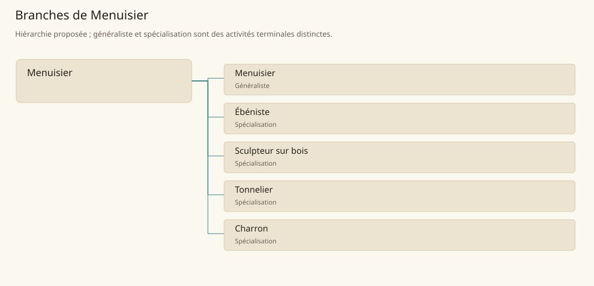

# Menuisier

[Accueil](../README.md) · [Arbre des métiers](../arbre-metiers.md)

Transformer du bois préparé en ouvrages mobiliers, récipients, pièces sculptées et véhicules.

**Métier de base proposé.** Cette famille rassemble les disciplines communes de ses branches ; elle n’ajoute pas une profession à chaque personne. Un généraliste est une feuille précise, distincte de la somme statistique de la base.

## Fonctions

- Affecter les essences et pièces de bois aux ouvrages
- Coordonner débit, séchage, façonnage et assemblage
- Contrôler la tenue des ouvrages et organiser leurs réparations

## Compétences nécessaires proposées

| Savoir-faire proposé | À quoi il sert | Acquisition |
|---|---|---|
| Lecture du fil | Orienter les pièces pour limiter fendage et déformation | Fendre et raboter des chutes commentées |
| Traçage des assemblages | Préparer des raccords reproductibles | Tracer puis ajuster tenons et mortaises d’exercice |
| Choix du séchage | Écarter les bois trop humides pour une commande | Suivre des lots entreposés et leurs déformations |
| Diagnostic des structures en bois | Identifier la pièce responsable d’un jeu ou d’une rupture | Démonter et réparer des ouvrages usagés |

P : atelier progressif sur bois préparé, assemblages d’essai puis ouvrages contrôlés.

## Outils et chaînes de travail

Scies, Rabots, Ciseaux à bois, Établis, Gabarits.

- Bûcherons et scieries
- Forgerons pour outils et ferrures
- Transport terrestre
- Clients des mobiliers et récipients

## Arbre de cette famille

| Branche | Nature | Fonction distinctive |
|---|---|---|
| [Menuisier](../Specialisations/bois/menuisier.md) | Généraliste | Le généraliste fournit des ouvrages courants ; la base bois regroupe aussi tonneaux, sculptures et véhicules. |
| [Ébéniste](../Specialisations/bois/ebeniste.md) | Spécialisation | Il se concentre sur précision et décor du mobilier ; le matériau précieux ne garantit aucun enchantement. |
| [Sculpteur sur bois](../Specialisations/bois/sculpteur-bois.md) | Spécialisation | Il réalise des formes et décors ; la construction du meuble porteur reste une autre opération. |
| [Tonnelier](../Specialisations/bois/tonnelier.md) | Spécialisation | Sa spécialité est le récipient cerclé, pas toute la menuiserie ni la préparation du contenu. |
| [Charron](../Specialisations/bois/charron.md) | Spécialisation | Il fabrique le véhicule ; le charretier conduit l’attelage et organise sa route. |

## Implantation et parts de population

Les deux colonnes changent de dénominateur. Les effectifs régionaux proposés servent à dimensionner les filières ; ils ne prouvent pas une compétence individuelle. Les valeurs relatives ne donnent aucun effectif absolu.

| Région | % des habitants | % des actifs | Portée |
|---|---|---|---|
| [Empire central](../Regions/empire.md) | 1,224 % | 1,898 % | proportion proposée |
| [République des Freelands](../Regions/freelands.md) | 1,235 % | 1,926 % | proportion proposée |
| [Ben’net impérial](../Regions/bennet.md) | 0,780 % | 1,160 % | proportion proposée |
| [Royaume de Kolbjörn](../Regions/kolbjorn.md) | 1,056 % | 1,582 % | proportion proposée |
| [Magocratie de Mage Tower](../Regions/magocracy.md) | 1,617 % | 2,444 % | proportion proposée |
| [Seashores](../Regions/seashores.md) | 1,135 % | 1,715 % | proportion proposée |
| [Forêt de Sindile](../Regions/sindile.md) | 3,347 % | 4,980 % | proportion proposée |
| [Domaines stravians](../Regions/stravian.md) | 1,003 % | 1,514 % | proportion proposée |
| [Îles des Tempêtes](../Regions/storm.md) | 1,200 % | 1,667 % | proportion proposée |
| [Cités de Taii’Maku](../Regions/taiimaku.md) | 0,896 % | 2,057 % | proportion proposée |
| [Théocratie de Kepesh](../Regions/kepesh.md) | 1,134 % | 1,696 % | proportion proposée |
| [Tsvetan](../Regions/tsvetan.md) | 0,853 % | 1,276 % | proportion proposée |
| [Yama](../Regions/yama.md) | 1,175 % | 1,763 % | proportion proposée |
| [Undertanares](../Regions/undertanares.md) | 0,882 % | 1,377 % | scénario relatif |
| [Darkall](../Regions/darkall.md) | 1,139 % | 1,725 % | scénario relatif |
| [Mystical et Wasteland](../Regions/mystical.md) | non applicable | non applicable | absence de dénominateur civil |

## Choix et sources

Références des feuilles conservées : MJ128, SB152. Elles appuient activités, outillage ou contexte des filières selon le classement du modèle. Cette base et son regroupement sont une hiérarchie P ; les fonctions, savoir-faire, outils détaillés et apprentissages ci-dessous sont des propositions P, sans bonus chiffré ni certification par les sources.

La parenté entre branches et les savoir-faire de cette fiche sont des propositions de conception. Appui des activités : [Manuel des Joueurs p. 128](../Sources/mj.md#p-128), [Tanares Sourcebook p. 152](../Sources/sb.md#p-152).
