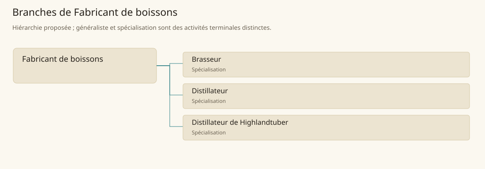

# Fabricant de boissons

[Accueil](../README.md) · [Arbre des métiers](../arbre-metiers.md)

Transformer des matières végétales en boissons en maîtrisant les étapes propres au produit.

**Métier de base proposé.** Cette famille rassemble les disciplines communes de ses branches ; elle n’ajoute pas une profession à chaque personne. Un généraliste est une feuille précise, distincte de la somme statistique de la base.

## Fonctions

- Préparer et identifier les matières et les récipients
- Conduire la transformation et en surveiller l’évolution
- Séparer, conditionner et classer les boissons produites

## Compétences nécessaires proposées

| Savoir-faire proposé | À quoi il sert | Acquisition |
|---|---|---|
| Préparation des matières | Préparer et identifier les matières et les récipients | Parcours proposé : Préparer des lots de matières différentes |
| Suivi de transformation | Conduire la transformation et en surveiller l’évolution | Parcours proposé : Tenir un carnet de lot avec un praticien |
| Contrôle des lots | Séparer, conditionner et classer les boissons produites | Parcours proposé : Comparer des échantillons identifiés par le maître |
| Organisation de cave | Planifier cuves, contenants et nettoyage sans mélanger les lots. | Parcours proposé : Planifier récipients disponibles et nettoyage |

Parcours proposé : Apprendre la filière avec un fabricant expérimenté ; brasserie et distillation ne sont pas interchangeables.

## Outils et chaînes de travail

Cuves, Récipients de mesure, Filtres, Matériel de chauffe adapté.

- Cultures et eau
- Contenants et combustible
- Négoce et usages locaux

## Arbre de cette famille

| Branche | Nature | Fonction distinctive |
|---|---|---|
| [Brasseur](../Specialisations/boissons/brasseur.md) | Spécialisation | Le brasseur conduit la fermentation ; il ne maîtrise pas automatiquement la distillation. |
| [Distillateur](../Specialisations/boissons/distillateur.md) | Spécialisation | La distillation est distincte de la fermentation qui fournit la matière de départ. |
| [Distillateur de Highlandtuber](../Specialisations/boissons/highlandtuber.md) | Spécialisation | La tradition et la réputation sont sourcées ; le titre n’ajoute ni puissance ni rendement au distillateur. |

## Implantation et parts de population

Les deux colonnes changent de dénominateur. Les effectifs régionaux proposés servent à dimensionner les filières ; ils ne prouvent pas une compétence individuelle. Les valeurs relatives ne donnent aucun effectif absolu.

| Région | % des habitants | % des actifs | Portée |
|---|---|---|---|
| [Empire central](../Regions/empire.md) | 0,206 % | 0,320 % | proportion proposée |
| [République des Freelands](../Regions/freelands.md) | 0,220 % | 0,343 % | proportion proposée |
| [Ben’net impérial](../Regions/bennet.md) | 1,836 % | 2,731 % | proportion proposée |
| [Royaume de Kolbjörn](../Regions/kolbjorn.md) | 0,195 % | 0,292 % | proportion proposée |
| [Magocratie de Mage Tower](../Regions/magocracy.md) | 0,299 % | 0,451 % | proportion proposée |
| [Seashores](../Regions/seashores.md) | 0,210 % | 0,317 % | proportion proposée |
| [Forêt de Sindile](../Regions/sindile.md) | 0,172 % | 0,256 % | proportion proposée |
| [Domaines stravians](../Regions/stravian.md) | 0,185 % | 0,280 % | proportion proposée |
| [Îles des Tempêtes](../Regions/storm.md) | 0,222 % | 0,308 % | proportion proposée |
| [Cités de Taii’Maku](../Regions/taiimaku.md) | 0,165 % | 0,380 % | proportion proposée |
| [Théocratie de Kepesh](../Regions/kepesh.md) | 0,209 % | 0,313 % | proportion proposée |
| [Tsvetan](../Regions/tsvetan.md) | 0,157 % | 0,236 % | proportion proposée |
| [Yama](../Regions/yama.md) | 0,325 % | 0,488 % | proportion proposée |
| [Undertanares](../Regions/undertanares.md) | 0,163 % | 0,254 % | scénario relatif |
| [Darkall](../Regions/darkall.md) | 0,210 % | 0,319 % | scénario relatif |
| [Mystical et Wasteland](../Regions/mystical.md) | non applicable | non applicable | absence de dénominateur civil |

## Choix et sources

Références du registre de base : MJ128, SB120, SB121. Leur portée concerne les activités, ressources et contextes des feuilles rattachées ; le regroupement en base, les fonctions détaillées, outils, compétences et formations sont proposés P, sans bonus ni nouvelle statistique.

La parenté entre branches et les savoir-faire de cette fiche sont des propositions de conception. Appui des activités : [Manuel des Joueurs p. 128](../Sources/mj.md#p-128), [Tanares Sourcebook p. 120](../Sources/sb.md#p-120), [Tanares Sourcebook p. 121](../Sources/sb.md#p-121).
