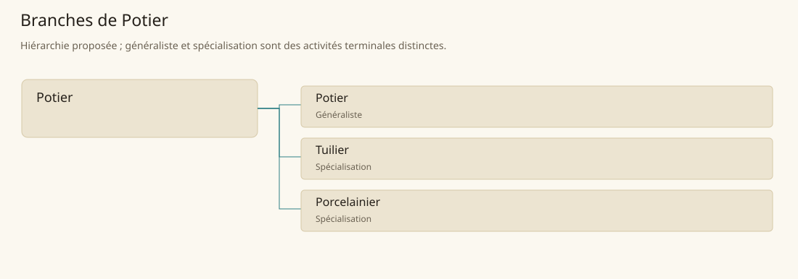

# Potier

[Accueil](../README.md) · [Arbre des métiers](../arbre-metiers.md)

Transformer les argiles en récipients et éléments bâtis adaptés à leurs usages.

**Métier de base proposé.** Cette famille rassemble les disciplines communes de ses branches ; elle n’ajoute pas une profession à chaque personne. Un généraliste est une feuille précise, distincte de la somme statistique de la base.

## Fonctions

- Préparer pâtes, formes et traitements de surface
- Organiser séchage, chargement et cuisson
- Trier défauts et affecter les produits aux usages compatibles

## Compétences nécessaires proposées

| Savoir-faire proposé | À quoi il sert | Acquisition |
|---|---|---|
| Reconnaissance des pâtes | Distinguer plasticité, grains et impuretés | Préparer des échantillons d’argiles |
| Gestion du retrait | Prévoir dimensions après séchage et cuisson | Mesurer une série d’essais |
| Lecture de cuisson | Identifier sous-cuisson, déformation ou choc thermique | Comparer des tessons de lots suivis |
| Contrôle d’usage | Vérifier forme, étanchéité et tenue du produit | Essayer récipients et éléments de couverture |

P : apprentissage du façonnage avant conduite autonome d’un four, en conservant des témoins de chaque cuisson.

## Outils et chaînes de travail

Tours ou moules, Cuves de préparation, Fours, Gabarits, Tessons d’essai.

- Extracteurs d’argile
- Eau
- Combustibles
- Maçons, couvreurs et clients des récipients

## Arbre de cette famille

| Branche | Nature | Fonction distinctive |
|---|---|---|
| [Potier](../Specialisations/ceramique/potier.md) | Généraliste | Feuille généraliste du récipient courant ; la base céramique comprend aussi couverture bâtie et pâtes fines. |
| [Tuilier](../Specialisations/ceramique/tuilier.md) | Spécialisation | Il fabrique les éléments de toiture ; le couvreur les pose et traite les raccords du bâtiment. |
| [Porcelainier](../Specialisations/ceramique/porcelainier.md) | Spécialisation | Cette spécialité de pâte fine est déduite dans le catalogue ; aucune recette ou température canonique n’est inventée. |

## Implantation et parts de population

Les deux colonnes changent de dénominateur. Les effectifs régionaux proposés servent à dimensionner les filières ; ils ne prouvent pas une compétence individuelle. Les valeurs relatives ne donnent aucun effectif absolu.

| Région | % des habitants | % des actifs | Portée |
|---|---|---|---|
| [Empire central](../Regions/empire.md) | 0,387 % | 0,600 % | proportion proposée |
| [République des Freelands](../Regions/freelands.md) | 0,412 % | 0,643 % | proportion proposée |
| [Ben’net impérial](../Regions/bennet.md) | 0,270 % | 0,401 % | proportion proposée |
| [Royaume de Kolbjörn](../Regions/kolbjorn.md) | 0,365 % | 0,548 % | proportion proposée |
| [Magocratie de Mage Tower](../Regions/magocracy.md) | 0,560 % | 0,846 % | proportion proposée |
| [Seashores](../Regions/seashores.md) | 0,393 % | 0,594 % | proportion proposée |
| [Forêt de Sindile](../Regions/sindile.md) | 0,323 % | 0,480 % | proportion proposée |
| [Domaines stravians](../Regions/stravian.md) | 0,347 % | 0,524 % | proportion proposée |
| [Îles des Tempêtes](../Regions/storm.md) | 0,416 % | 0,577 % | proportion proposée |
| [Cités de Taii’Maku](../Regions/taiimaku.md) | 0,310 % | 0,712 % | proportion proposée |
| [Théocratie de Kepesh](../Regions/kepesh.md) | 0,893 % | 1,334 % | proportion proposée |
| [Tsvetan](../Regions/tsvetan.md) | 0,295 % | 0,442 % | proportion proposée |
| [Yama](../Regions/yama.md) | 0,407 % | 0,610 % | proportion proposée |
| [Undertanares](../Regions/undertanares.md) | 0,305 % | 0,477 % | scénario relatif |
| [Darkall](../Regions/darkall.md) | 0,394 % | 0,597 % | scénario relatif |
| [Mystical et Wasteland](../Regions/mystical.md) | non applicable | non applicable | absence de dénominateur civil |

## Choix et sources

Références des feuilles conservées : MJ128, SB200. Elles appuient activités, outillage ou contexte des filières selon le classement du modèle. Cette base et son regroupement sont une hiérarchie P ; les fonctions, savoir-faire, outils détaillés et apprentissages ci-dessous sont des propositions P, sans bonus chiffré ni certification par les sources.

La parenté entre branches et les savoir-faire de cette fiche sont des propositions de conception. Appui des activités : [Manuel des Joueurs p. 128](../Sources/mj.md#p-128), [Tanares Sourcebook p. 200](../Sources/sb.md#p-200).
