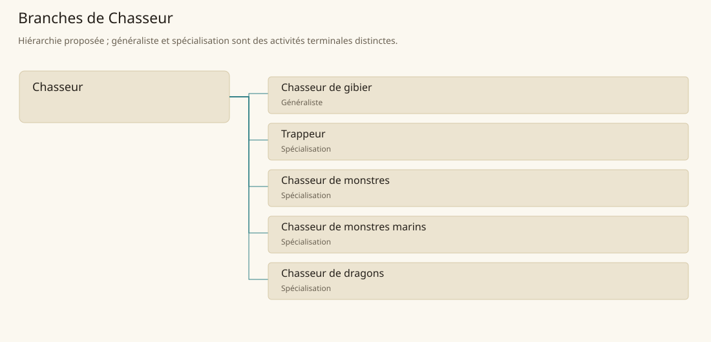

# Chasseur

[Accueil](../README.md) · [Arbre des métiers](../arbre-metiers.md)

Prélever des animaux ciblés en limitant les pertes et les risques pour les chasseurs et leurs voisins.

**Métier de base proposé.** Cette famille rassemble les disciplines communes de ses branches ; elle n’ajoute pas une profession à chaque personne. Un généraliste est une feuille précise, distincte de la somme statistique de la base.

## Fonctions

- Identifier traces, passages et habitudes de la proie
- Préparer l’approche, la capture ou l’abattage collectif
- Récupérer la dépouille et rendre compte du prélèvement

## Compétences nécessaires proposées

| Savoir-faire proposé | À quoi il sert | Acquisition |
|---|---|---|
| Pistage | Identifier traces, passages et habitudes de la proie | Parcours proposé : Comparer des traces avec celles d’animaux observés |
| Approche et interception | Préparer l’approche, la capture ou l’abattage collectif | Parcours proposé : Répéter une approche sans tirer sur une cible vivante |
| Valorisation de la dépouille | Récupérer la dépouille et rendre compte du prélèvement | Parcours proposé : Préparer une dépouille sous contrôle |
| Organisation d’expédition | Préparer itinéraire, rôles, repli et remise de la dépouille. | Parcours proposé : Préparer un itinéraire et une répartition des rôles |

Parcours proposé : Commencer par observation et assistance ; les proies dangereuses exigent ensuite un entraînement collectif spécialisé.

## Outils et chaînes de travail

Arme de chasse adaptée, Matériel de capture autorisé, Cordages, Sac de terrain.

- Droits de chasse
- Renseignement de terrain
- Transport et conservation

## Arbre de cette famille

| Branche | Nature | Fonction distinctive |
|---|---|---|
| [Chasseur de gibier](../Specialisations/chasse/chasse.md) | Généraliste | La base réunit toutes les chasses ; cette feuille généraliste vise le gibier ordinaire, sans expertise contre les monstres. |
| [Trappeur](../Specialisations/chasse/trappeur.md) | Spécialisation | La capture indirecte et le relevé des dispositifs le distinguent de la chasse à l’approche. |
| [Chasseur de monstres](../Specialisations/chasse/chasseur-monstres.md) | Spécialisation | Profession distincte d’un niveau ou d’une classe ; aucune puissance de combat ne découle du titre. |
| [Chasseur de monstres marins](../Specialisations/chasse/chasseur-marin.md) | Spécialisation | La chasse en mer demande une équipe ; elle ne remplace pas le métier principal des marins du navire. |
| [Chasseur de dragons](../Specialisations/chasse/chasseur-dragons.md) | Spécialisation | Spécialité d’expédition ; les sites Heroes Rise et Umay ne rendent pas tous leurs habitants chasseurs. |

## Implantation et parts de population

Les deux colonnes changent de dénominateur. Les effectifs régionaux proposés servent à dimensionner les filières ; ils ne prouvent pas une compétence individuelle. Les valeurs relatives ne donnent aucun effectif absolu.

| Région | % des habitants | % des actifs | Portée |
|---|---|---|---|
| [Empire central](../Regions/empire.md) | 0,724 % | 1,123 % | proportion proposée |
| [République des Freelands](../Regions/freelands.md) | 0,363 % | 0,566 % | proportion proposée |
| [Ben’net impérial](../Regions/bennet.md) | 0,098 % | 0,146 % | proportion proposée |
| [Royaume de Kolbjörn](../Regions/kolbjorn.md) | 0,144 % | 0,215 % | proportion proposée |
| [Magocratie de Mage Tower](../Regions/magocracy.md) | 0,786 % | 1,188 % | proportion proposée |
| [Seashores](../Regions/seashores.md) | 0,009 % | 0,014 % | proportion proposée |
| [Forêt de Sindile](../Regions/sindile.md) | 0,001 % | 0,001 % | proportion proposée |
| [Domaines stravians](../Regions/stravian.md) | 0,131 % | 0,197 % | proportion proposée |
| [Îles des Tempêtes](../Regions/storm.md) | 0,114 % | 0,158 % | proportion proposée |
| [Cités de Taii’Maku](../Regions/taiimaku.md) | 0,177 % | 0,406 % | proportion proposée |
| [Théocratie de Kepesh](../Regions/kepesh.md) | 0,020 % | 0,030 % | proportion proposée |
| [Tsvetan](../Regions/tsvetan.md) | 0,307 % | 0,458 % | proportion proposée |
| [Yama](../Regions/yama.md) | 0,005 % | 0,008 % | proportion proposée |
| [Undertanares](../Regions/undertanares.md) | 13,019 % | 20,315 % | scénario relatif |
| [Darkall](../Regions/darkall.md) | 1,931 % | 2,926 % | scénario relatif |
| [Mystical et Wasteland](../Regions/mystical.md) | non applicable | non applicable | absence de dénominateur civil |

## Choix et sources

Références du registre de base : MJ139, PG20, MJ140, PG58, SB148, SB220. Leur portée concerne les activités, ressources et contextes des feuilles rattachées ; le regroupement en base, les fonctions détaillées, outils, compétences et formations sont proposés P, sans bonus ni nouvelle statistique.

La parenté entre branches et les savoir-faire de cette fiche sont des propositions de conception. Appui des activités : [Manuel des Joueurs p. 139](../Sources/mj.md#p-139), [Manuel des Joueurs p. 140](../Sources/mj.md#p-140), [Player’s Guide to Tanares p. 20](../Sources/pg.md#p-20), [Player’s Guide to Tanares p. 58](../Sources/pg.md#p-58), [Tanares Sourcebook p. 148](../Sources/sb.md#p-148), [Tanares Sourcebook p. 220](../Sources/sb.md#p-220).
