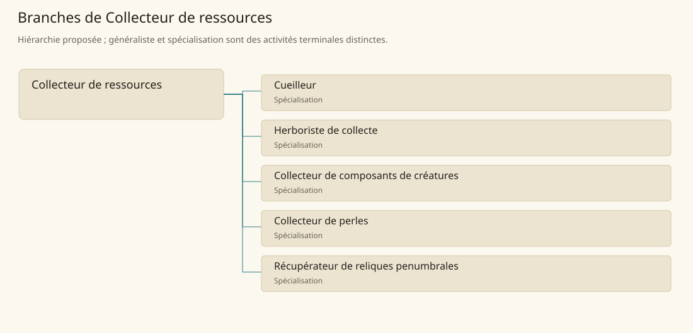

# Collecteur de ressources

[Accueil](../README.md) · [Arbre des métiers](../arbre-metiers.md)

Récupérer des matières dispersées en assurant leur identification, leur provenance et leur état.

**Métier de base proposé.** Cette famille rassemble les disciplines communes de ses branches ; elle n’ajoute pas une profession à chaque personne. Un généraliste est une feuille précise, distincte de la somme statistique de la base.

## Fonctions

- Repérer les ressources et distinguer matières utiles et indésirables
- Prélever sans détruire inutilement le gisement vivant ou le site
- Trier, conserver et remettre les lots avec leur provenance

## Compétences nécessaires proposées

| Savoir-faire proposé | À quoi il sert | Acquisition |
|---|---|---|
| Identification de ressource | Repérer les ressources et distinguer matières utiles et indésirables | Parcours proposé : Constituer une collection de référence validée |
| Prélèvement | Prélever sans détruire inutilement le gisement vivant ou le site | Parcours proposé : Comparer des prélèvements sur une zone d’essai |
| Tri et traçabilité | Trier, conserver et remettre les lots avec leur provenance | Parcours proposé : Étiqueter des lots semblables issus de sites différents |
| Organisation de tournée | Organiser la tournée selon accès, maturité et besoins des commanditaires. | Parcours proposé : Planifier la tournée selon accès et besoin client |

Parcours proposé : Collecter d’abord avec un connaisseur, puis faire contrôler systématiquement les lots avant remise.

## Outils et chaînes de travail

Paniers, Petits outils de prélèvement, Contenants séparés, Étiquettes et carnet.

- Accès aux sites
- Connaissance des dangers
- Acheteurs et conservation

## Arbre de cette famille

| Branche | Nature | Fonction distinctive |
|---|---|---|
| [Cueilleur](../Specialisations/collecte/cueilleur.md) | Spécialisation | Il prélève une ressource dispersée ; cultiver et transformer restent distincts. |
| [Herboriste de collecte](../Specialisations/collecte/herboriste.md) | Spécialisation | L’herboriste de collecte fournit les plantes ; l’apothicaire prépare des produits. |
| [Collecteur de composants de créatures](../Specialisations/collecte/composants.md) | Spécialisation | Collecter ne donne ni compétence de chasse ni connaissance de tous les effets des créatures. |
| [Collecteur de perles](../Specialisations/collecte/perles.md) | Spécialisation | Le commerce soutient cette feuille déduite ; collecte, vente et joaillerie restent distinctes. |
| [Récupérateur de reliques penumbrales](../Specialisations/collecte/collecteur-penumbral.md) | Spécialisation | Récupérer une relique est distinct de l’expertise magique et de la chasse pénombrale. |

## Implantation et parts de population

Les deux colonnes changent de dénominateur. Les effectifs régionaux proposés servent à dimensionner les filières ; ils ne prouvent pas une compétence individuelle. Les valeurs relatives ne donnent aucun effectif absolu.

| Région | % des habitants | % des actifs | Portée |
|---|---|---|---|
| [Empire central](../Regions/empire.md) | 1,750 % | 2,713 % | proportion proposée |
| [République des Freelands](../Regions/freelands.md) | 1,420 % | 2,215 % | proportion proposée |
| [Ben’net impérial](../Regions/bennet.md) | 0,948 % | 1,410 % | proportion proposée |
| [Royaume de Kolbjörn](../Regions/kolbjorn.md) | 1,166 % | 1,747 % | proportion proposée |
| [Magocratie de Mage Tower](../Regions/magocracy.md) | 1,670 % | 2,524 % | proportion proposée |
| [Seashores](../Regions/seashores.md) | 0,902 % | 1,362 % | proportion proposée |
| [Forêt de Sindile](../Regions/sindile.md) | 12,987 % | 19,326 % | proportion proposée |
| [Domaines stravians](../Regions/stravian.md) | 0,647 % | 0,977 % | proportion proposée |
| [Îles des Tempêtes](../Regions/storm.md) | 0,537 % | 0,746 % | proportion proposée |
| [Cités de Taii’Maku](../Regions/taiimaku.md) | 0,507 % | 1,163 % | proportion proposée |
| [Théocratie de Kepesh](../Regions/kepesh.md) | 0,267 % | 0,400 % | proportion proposée |
| [Tsvetan](../Regions/tsvetan.md) | 1,163 % | 1,739 % | proportion proposée |
| [Yama](../Regions/yama.md) | 0,811 % | 1,217 % | proportion proposée |
| [Undertanares](../Regions/undertanares.md) | 2,597 % | 4,052 % | scénario relatif |
| [Darkall](../Regions/darkall.md) | 1,383 % | 2,095 % | scénario relatif |
| [Mystical et Wasteland](../Regions/mystical.md) | non applicable | non applicable | absence de dénominateur civil |

## Choix et sources

Références du registre de base : MJ139, SB153, BR55, SB104, SB139, SB149, PG8. Leur portée concerne les activités, ressources et contextes des feuilles rattachées ; le regroupement en base, les fonctions détaillées, outils, compétences et formations sont proposés P, sans bonus ni nouvelle statistique.

La parenté entre branches et les savoir-faire de cette fiche sont des propositions de conception. Appui des activités : [Basic Rules p. 55](../Sources/br.md#p-55), [Manuel des Joueurs p. 139](../Sources/mj.md#p-139), [Player’s Guide to Tanares p. 8](../Sources/pg.md#p-8), [Tanares Sourcebook p. 104](../Sources/sb.md#p-104), [Tanares Sourcebook p. 139](../Sources/sb.md#p-139), [Tanares Sourcebook p. 149](../Sources/sb.md#p-149), [Tanares Sourcebook p. 153](../Sources/sb.md#p-153).
