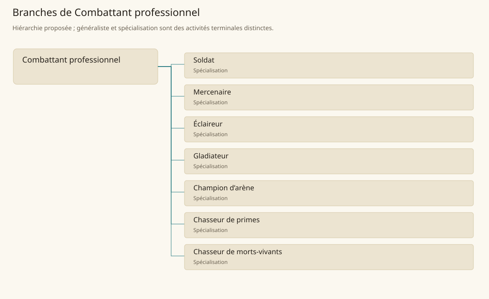

# Combattant professionnel

[Accueil](../README.md) · [Arbre des métiers](../arbre-metiers.md)

Organiser la préparation et l’emploi professionnel de combattants pour une mission définie.

**Métier de base proposé.** Cette famille rassemble les disciplines communes de ses branches ; elle n’ajoute pas une profession à chaque personne. Un généraliste est une feuille précise, distincte de la somme statistique de la base.

## Fonctions

- Vérifier objectif, commandement et conditions d’engagement
- Préparer matériel, entraînement et coordination
- Exécuter la mission et rendre compte de son résultat

## Compétences nécessaires proposées

| Savoir-faire proposé | À quoi il sert | Acquisition |
|---|---|---|
| Maniement d’équipement | Employer correctement le matériel de sa fonction | P : Exercices encadrés |
| Lecture tactique | Relier terrain, objectif et position du groupe | P : Mises en situation |
| Discipline collective | Suivre signaux et ordre de mouvement | P : Entraînement en unité |
| Évaluation de mission | Décrire résultat, perte et besoin de soutien | P : Débriefings avec le responsable |

Entraînement propre à la mission et au groupe ; titres, grades et classes restent distincts du métier.

## Outils et chaînes de travail

Armes adaptées, Protections, Cartes et signaux.

- Forge
- Logistique
- Soins
- Commanditaires et institutions

## Arbre de cette famille

| Branche | Nature | Fonction distinctive |
|---|---|---|
| [Soldat](../Specialisations/combat/soldat.md) | Spécialisation | Le métier militaire ne fixe ni grade, ni classe, ni perte du libre arbitre propre aux Ironhands. |
| [Mercenaire](../Specialisations/combat/mercenaire.md) | Spécialisation | Le contrat structure le travail ; ne présume ni illégalité ni grade militaire. |
| [Éclaireur](../Specialisations/combat/eclaireur.md) | Spécialisation | L’information de terrain prime ; ne se confond pas avec le guide des voyageurs. |
| [Gladiateur](../Specialisations/combat/gladiateur.md) | Spécialisation | Le cadre d’arène distingue la fonction du service militaire. |
| [Champion d’arène](../Specialisations/combat/champion.md) | Spécialisation | Fonction professionnelle proposée à partir du rôle attesté ; champion n’est ni niveau ni titre automatique. |
| [Chasseur de primes](../Specialisations/combat/chasseur-primes.md) | Spécialisation | La prime ne donne pas autorité universelle et ne présume pas la mort de la personne recherchée. |
| [Chasseur de morts-vivants](../Specialisations/combat/chasseur-undead.md) | Spécialisation | Spécialité attestée ; n’attribue ni destruction automatique ni pouvoir nouveau contre les morts-vivants. |

## Implantation et parts de population

Les deux colonnes changent de dénominateur. Les effectifs régionaux proposés servent à dimensionner les filières ; ils ne prouvent pas une compétence individuelle. Les valeurs relatives ne donnent aucun effectif absolu.

| Région | % des habitants | % des actifs | Portée |
|---|---|---|---|
| [Empire central](../Regions/empire.md) | 2,093 % | 3,246 % | proportion proposée |
| [République des Freelands](../Regions/freelands.md) | 1,755 % | 2,737 % | proportion proposée |
| [Ben’net impérial](../Regions/bennet.md) | 0,935 % | 1,391 % | proportion proposée |
| [Royaume de Kolbjörn](../Regions/kolbjorn.md) | 1,354 % | 2,030 % | proportion proposée |
| [Magocratie de Mage Tower](../Regions/magocracy.md) | 0,584 % | 0,883 % | proportion proposée |
| [Seashores](../Regions/seashores.md) | 1,033 % | 1,561 % | proportion proposée |
| [Forêt de Sindile](../Regions/sindile.md) | 2,364 % | 3,518 % | proportion proposée |
| [Domaines stravians](../Regions/stravian.md) | 0,723 % | 1,092 % | proportion proposée |
| [Îles des Tempêtes](../Regions/storm.md) | 37,162 % | 51,614 % | proportion proposée |
| [Cités de Taii’Maku](../Regions/taiimaku.md) | 4,146 % | 9,513 % | proportion proposée |
| [Théocratie de Kepesh](../Regions/kepesh.md) | 0,948 % | 1,418 % | proportion proposée |
| [Tsvetan](../Regions/tsvetan.md) | 2,833 % | 4,237 % | proportion proposée |
| [Yama](../Regions/yama.md) | 0,627 % | 0,941 % | proportion proposée |
| [Undertanares](../Regions/undertanares.md) | 2,747 % | 4,287 % | scénario relatif |
| [Darkall](../Regions/darkall.md) | 14,083 % | 21,338 % | scénario relatif |
| [Mystical et Wasteland](../Regions/mystical.md) | non applicable | non applicable | absence de dénominateur civil |

## Choix et sources

P : famille professionnelle, fonctions, compétences, outils et formation proposés. Les sources des feuilles appuient des activités ou contextes précis ; elles ne prouvent ni une organisation générale de cette famille, ni une maîtrise de toutes ses spécialités.

La parenté entre branches et les savoir-faire de cette fiche sont des propositions de conception. Appui des activités : [Manuel des Joueurs p. 130](../Sources/mj.md#p-130), [Manuel des Joueurs p. 140](../Sources/mj.md#p-140), [Tanares Sourcebook p. 210](../Sources/sb.md#p-210), [Tanares Sourcebook p. 90](../Sources/sb.md#p-90).
