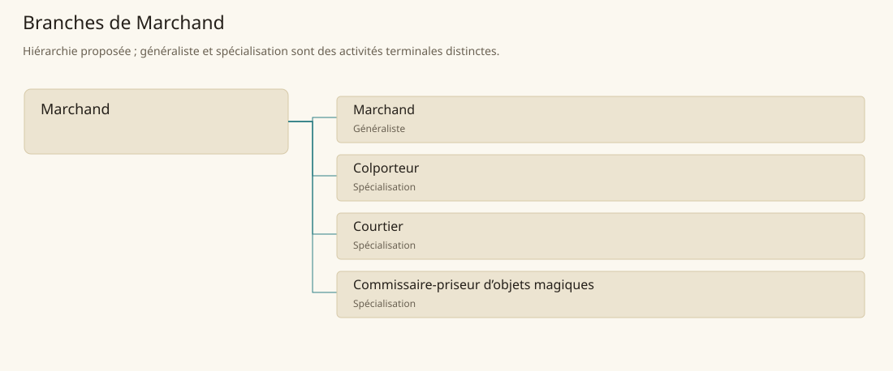

# Marchand

[Accueil](../README.md) · [Arbre des métiers](../arbre-metiers.md)

Mettre en relation production, besoins et circulation des biens dans un cadre de vente.

**Métier de base proposé.** Cette famille rassemble les disciplines communes de ses branches ; elle n’ajoute pas une profession à chaque personne. Un généraliste est une feuille précise, distincte de la somme statistique de la base.

## Fonctions

- Choisir des marchandises et comparer les débouchés
- Préparer conditions de vente et documents de livraison
- Suivre réserves, règlements et engagements envers les clients

## Compétences nécessaires proposées

| Savoir-faire proposé | À quoi il sert | Acquisition |
|---|---|---|
| Évaluation commerciale | Comparer qualité et débouché d’un lot | P : Visites de marchés commentées |
| Négociation | Formuler prix et conditions compréhensibles | P : Jeux de rôle acheteur vendeur |
| Gestion des stocks | Rapprocher entrées, sorties et réserves | P : Inventaires accompagnés |
| Relation clientèle | Écouter le besoin et expliquer les limites du produit | P : Ventes observées puis relues |

Pratique auprès d’un marchand avec achats, inventaires et traitement des réclamations.

## Outils et chaînes de travail

Balances, Échantillons, Livres de commandes.

- Transport
- Finance
- Administration
- Production artisanale

## Arbre de cette famille

| Branche | Nature | Fonction distinctive |
|---|---|---|
| [Marchand](../Specialisations/commerce/marchand.md) | Généraliste | Feuille généraliste d’exploitation d’un commerce ; la base décrit la circulation commerciale au sens large. |
| [Colporteur](../Specialisations/commerce/colporteur.md) | Spécialisation | L’itinérance et le petit chargement structurent le travail. |
| [Courtier](../Specialisations/commerce/courtier.md) | Spécialisation | Travaille par intermédiation plutôt que par revente d’un assortiment détenu. |
| [Commissaire-priseur d’objets magiques](../Specialisations/commerce/priseur.md) | Spécialisation | L’expertise magique et la certification restent des prestations distinctes. |

## Implantation et parts de population

Les deux colonnes changent de dénominateur. Les effectifs régionaux proposés servent à dimensionner les filières ; ils ne prouvent pas une compétence individuelle. Les valeurs relatives ne donnent aucun effectif absolu.

| Région | % des habitants | % des actifs | Portée |
|---|---|---|---|
| [Empire central](../Regions/empire.md) | 2,298 % | 3,563 % | proportion proposée |
| [République des Freelands](../Regions/freelands.md) | 3,074 % | 4,796 % | proportion proposée |
| [Ben’net impérial](../Regions/bennet.md) | 1,102 % | 1,639 % | proportion proposée |
| [Royaume de Kolbjörn](../Regions/kolbjorn.md) | 1,492 % | 2,236 % | proportion proposée |
| [Magocratie de Mage Tower](../Regions/magocracy.md) | 2,263 % | 3,420 % | proportion proposée |
| [Seashores](../Regions/seashores.md) | 2,746 % | 4,150 % | proportion proposée |
| [Forêt de Sindile](../Regions/sindile.md) | 0,933 % | 1,389 % | proportion proposée |
| [Domaines stravians](../Regions/stravian.md) | 1,825 % | 2,756 % | proportion proposée |
| [Îles des Tempêtes](../Regions/storm.md) | 1,780 % | 2,472 % | proportion proposée |
| [Cités de Taii’Maku](../Regions/taiimaku.md) | 1,288 % | 2,955 % | proportion proposée |
| [Théocratie de Kepesh](../Regions/kepesh.md) | 1,978 % | 2,957 % | proportion proposée |
| [Tsvetan](../Regions/tsvetan.md) | 0,878 % | 1,313 % | proportion proposée |
| [Yama](../Regions/yama.md) | 1,744 % | 2,617 % | proportion proposée |
| [Undertanares](../Regions/undertanares.md) | 1,593 % | 2,486 % | scénario relatif |
| [Darkall](../Regions/darkall.md) | 0,653 % | 0,990 % | scénario relatif |
| [Mystical et Wasteland](../Regions/mystical.md) | non applicable | non applicable | absence de dénominateur civil |

## Choix et sources

P : famille professionnelle, fonctions, compétences, outils et formation proposés. Les sources des feuilles appuient des activités ou contextes précis ; elles ne prouvent ni une organisation générale de cette famille, ni une maîtrise de toutes ses spécialités.

La parenté entre branches et les savoir-faire de cette fiche sont des propositions de conception. Appui des activités : [Manuel des Joueurs p. 128](../Sources/mj.md#p-128), [Tanares Sourcebook p. 121](../Sources/sb.md#p-121), [Tanares Sourcebook p. 139](../Sources/sb.md#p-139), [Tanares Sourcebook p. 149](../Sources/sb.md#p-149).
