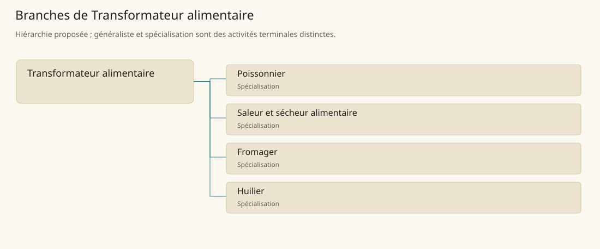

# Transformateur alimentaire

[Accueil](../README.md) · [Arbre des métiers](../arbre-metiers.md)

Transformer des aliments pour prolonger leur usage ou séparer des produits valorisables.

**Métier de base proposé.** Cette famille rassemble les disciplines communes de ses branches ; elle n’ajoute pas une profession à chaque personne. Un généraliste est une feuille précise, distincte de la somme statistique de la base.

## Fonctions

- Recevoir et trier la matière selon sa fraîcheur et son usage
- Conduire salage, séchage, affinage ou extraction selon la filière
- Contrôler, emballer et suivre les lots pendant leur stockage

## Compétences nécessaires proposées

| Savoir-faire proposé | À quoi il sert | Acquisition |
|---|---|---|
| Tri alimentaire | Recevoir et trier la matière selon sa fraîcheur et son usage | Parcours proposé : Comparer des matières avant transformation |
| Conduite de transformation | Conduire salage, séchage, affinage ou extraction selon la filière | Parcours proposé : Suivre un petit lot d’essai de sa préparation à sa sortie |
| Suivi de conservation | Contrôler, emballer et suivre les lots pendant leur stockage | Parcours proposé : Noter les altérations et refuser les lots douteux |
| Organisation des stocks | Ordonner transformation, contrôle et sortie des lots en distinguant procédé et stockage. | Parcours proposé : Classer entrées et sorties sans mélanger les lots |

Parcours proposé : Apprendre une seule filière avant d’élargir les procédés ; chaque produit exige ses propres repères de qualité.

## Outils et chaînes de travail

Balances, Cuves, Claies ou rayonnages, Contenants identifiés.

- Produits agricoles ou aquatiques
- Sel, eau ou combustible
- Stockage et transport

## Arbre de cette famille

| Branche | Nature | Fonction distinctive |
|---|---|---|
| [Poissonnier](../Specialisations/conservation/poissonnier.md) | Spécialisation | Il transforme ou vend les prises ; la capture relève de la pêche et la conservation longue d’une autre feuille. |
| [Saleur et sécheur alimentaire](../Specialisations/conservation/saleur.md) | Spécialisation | La spécialisation réduit la périssabilité ; elle ne remplace ni producteur primaire ni contrôle de qualité. |
| [Fromager](../Specialisations/conservation/fromager.md) | Spécialisation | Il transforme le lait ; traite et élevage ne sont pas de nouvelles personnes ajoutées au même métier. |
| [Huilier](../Specialisations/conservation/huilier.md) | Spécialisation | Le commerce de matières ne prouve pas cette profession canonique ; huile et coproduits sont séparés, sans double compte de matière. |

## Implantation et parts de population

Les deux colonnes changent de dénominateur. Les effectifs régionaux proposés servent à dimensionner les filières ; ils ne prouvent pas une compétence individuelle. Les valeurs relatives ne donnent aucun effectif absolu.

| Région | % des habitants | % des actifs | Portée |
|---|---|---|---|
| [Empire central](../Regions/empire.md) | 0,447 % | 0,693 % | proportion proposée |
| [République des Freelands](../Regions/freelands.md) | 0,476 % | 0,743 % | proportion proposée |
| [Ben’net impérial](../Regions/bennet.md) | 0,624 % | 0,928 % | proportion proposée |
| [Royaume de Kolbjörn](../Regions/kolbjorn.md) | 0,422 % | 0,633 % | proportion proposée |
| [Magocratie de Mage Tower](../Regions/magocracy.md) | 0,647 % | 0,978 % | proportion proposée |
| [Seashores](../Regions/seashores.md) | 0,529 % | 0,799 % | proportion proposée |
| [Forêt de Sindile](../Regions/sindile.md) | 0,373 % | 0,555 % | proportion proposée |
| [Domaines stravians](../Regions/stravian.md) | 0,422 % | 0,637 % | proportion proposée |
| [Îles des Tempêtes](../Regions/storm.md) | 0,480 % | 0,667 % | proportion proposée |
| [Cités de Taii’Maku](../Regions/taiimaku.md) | 0,359 % | 0,823 % | proportion proposée |
| [Théocratie de Kepesh](../Regions/kepesh.md) | 0,454 % | 0,678 % | proportion proposée |
| [Tsvetan](../Regions/tsvetan.md) | 0,354 % | 0,530 % | proportion proposée |
| [Yama](../Regions/yama.md) | 0,470 % | 0,705 % | proportion proposée |
| [Undertanares](../Regions/undertanares.md) | 0,353 % | 0,551 % | scénario relatif |
| [Darkall](../Regions/darkall.md) | 0,455 % | 0,690 % | scénario relatif |
| [Mystical et Wasteland](../Regions/mystical.md) | non applicable | non applicable | absence de dénominateur civil |

## Choix et sources

Références du registre de base : SB120, SB149. Leur portée concerne les activités, ressources et contextes des feuilles rattachées ; le regroupement en base, les fonctions détaillées, outils, compétences et formations sont proposés P, sans bonus ni nouvelle statistique.

La parenté entre branches et les savoir-faire de cette fiche sont des propositions de conception. Appui des activités : [Tanares Sourcebook p. 120](../Sources/sb.md#p-120), [Tanares Sourcebook p. 149](../Sources/sb.md#p-149).
