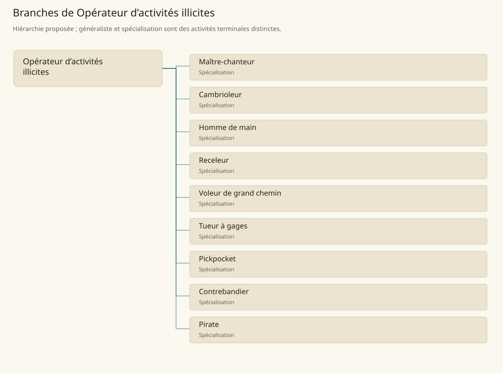

# Opérateur d’activités illicites

[Accueil](../README.md) · [Arbre des métiers](../arbre-metiers.md)

Décrire le travail et les réseaux d’activités illicites présents dans le monde, avec leur contexte social.

**Métier de base proposé.** Cette famille rassemble les disciplines communes de ses branches ; elle n’ajoute pas une profession à chaque personne. Un généraliste est une feuille précise, distincte de la somme statistique de la base.

## Fonctions

- Repérer ressources, contraintes et acteurs de l’activité clandestine
- Coordonner les rôles d’un réseau et la circulation des biens ou informations
- Gérer les suites d’une opération et les conflits du réseau

## Compétences nécessaires proposées

| Savoir-faire proposé | À quoi il sert | Acquisition |
|---|---|---|
| Lecture des rapports de force | Reconnaître les dépendances entre commanditaire et exécutant | P : Observation narrative d’un réseau |
| Discrétion sociale | Distinguer ce qui peut être confié à chaque interlocuteur | P : Apprentissage au contact d’intermédiaires |
| Évaluation des risques | Reconnaître incertitude, dommage et réponse des autorités | P : Retour d’expérience sur affaires |
| Gestion des échanges clandestins | Suivre biens, dettes et engagements internes | P : Participation encadrée dans le contexte fictionnel |

Transmission informelle au sein des réseaux, sans diplôme commun ni progression depuis une classe de personnage.

## Outils et chaînes de travail

Carnets d’engagements, Contenants de transport, Équipement variable selon l’activité.

- Commerce clandestin
- Transport
- Renseignement
- Rapports avec les autorités

## Arbre de cette famille

| Branche | Nature | Fonction distinctive |
|---|---|---|
| [Maître-chanteur](../Specialisations/crime/maitre-chanteur.md) | Spécialisation | L’information compromettante est au centre de l’activité, avec coercition et conséquences sociales. |
| [Cambrioleur](../Specialisations/crime/cambrioleur.md) | Spécialisation | Vol lié aux bâtiments ; ne confère ni invisibilité ni ouverture universelle des serrures. |
| [Homme de main](../Specialisations/crime/homme-main.md) | Spécialisation | Fonction subordonnée variable ; ne présume pas une classe de combattant. |
| [Receleur](../Specialisations/crime/receleur.md) | Spécialisation | La provenance illicite des biens distingue la fonction du commerce ordinaire. |
| [Voleur de grand chemin](../Specialisations/crime/voleur-route.md) | Spécialisation | L’activité vise les voyageurs et transports terrestres, distincte de l’attaque maritime. |
| [Tueur à gages](../Specialisations/crime/tueur-gages.md) | Spécialisation | Décrit un travail criminel dans la fiction ; aucun procédé létal ni pouvoir d’assassinat n’est ajouté. |
| [Pickpocket](../Specialisations/crime/pickpocket.md) | Spécialisation | Vol sur personne, distinct du cambriolage et sans bonus automatique de discrétion. |
| [Contrebandier](../Specialisations/crime/contrebandier.md) | Spécialisation | L’irrégularité de circulation distingue l’activité du transport ordinaire ; règles variables selon le lieu. |
| [Pirate](../Specialisations/crime/pirate.md) | Spécialisation | La piraterie est définie par l’activité illicite ; un marin ou corsaire n’en relève pas automatiquement. |

## Implantation et parts de population

Les deux colonnes changent de dénominateur. Les effectifs régionaux proposés servent à dimensionner les filières ; ils ne prouvent pas une compétence individuelle. Les valeurs relatives ne donnent aucun effectif absolu.

| Région | % des habitants | % des actifs | Portée |
|---|---|---|---|
| [Empire central](../Regions/empire.md) | 0,480 % | 0,745 % | proportion proposée |
| [République des Freelands](../Regions/freelands.md) | 0,424 % | 0,661 % | proportion proposée |
| [Ben’net impérial](../Regions/bennet.md) | 0,023 % | 0,034 % | proportion proposée |
| [Royaume de Kolbjörn](../Regions/kolbjorn.md) | 0,005 % | 0,007 % | proportion proposée |
| [Magocratie de Mage Tower](../Regions/magocracy.md) | 0,000 % | 0,000 % | proportion proposée |
| [Seashores](../Regions/seashores.md) | 0,770 % | 1,164 % | proportion proposée |
| [Forêt de Sindile](../Regions/sindile.md) | 0,000 % | 0,000 % | proportion proposée |
| [Domaines stravians](../Regions/stravian.md) | 0,009 % | 0,014 % | proportion proposée |
| [Îles des Tempêtes](../Regions/storm.md) | 0,000 % | 0,000 % | proportion proposée |
| [Cités de Taii’Maku](../Regions/taiimaku.md) | 0,000 % | 0,000 % | proportion proposée |
| [Théocratie de Kepesh](../Regions/kepesh.md) | 0,000 % | 0,000 % | proportion proposée |
| [Tsvetan](../Regions/tsvetan.md) | 0,117 % | 0,175 % | proportion proposée |
| [Yama](../Regions/yama.md) | 0,000 % | 0,000 % | proportion proposée |
| [Undertanares](../Regions/undertanares.md) | 0,000 % | 0,000 % | scénario relatif |
| [Darkall](../Regions/darkall.md) | 0,000 % | 0,000 % | scénario relatif |
| [Mystical et Wasteland](../Regions/mystical.md) | non applicable | non applicable | absence de dénominateur civil |

## Choix et sources

P : famille professionnelle, fonctions, compétences, outils et formation proposés. Les sources des feuilles appuient des activités ou contextes précis ; elles ne prouvent ni une organisation générale de cette famille, ni une maîtrise de toutes ses spécialités.

La parenté entre branches et les savoir-faire de cette fiche sont des propositions de conception. Appui des activités : [Basic Rules p. 42](../Sources/br.md#p-42), [Manuel des Joueurs p. 136](../Sources/mj.md#p-136).
