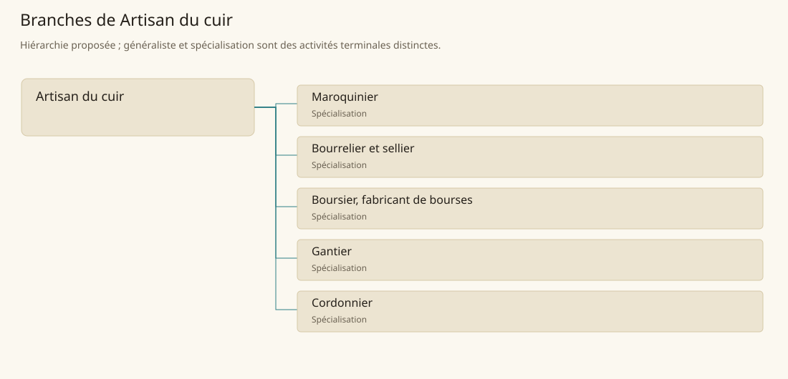

# Artisan du cuir

[Accueil](../README.md) · [Arbre des métiers](../arbre-metiers.md)

Découper, assembler et entretenir des objets en cuir adaptés au corps, au transport ou à la protection d’équipements.

**Métier de base proposé.** Cette famille rassemble les disciplines communes de ses branches ; elle n’ajoute pas une profession à chaque personne. Un généraliste est une feuille précise, distincte de la somme statistique de la base.

## Fonctions

- Choisir et tracer le cuir selon contraintes et dimensions
- Découper puis assembler les pièces avec attaches adaptées
- Essayer, finir et réparer l’objet en contrôlant les zones sollicitées

## Compétences nécessaires proposées

| Savoir-faire proposé | À quoi il sert | Acquisition |
|---|---|---|
| Choix et patronage | Choisir et tracer le cuir selon contraintes et dimensions | Parcours proposé : Tracer plusieurs patrons sur une même peau |
| Coupe et assemblage | Découper puis assembler les pièces avec attaches adaptées | Parcours proposé : Coudre un assemblage d’exercice |
| Essai et réparation | Essayer, finir et réparer l’objet en contrôlant les zones sollicitées | Parcours proposé : Comparer usure et tension sur une pièce d’essai |
| Organisation de fabrication | Préparer patrons, cuir, couture et ferrures pour la commande. | Parcours proposé : Planifier les pièces et ferrures d’une commande |

Parcours proposé : Passer de coutures simples à un objet complet ; chaussure, gant et sellerie ont des exigences propres.

## Outils et chaînes de travail

Alêne, Couteau de coupe, Aiguilles et fil, Gabarits.

- Cuir préparé
- Fils et ferrures
- Mesures et besoins du client

## Arbre de cette famille

| Branche | Nature | Fonction distinctive |
|---|---|---|
| [Maroquinier](../Specialisations/cuir/maroquinier.md) | Spécialisation | C’est une feuille de l’artisanat du cuir ; elle ne maîtrise pas automatiquement chaussure, gant ou sellerie. |
| [Bourrelier et sellier](../Specialisations/cuir/bourrelier.md) | Spécialisation | La selle pour sanglier du contexte stravian soutient la filière ; aucun harnais universel pour toutes montures n’est présumé. |
| [Boursier, fabricant de bourses](../Specialisations/cuir/boursier.md) | Spécialisation | Boursier signifie ici fabricant de bourses en cuir ; il ne désigne ni financier ni bénéficiaire d’une aide. |
| [Gantier](../Specialisations/cuir/gantier.md) | Spécialisation | L’ajustement à la main le distingue du maroquinier ; gant magique et bonus d’action ne sont pas ajoutés. |
| [Cordonnier](../Specialisations/cuir/cordonnier.md) | Spécialisation | Il travaille la chaussure ; tannage de la peau et fabrication des autres objets de cuir restent distincts. |

## Implantation et parts de population

Les deux colonnes changent de dénominateur. Les effectifs régionaux proposés servent à dimensionner les filières ; ils ne prouvent pas une compétence individuelle. Les valeurs relatives ne donnent aucun effectif absolu.

| Région | % des habitants | % des actifs | Portée |
|---|---|---|---|
| [Empire central](../Regions/empire.md) | 0,688 % | 1,067 % | proportion proposée |
| [République des Freelands](../Regions/freelands.md) | 0,732 % | 1,142 % | proportion proposée |
| [Ben’net impérial](../Regions/bennet.md) | 0,480 % | 0,714 % | proportion proposée |
| [Royaume de Kolbjörn](../Regions/kolbjorn.md) | 1,289 % | 1,931 % | proportion proposée |
| [Magocratie de Mage Tower](../Regions/magocracy.md) | 0,995 % | 1,504 % | proportion proposée |
| [Seashores](../Regions/seashores.md) | 0,698 % | 1,055 % | proportion proposée |
| [Forêt de Sindile](../Regions/sindile.md) | 0,573 % | 0,853 % | proportion proposée |
| [Domaines stravians](../Regions/stravian.md) | 0,309 % | 0,466 % | proportion proposée |
| [Îles des Tempêtes](../Regions/storm.md) | 0,739 % | 1,026 % | proportion proposée |
| [Cités de Taii’Maku](../Regions/taiimaku.md) | 0,552 % | 1,266 % | proportion proposée |
| [Théocratie de Kepesh](../Regions/kepesh.md) | 0,698 % | 1,044 % | proportion proposée |
| [Tsvetan](../Regions/tsvetan.md) | 1,050 % | 1,570 % | proportion proposée |
| [Yama](../Regions/yama.md) | 0,723 % | 1,085 % | proportion proposée |
| [Undertanares](../Regions/undertanares.md) | 0,543 % | 0,847 % | scénario relatif |
| [Darkall](../Regions/darkall.md) | 0,701 % | 1,062 % | scénario relatif |
| [Mystical et Wasteland](../Regions/mystical.md) | non applicable | non applicable | absence de dénominateur civil |

## Choix et sources

Références du registre de base : MJ128, SB163. Leur portée concerne les activités, ressources et contextes des feuilles rattachées ; le regroupement en base, les fonctions détaillées, outils, compétences et formations sont proposés P, sans bonus ni nouvelle statistique.

La parenté entre branches et les savoir-faire de cette fiche sont des propositions de conception. Appui des activités : [Manuel des Joueurs p. 128](../Sources/mj.md#p-128), [Tanares Sourcebook p. 163](../Sources/sb.md#p-163).
