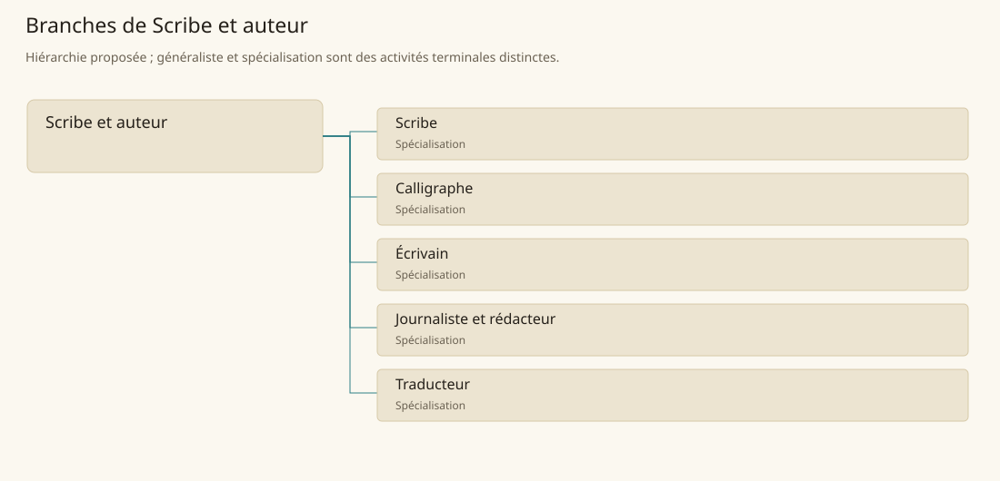

# Scribe et auteur

[Accueil](../README.md) · [Arbre des métiers](../arbre-metiers.md)

Produire et transmettre des textes fiables, adaptés à leur lecteur et à leur usage.

**Métier de base proposé.** Cette famille rassemble les disciplines communes de ses branches ; elle n’ajoute pas une profession à chaque personne. Un généraliste est une feuille précise, distincte de la somme statistique de la base.

## Fonctions

- Recueillir consignes, informations et destinataires
- Composer, copier ou reformuler le texte demandé
- Vérifier versions, lisibilité et conditions de diffusion

## Compétences nécessaires proposées

| Savoir-faire proposé | À quoi il sert | Acquisition |
|---|---|---|
| Rédaction | Structurer une information pour son lecteur | P : Révisions avec un auteur expérimenté |
| Copie exacte | Préserver noms, nombres et passages cités | P : Collation de manuscrits |
| Recherche documentaire | Séparer témoignage, source écrite et invention | P : Constitution de dossiers sourcés |
| Révision | Corriger sans changer le sens demandé | P : Comparaison de versions annotées |

Étude de textes, copie corrigée et commandes rédactionnelles accompagnées.

## Outils et chaînes de travail

Plumes et encres, Supports d’écriture, Lexiques et registres.

- Papier
- Savoir
- Administration
- Commerce

## Arbre de cette famille

| Branche | Nature | Fonction distinctive |
|---|---|---|
| [Scribe](../Specialisations/ecriture/scribe.md) | Spécialisation | La fidélité au texte reçu prime sur la création littéraire. |
| [Calligraphe](../Specialisations/ecriture/calligraphe.md) | Spécialisation | Spécialise la forme graphique du texte plutôt que son contenu. |
| [Écrivain](../Specialisations/ecriture/ecrivain.md) | Spécialisation | Crée le contenu ; ne se réduit pas à la copie d’un acte. |
| [Journaliste et rédacteur](../Specialisations/ecriture/journaliste.md) | Spécialisation | Fonction appuyée par le contexte du Compendium ; aucun réseau de presse général n’est ajouté. |
| [Traducteur](../Specialisations/ecriture/traducteur.md) | Spécialisation | Métier déduit d’un contexte linguistique ; connaître une langue ne prouve pas l’exercice professionnel. |

## Implantation et parts de population

Les deux colonnes changent de dénominateur. Les effectifs régionaux proposés servent à dimensionner les filières ; ils ne prouvent pas une compétence individuelle. Les valeurs relatives ne donnent aucun effectif absolu.

| Région | % des habitants | % des actifs | Portée |
|---|---|---|---|
| [Empire central](../Regions/empire.md) | 0,177 % | 0,275 % | proportion proposée |
| [République des Freelands](../Regions/freelands.md) | 0,328 % | 0,511 % | proportion proposée |
| [Ben’net impérial](../Regions/bennet.md) | 0,194 % | 0,288 % | proportion proposée |
| [Royaume de Kolbjörn](../Regions/kolbjorn.md) | 0,149 % | 0,223 % | proportion proposée |
| [Magocratie de Mage Tower](../Regions/magocracy.md) | 0,142 % | 0,214 % | proportion proposée |
| [Seashores](../Regions/seashores.md) | 0,135 % | 0,204 % | proportion proposée |
| [Forêt de Sindile](../Regions/sindile.md) | 0,126 % | 0,187 % | proportion proposée |
| [Domaines stravians](../Regions/stravian.md) | 0,115 % | 0,174 % | proportion proposée |
| [Îles des Tempêtes](../Regions/storm.md) | 0,399 % | 0,554 % | proportion proposée |
| [Cités de Taii’Maku](../Regions/taiimaku.md) | 0,430 % | 0,986 % | proportion proposée |
| [Théocratie de Kepesh](../Regions/kepesh.md) | 0,143 % | 0,214 % | proportion proposée |
| [Tsvetan](../Regions/tsvetan.md) | 0,247 % | 0,369 % | proportion proposée |
| [Yama](../Regions/yama.md) | 0,258 % | 0,387 % | proportion proposée |
| [Undertanares](../Regions/undertanares.md) | 0,363 % | 0,567 % | scénario relatif |
| [Darkall](../Regions/darkall.md) | 0,401 % | 0,607 % | scénario relatif |
| [Mystical et Wasteland](../Regions/mystical.md) | non applicable | non applicable | absence de dénominateur civil |

## Choix et sources

P : famille professionnelle, fonctions, compétences, outils et formation proposés. Les sources des feuilles appuient des activités ou contextes précis ; elles ne prouvent ni une organisation générale de cette famille, ni une maîtrise de toutes ses spécialités.

La parenté entre branches et les savoir-faire de cette fiche sont des propositions de conception. Appui des activités : [Character Compendium p. 9](../Sources/cc.md#p-9), [Manuel des Joueurs p. 128](../Sources/mj.md#p-128), [Tanares Sourcebook p. 198](../Sources/sb.md#p-198), [Tanares Sourcebook p. 32](../Sources/sb.md#p-32).
