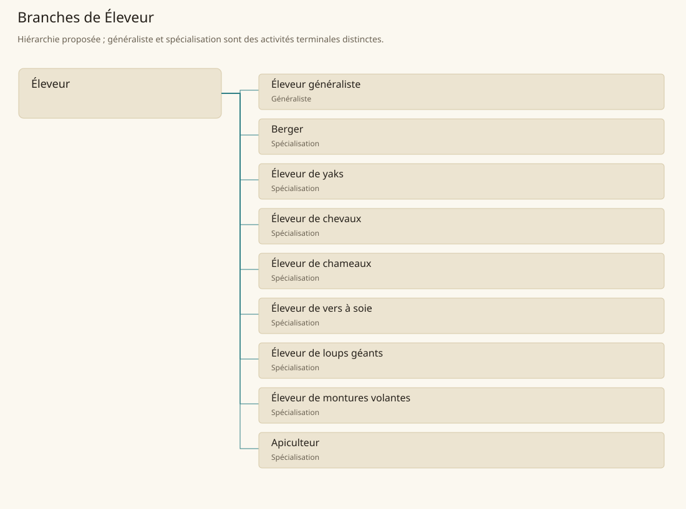

# Éleveur

[Accueil](../README.md) · [Arbre des métiers](../arbre-metiers.md)

Maintenir des populations animales en santé et fournir produits, animaux de travail ou reproducteurs.

**Métier de base proposé.** Cette famille rassemble les disciplines communes de ses branches ; elle n’ajoute pas une profession à chaque personne. Un généraliste est une feuille précise, distincte de la somme statistique de la base.

## Fonctions

- Organiser alimentation, abreuvement et hébergement
- Surveiller comportements, reproduction et état corporel
- Prélever les produits ou préparer le transfert des animaux

## Compétences nécessaires proposées

| Savoir-faire proposé | À quoi il sert | Acquisition |
|---|---|---|
| Observation animale | Organiser alimentation, abreuvement et hébergement | Parcours proposé : Tenir un carnet d’observation de quelques animaux |
| Conduite des lots | Surveiller comportements, reproduction et état corporel | Parcours proposé : Ajuster une ration et les déplacements d’un lot |
| Soins et manipulations | Prélever les produits ou préparer le transfert des animaux | Parcours proposé : Pratiquer contention et premiers gestes sous encadrement |
| Organisation du cheptel | Planifier lots, besoins alimentaires et interventions sans affecter deux fois un animal à des usages incompatibles. | Parcours proposé : Établir le calendrier du troupeau avec les fournisseurs |

Parcours proposé : Apprendre auprès d’un gardien expérimenté avec des animaux calmes avant de prendre en charge un lot.

## Outils et chaînes de travail

Enclos, Mangeoires et abreuvoirs, Matériel de contention adapté, Registre de cheptel.

- Fourrages et eau
- Pâtures ou bâtiments
- Soignants et débouchés

## Arbre de cette famille

| Branche | Nature | Fonction distinctive |
|---|---|---|
| [Éleveur généraliste](../Specialisations/elevage/elevage.md) | Généraliste | La base réunit toutes les espèces ; ce généraliste n’a pas automatiquement l’expertise des animaux rares. |
| [Berger](../Specialisations/elevage/berger.md) | Spécialisation | La conduite ovine le distingue du généraliste ; tondre est une tâche possible, pas un second emploi additionné. |
| [Éleveur de yaks](../Specialisations/elevage/yak.md) | Spécialisation | La conduite des yaks ne se transpose pas sans apprentissage depuis celle des moutons. |
| [Éleveur de chevaux](../Specialisations/elevage/chevaux.md) | Spécialisation | Il fournit des chevaux ; équitation experte et combat monté sont distincts. |
| [Éleveur de chameaux](../Specialisations/elevage/chameaux.md) | Spécialisation | Élever prépare l’animal ; transporter des marchandises relève du transport. |
| [Éleveur de vers à soie](../Specialisations/elevage/sericulture.md) | Spécialisation | Il livre le cocon ; dévidage, tissage et teinture sont des transformations distinctes. |
| [Éleveur de loups géants](../Specialisations/elevage/loups.md) | Spécialisation | Il gère les animaux ; emploi tactique et maîtrise d’un loup sauvage restent distincts. |
| [Éleveur de montures volantes](../Specialisations/elevage/montures-volantes.md) | Spécialisation | Aucune espèce unique ni performance de vol ne découle du titre ; pilote et éleveur sont distincts. |
| [Apiculteur](../Specialisations/elevage/apiculteur.md) | Spécialisation | Feuille proposée depuis le contexte de Sindile, sans filière canonique démontrée. |

## Implantation et parts de population

Les deux colonnes changent de dénominateur. Les effectifs régionaux proposés servent à dimensionner les filières ; ils ne prouvent pas une compétence individuelle. Les valeurs relatives ne donnent aucun effectif absolu.

| Région | % des habitants | % des actifs | Portée |
|---|---|---|---|
| [Empire central](../Regions/empire.md) | 4,126 % | 6,398 % | proportion proposée |
| [République des Freelands](../Regions/freelands.md) | 4,302 % | 6,712 % | proportion proposée |
| [Ben’net impérial](../Regions/bennet.md) | 25,555 % | 38,015 % | proportion proposée |
| [Royaume de Kolbjörn](../Regions/kolbjorn.md) | 8,976 % | 13,453 % | proportion proposée |
| [Magocratie de Mage Tower](../Regions/magocracy.md) | 6,445 % | 9,739 % | proportion proposée |
| [Seashores](../Regions/seashores.md) | 1,346 % | 2,034 % | proportion proposée |
| [Forêt de Sindile](../Regions/sindile.md) | 1,298 % | 1,931 % | proportion proposée |
| [Domaines stravians](../Regions/stravian.md) | 2,680 % | 4,047 % | proportion proposée |
| [Îles des Tempêtes](../Regions/storm.md) | 0,894 % | 1,241 % | proportion proposée |
| [Cités de Taii’Maku](../Regions/taiimaku.md) | 0,781 % | 1,791 % | proportion proposée |
| [Théocratie de Kepesh](../Regions/kepesh.md) | 15,368 % | 22,975 % | proportion proposée |
| [Tsvetan](../Regions/tsvetan.md) | 10,695 % | 15,996 % | proportion proposée |
| [Yama](../Regions/yama.md) | 5,993 % | 8,994 % | proportion proposée |
| [Undertanares](../Regions/undertanares.md) | 3,668 % | 5,724 % | scénario relatif |
| [Darkall](../Regions/darkall.md) | 4,165 % | 6,311 % | scénario relatif |
| [Mystical et Wasteland](../Regions/mystical.md) | non applicable | non applicable | absence de dénominateur civil |

## Choix et sources

Références du registre de base : SB120, SB182, MJ135, SB198, SB191, SB124, SB107, SB152. Leur portée concerne les activités, ressources et contextes des feuilles rattachées ; le regroupement en base, les fonctions détaillées, outils, compétences et formations sont proposés P, sans bonus ni nouvelle statistique.

La parenté entre branches et les savoir-faire de cette fiche sont des propositions de conception. Appui des activités : [Manuel des Joueurs p. 135](../Sources/mj.md#p-135), [Tanares Sourcebook p. 107](../Sources/sb.md#p-107), [Tanares Sourcebook p. 120](../Sources/sb.md#p-120), [Tanares Sourcebook p. 124](../Sources/sb.md#p-124), [Tanares Sourcebook p. 152](../Sources/sb.md#p-152), [Tanares Sourcebook p. 182](../Sources/sb.md#p-182), [Tanares Sourcebook p. 191](../Sources/sb.md#p-191), [Tanares Sourcebook p. 198](../Sources/sb.md#p-198).
