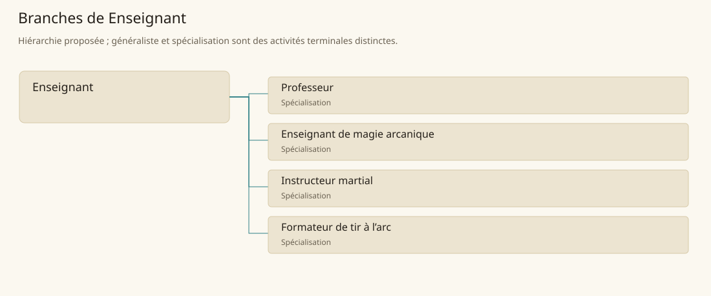

# Enseignant

[Accueil](../README.md) · [Arbre des métiers](../arbre-metiers.md)

Transformer un savoir maîtrisé en apprentissages progressifs et vérifiables.

**Métier de base proposé.** Cette famille rassemble les disciplines communes de ses branches ; elle n’ajoute pas une profession à chaque personne. Un généraliste est une feuille précise, distincte de la somme statistique de la base.

## Fonctions

- Identifier acquis et besoin de l’élève
- Préparer démonstrations et exercices gradués
- Observer les essais et expliquer les corrections

## Compétences nécessaires proposées

| Savoir-faire proposé | À quoi il sert | Acquisition |
|---|---|---|
| Conception de leçon | Choisir un objectif atteignable | P : Préparation avec un enseignant |
| Démonstration | Rendre visibles gestes et raisonnement | P : Leçons observées puis répétées |
| Évaluation formative | Repérer l’erreur sans confondre élève et faute | P : Correction de travaux commentée |
| Gestion du groupe | Maintenir attention et sécurité des exercices | P : Séances accompagnées |

Maîtrise préalable de la discipline et pratique pédagogique supervisée ; enseigner une magie exige son apprentissage séparé.

## Outils et chaînes de travail

Supports de cours, Carnets de progression, Matériel propre à la discipline.

- Savoir
- Écriture
- Locaux de formation
- Spécialistes de chaque discipline

## Arbre de cette famille

| Branche | Nature | Fonction distinctive |
|---|---|---|
| [Professeur](../Specialisations/enseignement/professeur.md) | Spécialisation | Spécialité d’enseignement suivie ; la base couvre aussi les formations pratiques. |
| [Enseignant de magie arcanique](../Specialisations/enseignement/prof-arcane.md) | Spécialisation | Enseigner ne donne pas accès à toutes les écoles ni aux savoirs secrets. |
| [Instructeur martial](../Specialisations/enseignement/instructeur-martial.md) | Spécialisation | Transmet la pratique ; ne devient pas automatiquement officier ou commandant. |
| [Formateur de tir à l’arc](../Specialisations/enseignement/instructeur-arc.md) | Spécialisation | La formation au tir se distingue de la fabrication d’arcs et de la chasse. |

## Implantation et parts de population

Les deux colonnes changent de dénominateur. Les effectifs régionaux proposés servent à dimensionner les filières ; ils ne prouvent pas une compétence individuelle. Les valeurs relatives ne donnent aucun effectif absolu.

| Région | % des habitants | % des actifs | Portée |
|---|---|---|---|
| [Empire central](../Regions/empire.md) | 0,091 % | 0,142 % | proportion proposée |
| [République des Freelands](../Regions/freelands.md) | 0,155 % | 0,241 % | proportion proposée |
| [Ben’net impérial](../Regions/bennet.md) | 0,101 % | 0,150 % | proportion proposée |
| [Royaume de Kolbjörn](../Regions/kolbjorn.md) | 0,106 % | 0,159 % | proportion proposée |
| [Magocratie de Mage Tower](../Regions/magocracy.md) | 0,541 % | 0,818 % | proportion proposée |
| [Seashores](../Regions/seashores.md) | 0,102 % | 0,154 % | proportion proposée |
| [Forêt de Sindile](../Regions/sindile.md) | 0,174 % | 0,258 % | proportion proposée |
| [Domaines stravians](../Regions/stravian.md) | 0,051 % | 0,076 % | proportion proposée |
| [Îles des Tempêtes](../Regions/storm.md) | 0,256 % | 0,355 % | proportion proposée |
| [Cités de Taii’Maku](../Regions/taiimaku.md) | 3,435 % | 7,883 % | proportion proposée |
| [Théocratie de Kepesh](../Regions/kepesh.md) | 0,073 % | 0,109 % | proportion proposée |
| [Tsvetan](../Regions/tsvetan.md) | 0,074 % | 0,110 % | proportion proposée |
| [Yama](../Regions/yama.md) | 0,149 % | 0,224 % | proportion proposée |
| [Undertanares](../Regions/undertanares.md) | 0,074 % | 0,115 % | scénario relatif |
| [Darkall](../Regions/darkall.md) | 0,101 % | 0,153 % | scénario relatif |
| [Mystical et Wasteland](../Regions/mystical.md) | non applicable | non applicable | absence de dénominateur civil |

## Choix et sources

P : famille professionnelle, fonctions, compétences, outils et formation proposés. Les sources des feuilles appuient des activités ou contextes précis ; elles ne prouvent ni une organisation générale de cette famille, ni une maîtrise de toutes ses spécialités.

La parenté entre branches et les savoir-faire de cette fiche sont des propositions de conception. Appui des activités : [Manuel des Joueurs p. 138](../Sources/mj.md#p-138), [Tanares Sourcebook p. 141](../Sources/sb.md#p-141), [Tanares Sourcebook p. 155](../Sources/sb.md#p-155), [Tanares Sourcebook p. 94](../Sources/sb.md#p-94).
