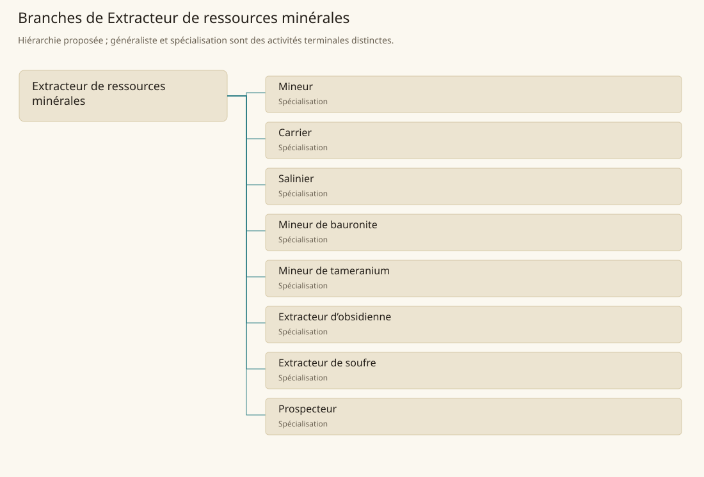

# Extracteur de ressources minérales

[Accueil](../README.md) · [Arbre des métiers](../arbre-metiers.md)

Séparer des matières minérales de leur environnement et les livrer sous forme de lots identifiés.

**Métier de base proposé.** Cette famille rassemble les disciplines communes de ses branches ; elle n’ajoute pas une profession à chaque personne. Un généraliste est une feuille précise, distincte de la somme statistique de la base.

## Fonctions

- Reconnaître un gisement et les dangers de l’accès
- Extraire puis séparer roche utile et stérile
- Classer les lots et organiser leur sortie du chantier

## Compétences nécessaires proposées

| Savoir-faire proposé | À quoi il sert | Acquisition |
|---|---|---|
| Reconnaissance de matière | Reconnaître un gisement et les dangers de l’accès | Parcours proposé : Comparer échantillons et roche encaissante |
| Extraction contrôlée | Extraire puis séparer roche utile et stérile | Parcours proposé : Apprendre les gestes sur un front stable d’exercice |
| Tri du minerai | Classer les lots et organiser leur sortie du chantier | Parcours proposé : Trier un lot d’essai et noter ses défauts |
| Organisation de chantier | Préparer accès, outils, protections et circuit d’évacuation des matières. | Parcours proposé : Préparer le circuit des outils, lots et déblais |

Parcours proposé : Apprendre avec un chef de chantier ; accès profond, soutènement et matières magiques exigent une habilitation d’atelier proposée.

## Outils et chaînes de travail

Pics, Coins, Lampes, Paniers ou chariots.

- Accès au gisement
- Soutènement et drainage
- Transport et transformation

## Arbre de cette famille

| Branche | Nature | Fonction distinctive |
|---|---|---|
| [Mineur](../Specialisations/extraction/mineur.md) | Spécialisation | Il produit le minerai ; prospection et métallurgie restent distinctes. |
| [Carrier](../Specialisations/extraction/carrier.md) | Spécialisation | Il extrait la pierre brute ; taille décorative et maçonnerie sont distinctes. |
| [Salinier](../Specialisations/extraction/salinier.md) | Spécialisation | Les échanges de sel motivent la proposition ; ils ne prouvent pas une saline à Ben’net ni une méthode canonique. |
| [Mineur de bauronite](../Specialisations/extraction/bauronite.md) | Spécialisation | Ressource brute, noyau de golem et combustible sont des produits distincts. |
| [Mineur de tameranium](../Specialisations/extraction/tameranium.md) | Spécialisation | Le minerai ne donne pas automatiquement droit d’usage ni compétence d’arme ou de rituel. |
| [Extracteur d’obsidienne](../Specialisations/extraction/obsidienne.md) | Spécialisation | La fourniture brute ne confère pas la fabrication des outils finis. |
| [Extracteur de soufre](../Specialisations/extraction/soufre.md) | Spécialisation | L’usage médicinal de la matière ne rend pas l’extracteur praticien de santé. |
| [Prospecteur](../Specialisations/extraction/prospecteur.md) | Spécialisation | Un indice ne prouve ni quantité exploitable ni droit d’ouverture d’une mine. |

## Implantation et parts de population

Les deux colonnes changent de dénominateur. Les effectifs régionaux proposés servent à dimensionner les filières ; ils ne prouvent pas une compétence individuelle. Les valeurs relatives ne donnent aucun effectif absolu.

| Région | % des habitants | % des actifs | Portée |
|---|---|---|---|
| [Empire central](../Regions/empire.md) | 0,312 % | 0,484 % | proportion proposée |
| [République des Freelands](../Regions/freelands.md) | 0,824 % | 1,286 % | proportion proposée |
| [Ben’net impérial](../Regions/bennet.md) | 0,188 % | 0,280 % | proportion proposée |
| [Royaume de Kolbjörn](../Regions/kolbjorn.md) | 0,932 % | 1,396 % | proportion proposée |
| [Magocratie de Mage Tower](../Regions/magocracy.md) | 0,488 % | 0,738 % | proportion proposée |
| [Seashores](../Regions/seashores.md) | 0,111 % | 0,167 % | proportion proposée |
| [Forêt de Sindile](../Regions/sindile.md) | 0,016 % | 0,024 % | proportion proposée |
| [Domaines stravians](../Regions/stravian.md) | 3,034 % | 4,582 % | proportion proposée |
| [Îles des Tempêtes](../Regions/storm.md) | 1,322 % | 1,836 % | proportion proposée |
| [Cités de Taii’Maku](../Regions/taiimaku.md) | 0,368 % | 0,844 % | proportion proposée |
| [Théocratie de Kepesh](../Regions/kepesh.md) | 0,227 % | 0,339 % | proportion proposée |
| [Tsvetan](../Regions/tsvetan.md) | 0,479 % | 0,717 % | proportion proposée |
| [Yama](../Regions/yama.md) | 0,026 % | 0,039 % | proportion proposée |
| [Undertanares](../Regions/undertanares.md) | 5,921 % | 9,240 % | scénario relatif |
| [Darkall](../Regions/darkall.md) | 0,737 % | 1,117 % | scénario relatif |
| [Mystical et Wasteland](../Regions/mystical.md) | non applicable | non applicable | absence de dénominateur civil |

## Choix et sources

Références du registre de base : MJ135, SB160, SB120, SB174, SB182, SB168, SB198, SB190, SB104. Leur portée concerne les activités, ressources et contextes des feuilles rattachées ; le regroupement en base, les fonctions détaillées, outils, compétences et formations sont proposés P, sans bonus ni nouvelle statistique.

La parenté entre branches et les savoir-faire de cette fiche sont des propositions de conception. Appui des activités : [Manuel des Joueurs p. 135](../Sources/mj.md#p-135), [Tanares Sourcebook p. 104](../Sources/sb.md#p-104), [Tanares Sourcebook p. 120](../Sources/sb.md#p-120), [Tanares Sourcebook p. 160](../Sources/sb.md#p-160), [Tanares Sourcebook p. 168](../Sources/sb.md#p-168), [Tanares Sourcebook p. 174](../Sources/sb.md#p-174), [Tanares Sourcebook p. 182](../Sources/sb.md#p-182), [Tanares Sourcebook p. 190](../Sources/sb.md#p-190), [Tanares Sourcebook p. 198](../Sources/sb.md#p-198).
