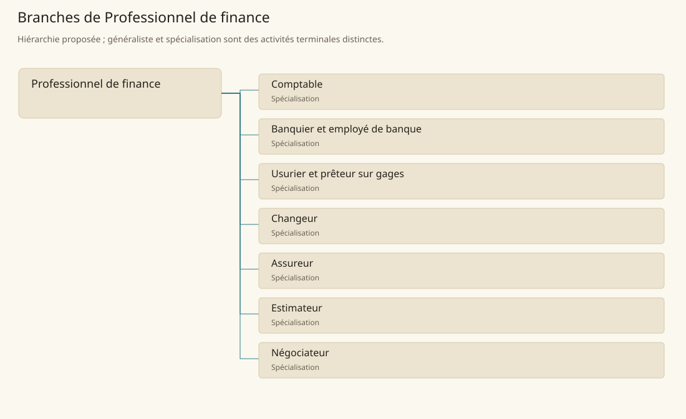

# Professionnel de finance

[Accueil](../README.md) · [Arbre des métiers](../arbre-metiers.md)

Rendre lisibles les valeurs, dettes et risques qui accompagnent les échanges.

**Métier de base proposé.** Cette famille rassemble les disciplines communes de ses branches ; elle n’ajoute pas une profession à chaque personne. Un généraliste est une feuille précise, distincte de la somme statistique de la base.

## Fonctions

- Enregistrer mouvements de fonds et engagements
- Comparer valeur des biens et conditions de financement
- Établir des accords vérifiables et suivre leur exécution

## Compétences nécessaires proposées

| Savoir-faire proposé | À quoi il sert | Acquisition |
|---|---|---|
| Calcul financier | Rapprocher montants, échéances et soldes | P : Exercices de comptes relus |
| Lecture contractuelle | Identifier obligations et garanties | P : Étude de contrats annotés |
| Estimation du risque | Distinguer preuve disponible et incertitude | P : Comparaison de dossiers historiques |
| Discrétion des dossiers | Limiter la diffusion des avoirs et dettes | P : Travail encadré en étude ou banque |

Formation par tenue de comptes, étude d’accords et revue de dossiers financiers.

## Outils et chaînes de travail

Livres de comptes, Tables de change, Contrats et sceaux.

- Commerce
- Administration
- Écriture
- Sécurité des dépôts

## Arbre de cette famille

| Branche | Nature | Fonction distinctive |
|---|---|---|
| [Comptable](../Specialisations/finance/comptable.md) | Spécialisation | Métier déduit des activités financières ; n’octroie ni prêt ni décision de crédit. |
| [Banquier et employé de banque](../Specialisations/finance/banquier.md) | Spécialisation | Exerce au sein d’une banque ; les fonctions exactes varient entre employé et responsable. |
| [Usurier et prêteur sur gages](../Specialisations/finance/usurier.md) | Spécialisation | Fonction de prêt sur engagement ; sa légalité dépend du cadre local. |
| [Changeur](../Specialisations/finance/changeur.md) | Spécialisation | Convertit des monnaies ; ne garantit pas tous les placements ou crédits. |
| [Assureur](../Specialisations/finance/assureur.md) | Spécialisation | Métier proposé à partir du contexte financier ; aucun régime d’assurance universel n’est attesté. |
| [Estimateur](../Specialisations/finance/estimateur.md) | Spécialisation | Estime une valeur ; la certification arcanique exige un autre spécialiste. |
| [Négociateur](../Specialisations/finance/negociateur.md) | Spécialisation | Travaille sur les conditions d’accord plutôt que sur la tenue quotidienne des comptes. |

## Implantation et parts de population

Les deux colonnes changent de dénominateur. Les effectifs régionaux proposés servent à dimensionner les filières ; ils ne prouvent pas une compétence individuelle. Les valeurs relatives ne donnent aucun effectif absolu.

| Région | % des habitants | % des actifs | Portée |
|---|---|---|---|
| [Empire central](../Regions/empire.md) | 0,563 % | 0,873 % | proportion proposée |
| [République des Freelands](../Regions/freelands.md) | 0,318 % | 0,496 % | proportion proposée |
| [Ben’net impérial](../Regions/bennet.md) | 0,116 % | 0,173 % | proportion proposée |
| [Royaume de Kolbjörn](../Regions/kolbjorn.md) | 0,149 % | 0,224 % | proportion proposée |
| [Magocratie de Mage Tower](../Regions/magocracy.md) | 0,204 % | 0,308 % | proportion proposée |
| [Seashores](../Regions/seashores.md) | 0,141 % | 0,213 % | proportion proposée |
| [Forêt de Sindile](../Regions/sindile.md) | 0,034 % | 0,051 % | proportion proposée |
| [Domaines stravians](../Regions/stravian.md) | 0,195 % | 0,295 % | proportion proposée |
| [Îles des Tempêtes](../Regions/storm.md) | 0,144 % | 0,201 % | proportion proposée |
| [Cités de Taii’Maku](../Regions/taiimaku.md) | 0,245 % | 0,562 % | proportion proposée |
| [Théocratie de Kepesh](../Regions/kepesh.md) | 0,223 % | 0,334 % | proportion proposée |
| [Tsvetan](../Regions/tsvetan.md) | 0,054 % | 0,081 % | proportion proposée |
| [Yama](../Regions/yama.md) | 0,162 % | 0,244 % | proportion proposée |
| [Undertanares](../Regions/undertanares.md) | 0,298 % | 0,466 % | scénario relatif |
| [Darkall](../Regions/darkall.md) | 0,134 % | 0,203 % | scénario relatif |
| [Mystical et Wasteland](../Regions/mystical.md) | non applicable | non applicable | absence de dénominateur civil |

## Choix et sources

P : famille professionnelle, fonctions, compétences, outils et formation proposés. Les sources des feuilles appuient des activités ou contextes précis ; elles ne prouvent ni une organisation générale de cette famille, ni une maîtrise de toutes ses spécialités.

La parenté entre branches et les savoir-faire de cette fiche sont des propositions de conception. Appui des activités : [Tanares Sourcebook p. 212](../Sources/sb.md#p-212), [Tanares Sourcebook p. 213](../Sources/sb.md#p-213).
