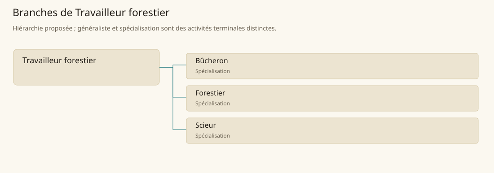

# Travailleur forestier

[Accueil](../README.md) · [Arbre des métiers](../arbre-metiers.md)

Gérer et transformer les ressources forestières jusqu’au bois de chantier ou d’atelier.

**Métier de base proposé.** Cette famille rassemble les disciplines communes de ses branches ; elle n’ajoute pas une profession à chaque personne. Un généraliste est une feuille précise, distincte de la somme statistique de la base.

## Fonctions

- Repérer les arbres, les accès et les zones à préserver
- Organiser coupe, débardage ou surveillance du peuplement
- Trier et débiter le bois selon son usage

## Compétences nécessaires proposées

| Savoir-faire proposé | À quoi il sert | Acquisition |
|---|---|---|
| Lecture du peuplement | Repérer les arbres, les accès et les zones à préserver | Parcours proposé : Inventorier un petit secteur avec un forestier |
| Conduite de chantier forestier | Organiser coupe, débardage ou surveillance du peuplement | Parcours proposé : Répéter les signaux et chemins de retrait d’un chantier |
| Classement du bois | Trier et débiter le bois selon son usage | Parcours proposé : Comparer bois sain, noueux et dégradé |
| Organisation de coupe | Coordonner arbres autorisés, coupe, débardage et sciage dans les limites du chantier. | Parcours proposé : Établir un plan partagé entre coupe et sciage |

Parcours proposé : Assister un chantier avant d’assumer une coupe ; gestion du peuplement et sciage demandent des compléments distincts.

## Outils et chaînes de travail

Hache, Scie, Cordages de débardage, Marques de classement.

- Droits forestiers
- Traction et accès
- Charpenterie et ateliers

## Arbre de cette famille

| Branche | Nature | Fonction distinctive |
|---|---|---|
| [Bûcheron](../Specialisations/foresterie/bucheron.md) | Spécialisation | Couper ne donne pas le droit d’accès ni la compétence de gestion du peuplement. |
| [Forestier](../Specialisations/foresterie/forestier.md) | Spécialisation | Il gère et surveille ; il n’est pas obligatoirement le bûcheron réalisant la coupe. |
| [Scieur](../Specialisations/foresterie/scieur.md) | Spécialisation | Il livre du bois débité ; charpente et meuble sont des métiers distincts. |

## Implantation et parts de population

Les deux colonnes changent de dénominateur. Les effectifs régionaux proposés servent à dimensionner les filières ; ils ne prouvent pas une compétence individuelle. Les valeurs relatives ne donnent aucun effectif absolu.

| Région | % des habitants | % des actifs | Portée |
|---|---|---|---|
| [Empire central](../Regions/empire.md) | 0,343 % | 0,532 % | proportion proposée |
| [République des Freelands](../Regions/freelands.md) | 1,087 % | 1,697 % | proportion proposée |
| [Ben’net impérial](../Regions/bennet.md) | 0,188 % | 0,280 % | proportion proposée |
| [Royaume de Kolbjörn](../Regions/kolbjorn.md) | 0,789 % | 1,183 % | proportion proposée |
| [Magocratie de Mage Tower](../Regions/magocracy.md) | 0,195 % | 0,295 % | proportion proposée |
| [Seashores](../Regions/seashores.md) | 0,332 % | 0,502 % | proportion proposée |
| [Forêt de Sindile](../Regions/sindile.md) | 0,039 % | 0,058 % | proportion proposée |
| [Domaines stravians](../Regions/stravian.md) | 0,305 % | 0,461 % | proportion proposée |
| [Îles des Tempêtes](../Regions/storm.md) | 0,258 % | 0,358 % | proportion proposée |
| [Cités de Taii’Maku](../Regions/taiimaku.md) | 0,028 % | 0,063 % | proportion proposée |
| [Théocratie de Kepesh](../Regions/kepesh.md) | 0,054 % | 0,081 % | proportion proposée |
| [Tsvetan](../Regions/tsvetan.md) | 0,144 % | 0,215 % | proportion proposée |
| [Yama](../Regions/yama.md) | 0,019 % | 0,029 % | proportion proposée |
| [Undertanares](../Regions/undertanares.md) | 0,600 % | 0,937 % | scénario relatif |
| [Darkall](../Regions/darkall.md) | 0,471 % | 0,714 % | scénario relatif |
| [Mystical et Wasteland](../Regions/mystical.md) | non applicable | non applicable | absence de dénominateur civil |

## Choix et sources

Références du registre de base : MJ135, SB107, MJ140, SB99. Leur portée concerne les activités, ressources et contextes des feuilles rattachées ; le regroupement en base, les fonctions détaillées, outils, compétences et formations sont proposés P, sans bonus ni nouvelle statistique.

La parenté entre branches et les savoir-faire de cette fiche sont des propositions de conception. Appui des activités : [Manuel des Joueurs p. 135](../Sources/mj.md#p-135), [Manuel des Joueurs p. 140](../Sources/mj.md#p-140), [Tanares Sourcebook p. 107](../Sources/sb.md#p-107), [Tanares Sourcebook p. 99](../Sources/sb.md#p-99).
