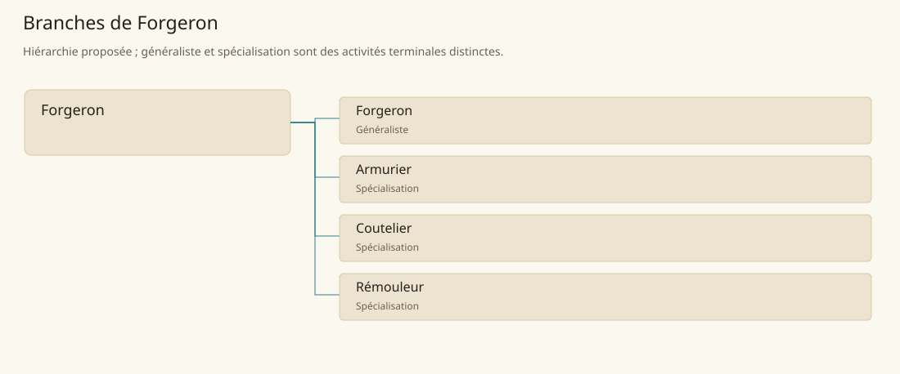

# Forgeron

[Accueil](../README.md) · [Arbre des métiers](../arbre-metiers.md)

Façonner et réparer des pièces métalliques par chauffe, déformation et finition.

**Métier de base proposé.** Cette famille rassemble les disciplines communes de ses branches ; elle n’ajoute pas une profession à chaque personne. Un généraliste est une feuille précise, distincte de la somme statistique de la base.

## Fonctions

- Préparer métal, feu et outillage pour la pièce demandée
- Former puis assembler la pièce en contrôlant son ajustement
- Finir, vérifier et remettre un objet utilisable

## Compétences nécessaires proposées

| Savoir-faire proposé | À quoi il sert | Acquisition |
|---|---|---|
| Conduite du feu | Préparer métal, feu et outillage pour la pièce demandée | Parcours proposé : Maintenir un feu sous le contrôle du maître |
| Forge et assemblage | Former puis assembler la pièce en contrôlant son ajustement | Parcours proposé : Fabriquer une petite pièce répétée |
| Contrôle fonctionnel | Finir, vérifier et remettre un objet utilisable | Parcours proposé : Comparer l’ajustement de deux pièces jumelles |
| Organisation d’atelier | Préparer matière, chauffe, outillage et finition pour terminer une commande. | Parcours proposé : Préparer une commande avec matière et outils disponibles |

Parcours proposé : Passer de l’entretien des outils aux pièces simples, puis suivre la formation propre aux armes ou objets recherchés.

## Outils et chaînes de travail

Forge, Enclume, Marteaux, Pinces et limes.

- Métal et combustible
- Outillage et espace
- Clients et entretien

## Arbre de cette famille

| Branche | Nature | Fonction distinctive |
|---|---|---|
| [Forgeron](../Specialisations/forge/forgeron.md) | Généraliste | La base comprend toutes les feuilles de forge ; ce généraliste produit les pièces usuelles, sans expertise automatique d’armure ou de lame fine. |
| [Armurier](../Specialisations/forge/armurier.md) | Spécialisation | La protection portée est sa spécialité ; le titre n’ajoute ni classe d’armure ni compétence de combat. |
| [Coutelier](../Specialisations/forge/coutelier.md) | Spécialisation | La spécialité est déduite depuis le contexte de forge ; aucune propriété magique ou valeur de dégâts n’est ajoutée. |
| [Rémouleur](../Specialisations/forge/remouleur.md) | Spécialisation | Il entretient la coupe ; forger la lame neuve ou qualifier une arme magique reste distinct. |

## Implantation et parts de population

Les deux colonnes changent de dénominateur. Les effectifs régionaux proposés servent à dimensionner les filières ; ils ne prouvent pas une compétence individuelle. Les valeurs relatives ne donnent aucun effectif absolu.

| Région | % des habitants | % des actifs | Portée |
|---|---|---|---|
| [Empire central](../Regions/empire.md) | 1,083 % | 1,679 % | proportion proposée |
| [République des Freelands](../Regions/freelands.md) | 1,007 % | 1,571 % | proportion proposée |
| [Ben’net impérial](../Regions/bennet.md) | 0,660 % | 0,981 % | proportion proposée |
| [Royaume de Kolbjörn](../Regions/kolbjorn.md) | 1,070 % | 1,604 % | proportion proposée |
| [Magocratie de Mage Tower](../Regions/magocracy.md) | 1,369 % | 2,068 % | proportion proposée |
| [Seashores](../Regions/seashores.md) | 0,960 % | 1,451 % | proportion proposée |
| [Forêt de Sindile](../Regions/sindile.md) | 0,788 % | 1,173 % | proportion proposée |
| [Domaines stravians](../Regions/stravian.md) | 3,344 % | 5,050 % | proportion proposée |
| [Îles des Tempêtes](../Regions/storm.md) | 1,016 % | 1,411 % | proportion proposée |
| [Cités de Taii’Maku](../Regions/taiimaku.md) | 0,228 % | 0,522 % | proportion proposée |
| [Théocratie de Kepesh](../Regions/kepesh.md) | 0,960 % | 1,435 % | proportion proposée |
| [Tsvetan](../Regions/tsvetan.md) | 2,226 % | 3,330 % | proportion proposée |
| [Yama](../Regions/yama.md) | 0,994 % | 1,492 % | proportion proposée |
| [Undertanares](../Regions/undertanares.md) | 7,563 % | 11,801 % | scénario relatif |
| [Darkall](../Regions/darkall.md) | 0,963 % | 1,460 % | scénario relatif |
| [Mystical et Wasteland](../Regions/mystical.md) | non applicable | non applicable | absence de dénominateur civil |

## Choix et sources

Références du registre de base : MJ128. Leur portée concerne les activités, ressources et contextes des feuilles rattachées ; le regroupement en base, les fonctions détaillées, outils, compétences et formations sont proposés P, sans bonus ni nouvelle statistique.

La parenté entre branches et les savoir-faire de cette fiche sont des propositions de conception. Appui des activités : [Manuel des Joueurs p. 128](../Sources/mj.md#p-128).
