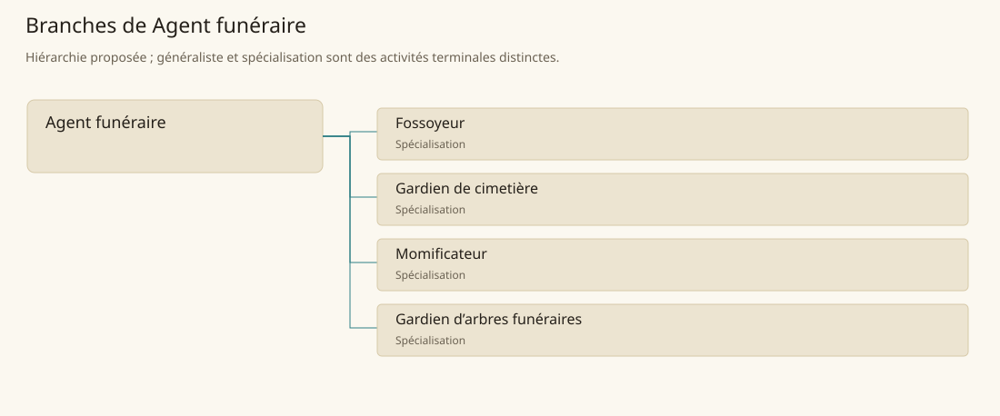

# Agent funéraire

[Accueil](../README.md) · [Arbre des métiers](../arbre-metiers.md)

Organiser la prise en charge des morts et la conservation de leurs lieux de mémoire.

**Métier de base proposé.** Cette famille rassemble les disciplines communes de ses branches ; elle n’ajoute pas une profession à chaque personne. Un généraliste est une feuille précise, distincte de la somme statistique de la base.

## Fonctions

- Accueillir les proches et établir le besoin funéraire
- Coordonner transport, préparation et sépulture selon le rite local
- Tenir la mémoire des défunts et l’entretien des lieux

## Compétences nécessaires proposées

| Savoir-faire proposé | À quoi il sert | Acquisition |
|---|---|---|
| Accueil du deuil | Recueillir les souhaits sans imposer un rite | P : Accompagnement de familles avec un officiant |
| Organisation des obsèques | Séparer préparation du corps, cérémonie et inhumation | P : Observation de convois et planning supervisé |
| Registre funéraire | Relier identité, emplacement et date | P : Tenue de registres relus |
| Respect des dépouilles | Adapter manipulation et matériel au rite | P : Démonstrations par le responsable local |

Apprentissage auprès d’un responsable funéraire, avec transmission distincte des pratiques de Kepesh et de Sindile.

## Outils et chaînes de travail

Registres de sépultures, Matériel de transport des corps, Plans de cimetières.

- Transport
- Religion
- Maçonnerie
- Hygiène

## Arbre de cette famille

| Branche | Nature | Fonction distinctive |
|---|---|---|
| [Fossoyeur](../Specialisations/funeraire/fossoyeur.md) | Spécialisation | Travaille sur la sépulture matérielle plutôt que sur le rite ou la surveillance. |
| [Gardien de cimetière](../Specialisations/funeraire/gardien-cimetiere.md) | Spécialisation | Assure la continuité du lieu au-delà de chaque inhumation. |
| [Momificateur](../Specialisations/funeraire/momificateur.md) | Spécialisation | Conserve le corps ; cette fonction ne confère pas les rites d’immortalisation. |
| [Gardien d’arbres funéraires](../Specialisations/funeraire/arbres-funeraires.md) | Spécialisation | Fonction déduite d’une pratique funéraire forestière ; aucun pouvoir de l’arbre n’est ajouté. |

## Implantation et parts de population

Les deux colonnes changent de dénominateur. Les effectifs régionaux proposés servent à dimensionner les filières ; ils ne prouvent pas une compétence individuelle. Les valeurs relatives ne donnent aucun effectif absolu.

| Région | % des habitants | % des actifs | Portée |
|---|---|---|---|
| [Empire central](../Regions/empire.md) | 0,083 % | 0,129 % | proportion proposée |
| [République des Freelands](../Regions/freelands.md) | 0,084 % | 0,131 % | proportion proposée |
| [Ben’net impérial](../Regions/bennet.md) | 0,027 % | 0,041 % | proportion proposée |
| [Royaume de Kolbjörn](../Regions/kolbjorn.md) | 0,037 % | 0,056 % | proportion proposée |
| [Magocratie de Mage Tower](../Regions/magocracy.md) | 0,056 % | 0,085 % | proportion proposée |
| [Seashores](../Regions/seashores.md) | 0,053 % | 0,080 % | proportion proposée |
| [Forêt de Sindile](../Regions/sindile.md) | 0,060 % | 0,089 % | proportion proposée |
| [Domaines stravians](../Regions/stravian.md) | 0,027 % | 0,041 % | proportion proposée |
| [Îles des Tempêtes](../Regions/storm.md) | 0,076 % | 0,106 % | proportion proposée |
| [Cités de Taii’Maku](../Regions/taiimaku.md) | 0,077 % | 0,178 % | proportion proposée |
| [Théocratie de Kepesh](../Regions/kepesh.md) | 0,257 % | 0,384 % | proportion proposée |
| [Tsvetan](../Regions/tsvetan.md) | 0,030 % | 0,045 % | proportion proposée |
| [Yama](../Regions/yama.md) | 0,023 % | 0,035 % | proportion proposée |
| [Undertanares](../Regions/undertanares.md) | 0,026 % | 0,041 % | scénario relatif |
| [Darkall](../Regions/darkall.md) | 0,065 % | 0,098 % | scénario relatif |
| [Mystical et Wasteland](../Regions/mystical.md) | non applicable | non applicable | absence de dénominateur civil |

## Choix et sources

P : famille professionnelle, fonctions, compétences, outils et formation proposés. Les sources des feuilles appuient des activités ou contextes précis ; elles ne prouvent ni une organisation générale de cette famille, ni une maîtrise de toutes ses spécialités.

La parenté entre branches et les savoir-faire de cette fiche sont des propositions de conception. Appui des activités : [Manuel des Joueurs p. 135](../Sources/mj.md#p-135), [Tanares Sourcebook p. 155](../Sources/sb.md#p-155), [Tanares Sourcebook p. 182](../Sources/sb.md#p-182), [Tanares Sourcebook p. 99](../Sources/sb.md#p-99).
