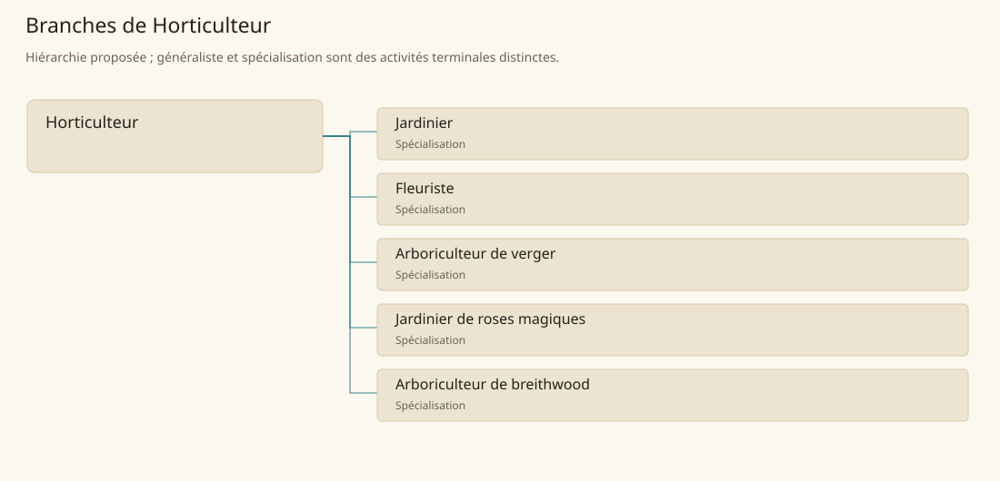

# Horticulteur

[Accueil](../README.md) · [Arbre des métiers](../arbre-metiers.md)

Entretenir des plantes cultivées dont la forme, la santé ou la production demandent un suivi individuel.

**Métier de base proposé.** Cette famille rassemble les disciplines communes de ses branches ; elle n’ajoute pas une profession à chaque personne. Un généraliste est une feuille précise, distincte de la somme statistique de la base.

## Fonctions

- Multiplier des plants et installer jardins ou plantations
- Tailler, arroser et entretenir les végétaux selon leur usage
- Prélever fleurs, fruits ou bois sans compromettre la plantation

## Compétences nécessaires proposées

| Savoir-faire proposé | À quoi il sert | Acquisition |
|---|---|---|
| Multiplication végétale | Multiplier des plants et installer jardins ou plantations | Parcours proposé : Suivre une pépinière de boutures |
| Entretien des plants | Tailler, arroser et entretenir les végétaux selon leur usage | Parcours proposé : Tenir le carnet d’entretien d’un jardin |
| Prélèvement raisonné | Prélever fleurs, fruits ou bois sans compromettre la plantation | Parcours proposé : Comparer des prélèvements et la reprise des plants |
| Organisation des plantations | Planifier pépinière, remplacement des plants et interventions selon les usages du jardin. | Parcours proposé : Planifier remplacement et entretien des sujets |

Parcours proposé : Commencer sur plants ordinaires et parcelles d’essai ; une matière magique exige ensuite une formation propre au site.

## Outils et chaînes de travail

Sécateur, Greffoir, Arrosoirs, Supports et contenants de pépinière.

- Plants et terre
- Eau et amendements
- Droits d’accès aux jardins

## Arbre de cette famille

| Branche | Nature | Fonction distinctive |
|---|---|---|
| [Jardinier](../Specialisations/horticulture/jardinier.md) | Spécialisation | Il suit l’ensemble du jardin ; les autres feuilles se concentrent sur une production. |
| [Fleuriste](../Specialisations/horticulture/fleuriste.md) | Spécialisation | La composition est son produit ; elle ne remplace pas l’entretien du jardin fournisseur. |
| [Arboriculteur de verger](../Specialisations/horticulture/verger.md) | Spécialisation | Produire des fruits est distinct de leur transformation et des rites du verger. |
| [Jardinier de roses magiques](../Specialisations/horticulture/roses-magiques.md) | Spécialisation | La spécificité tient aux roses et au site ; elle ne garantit pas un effet magique reproductible. |
| [Arboriculteur de breithwood](../Specialisations/horticulture/breithwood.md) | Spécialisation | Le matériau est sourcé ; l’organisation en arboriculteur est déduite, sans capacité magique ajoutée. |

## Implantation et parts de population

Les deux colonnes changent de dénominateur. Les effectifs régionaux proposés servent à dimensionner les filières ; ils ne prouvent pas une compétence individuelle. Les valeurs relatives ne donnent aucun effectif absolu.

| Région | % des habitants | % des actifs | Portée |
|---|---|---|---|
| [Empire central](../Regions/empire.md) | 1,865 % | 2,893 % | proportion proposée |
| [République des Freelands](../Regions/freelands.md) | 1,625 % | 2,535 % | proportion proposée |
| [Ben’net impérial](../Regions/bennet.md) | 0,318 % | 0,473 % | proportion proposée |
| [Royaume de Kolbjörn](../Regions/kolbjorn.md) | 1,064 % | 1,595 % | proportion proposée |
| [Magocratie de Mage Tower](../Regions/magocracy.md) | 3,699 % | 5,589 % | proportion proposée |
| [Seashores](../Regions/seashores.md) | 3,056 % | 4,618 % | proportion proposée |
| [Forêt de Sindile](../Regions/sindile.md) | 21,755 % | 32,374 % | proportion proposée |
| [Domaines stravians](../Regions/stravian.md) | 3,262 % | 4,927 % | proportion proposée |
| [Îles des Tempêtes](../Regions/storm.md) | 0,361 % | 0,501 % | proportion proposée |
| [Cités de Taii’Maku](../Regions/taiimaku.md) | 0,767 % | 1,759 % | proportion proposée |
| [Théocratie de Kepesh](../Regions/kepesh.md) | 1,672 % | 2,499 % | proportion proposée |
| [Tsvetan](../Regions/tsvetan.md) | 1,404 % | 2,100 % | proportion proposée |
| [Yama](../Regions/yama.md) | 2,789 % | 4,186 % | proportion proposée |
| [Undertanares](../Regions/undertanares.md) | 2,196 % | 3,426 % | scénario relatif |
| [Darkall](../Regions/darkall.md) | 1,728 % | 2,619 % | scénario relatif |
| [Mystical et Wasteland](../Regions/mystical.md) | non applicable | non applicable | absence de dénominateur civil |

## Choix et sources

Références du registre de base : SB29, SB161, SB157, SB152. Leur portée concerne les activités, ressources et contextes des feuilles rattachées ; le regroupement en base, les fonctions détaillées, outils, compétences et formations sont proposés P, sans bonus ni nouvelle statistique.

La parenté entre branches et les savoir-faire de cette fiche sont des propositions de conception. Appui des activités : [Tanares Sourcebook p. 152](../Sources/sb.md#p-152), [Tanares Sourcebook p. 157](../Sources/sb.md#p-157), [Tanares Sourcebook p. 161](../Sources/sb.md#p-161), [Tanares Sourcebook p. 29](../Sources/sb.md#p-29).
