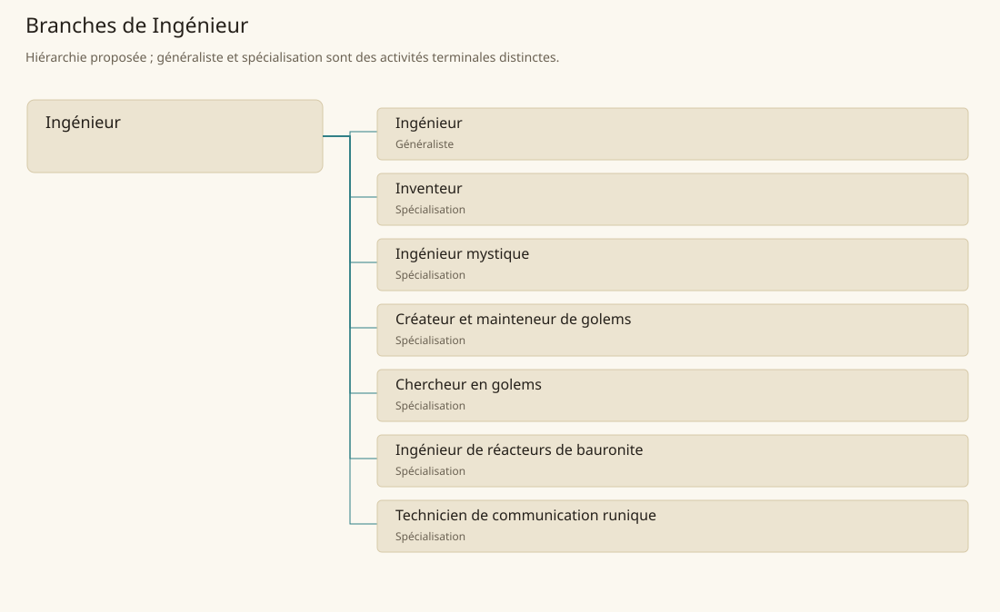

# Ingénieur

[Accueil](../README.md) · [Arbre des métiers](../arbre-metiers.md)

Concevoir des systèmes construits, mesurer leurs contraintes et organiser leur entretien.

**Métier de base proposé.** Cette famille rassemble les disciplines communes de ses branches ; elle n’ajoute pas une profession à chaque personne. Un généraliste est une feuille précise, distincte de la somme statistique de la base.

## Fonctions

- Traduire un besoin en plans et critères de fonctionnement
- Comparer solutions et coordonner leur fabrication
- Examiner essais, défauts et besoins de maintenance

## Compétences nécessaires proposées

| Savoir-faire proposé | À quoi il sert | Acquisition |
|---|---|---|
| Dessin technique | Décrire pièces et assemblages sans ambiguïté | P : Plans corrigés sur des réalisations connues |
| Analyse fonctionnelle | Relier chaque pièce au service attendu | P : Démontage et étude de systèmes |
| Essai contrôlé | Comparer résultat prévu et observé | P : Campagnes d’essais accompagnées |
| Coordination d’atelier | Communiquer tolérances et ordre de montage | P : Suivi de fabrication avec artisans |

Études appliquées, atelier et essais ; golems, runes et réacteurs réclament un accès et une formation propres.

## Outils et chaînes de travail

Plans, Instruments de mesure, Bancs d’essai.

- Mécanique
- Métallurgie
- Architecture
- Services arcaniques

## Arbre de cette famille

| Branche | Nature | Fonction distinctive |
|---|---|---|
| [Ingénieur](../Specialisations/ingenierie/ingenieur.md) | Généraliste | Feuille généraliste de projets techniques ; la base englobe les domaines mystiques spécialisés. |
| [Inventeur](../Specialisations/ingenierie/inventeur.md) | Spécialisation | La nouveauté d’un objet n’établit ni son efficacité ni une découverte magique. |
| [Ingénieur mystique](../Specialisations/ingenierie/ingenieur-mystique.md) | Spécialisation | Ne confère ni secret de réacteur ni maîtrise universelle des golems. |
| [Créateur et mainteneur de golems](../Specialisations/ingenierie/golemicien.md) | Spécialisation | Métier déduit des activités de golems ; aucune méthode nouvelle d’animation n’est inventée. |
| [Chercheur en golems](../Specialisations/ingenierie/chercheur-golems.md) | Spécialisation | Étudie les golems ; les besoins ordinaires de G’bagede sont assurés par golems, sans ajouter d’emplois vivants. |
| [Ingénieur de réacteurs de bauronite](../Specialisations/ingenierie/reacteur.md) | Spécialisation | La bauronite seule ne permet pas de reconstruire le procédé secret. |
| [Technicien de communication runique](../Specialisations/ingenierie/communication-runique.md) | Spécialisation | Métier déduit du contexte de communication ; aucune portée ou technique nouvelle n’est postulée. |

## Implantation et parts de population

Les deux colonnes changent de dénominateur. Les effectifs régionaux proposés servent à dimensionner les filières ; ils ne prouvent pas une compétence individuelle. Les valeurs relatives ne donnent aucun effectif absolu.

| Région | % des habitants | % des actifs | Portée |
|---|---|---|---|
| [Empire central](../Regions/empire.md) | 0,040 % | 0,062 % | proportion proposée |
| [République des Freelands](../Regions/freelands.md) | 0,075 % | 0,118 % | proportion proposée |
| [Ben’net impérial](../Regions/bennet.md) | 0,053 % | 0,079 % | proportion proposée |
| [Royaume de Kolbjörn](../Regions/kolbjorn.md) | 0,021 % | 0,031 % | proportion proposée |
| [Magocratie de Mage Tower](../Regions/magocracy.md) | 0,028 % | 0,042 % | proportion proposée |
| [Seashores](../Regions/seashores.md) | 0,034 % | 0,051 % | proportion proposée |
| [Forêt de Sindile](../Regions/sindile.md) | 0,025 % | 0,037 % | proportion proposée |
| [Domaines stravians](../Regions/stravian.md) | 0,029 % | 0,044 % | proportion proposée |
| [Îles des Tempêtes](../Regions/storm.md) | 0,020 % | 0,028 % | proportion proposée |
| [Cités de Taii’Maku](../Regions/taiimaku.md) | 4,813 % | 11,044 % | proportion proposée |
| [Théocratie de Kepesh](../Regions/kepesh.md) | 0,043 % | 0,065 % | proportion proposée |
| [Tsvetan](../Regions/tsvetan.md) | 0,059 % | 0,088 % | proportion proposée |
| [Yama](../Regions/yama.md) | 0,013 % | 0,019 % | proportion proposée |
| [Undertanares](../Regions/undertanares.md) | 0,213 % | 0,332 % | scénario relatif |
| [Darkall](../Regions/darkall.md) | 0,070 % | 0,106 % | scénario relatif |
| [Mystical et Wasteland](../Regions/mystical.md) | non applicable | non applicable | absence de dénominateur civil |

## Choix et sources

P : famille professionnelle, fonctions, compétences, outils et formation proposés. Les sources des feuilles appuient des activités ou contextes précis ; elles ne prouvent ni une organisation générale de cette famille, ni une maîtrise de toutes ses spécialités.

La parenté entre branches et les savoir-faire de cette fiche sont des propositions de conception. Appui des activités : [Tanares Sourcebook p. 174](../Sources/sb.md#p-174), [Tanares Sourcebook p. 178](../Sources/sb.md#p-178).
