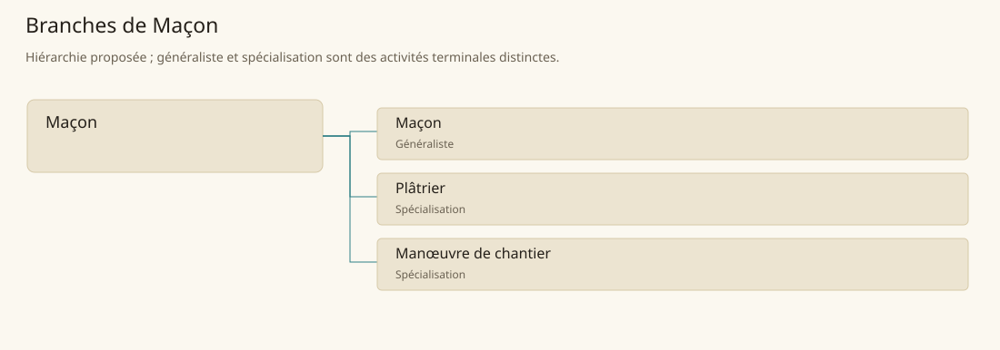

# Maçon

[Accueil](../README.md) · [Arbre des métiers](../arbre-metiers.md)

Élever, protéger et réparer les ouvrages minéraux par une organisation cohérente du chantier.

**Métier de base proposé.** Cette famille rassemble les disciplines communes de ses branches ; elle n’ajoute pas une profession à chaque personne. Un généraliste est une feuille précise, distincte de la somme statistique de la base.

## Fonctions

- Préparer fondations, matériaux et approvisionnement
- Coordonner appareillage, mortiers et enduits
- Inspecter fissures, humidité et réparations

## Compétences nécessaires proposées

| Savoir-faire proposé | À quoi il sert | Acquisition |
|---|---|---|
| Lecture des appuis | Repérer tassement et faiblesse de fondation | Étudier des petits ouvrages avec un maçon |
| Préparation des liants | Adapter mélange et état du support | Réaliser des éprouvettes et suivre leur prise |
| Ordonnancement du chantier | Préserver accès et continuité des travaux | Planifier un mur d’exercice avec l’équipe |
| Diagnostic du bâti | Séparer défaut d’enduit et problème de structure | Examiner fissures et infiltrations documentées |

P : formation au sol, ouvrages simples puis responsabilité progressive sur chantier encadré.

## Outils et chaînes de travail

Truelles, Niveaux, Fils à plomb, Auges, Échafaudages.

- Carriers et tailleurs de pierre
- Tuiliers
- Charpentiers
- Transporteurs et eau de chantier

## Arbre de cette famille

| Branche | Nature | Fonction distinctive |
|---|---|---|
| [Maçon](../Specialisations/maconnerie/macon.md) | Généraliste | Généraliste d’assemblage du bâti ; la base maçonnerie englobe également enduits, manutention et organisation du chantier. |
| [Plâtrier](../Specialisations/maconnerie/platrier.md) | Spécialisation | Il réalise une couche de finition ; masquer une fissure ne résout pas sa cause structurelle. |
| [Manœuvre de chantier](../Specialisations/maconnerie/manoeuvre.md) | Spécialisation | Il soutient les artisans ; un travail utile ne lui confère pas automatiquement le savoir d’un maçon ou architecte. |

## Implantation et parts de population

Les deux colonnes changent de dénominateur. Les effectifs régionaux proposés servent à dimensionner les filières ; ils ne prouvent pas une compétence individuelle. Les valeurs relatives ne donnent aucun effectif absolu.

| Région | % des habitants | % des actifs | Portée |
|---|---|---|---|
| [Empire central](../Regions/empire.md) | 2,167 % | 3,361 % | proportion proposée |
| [République des Freelands](../Regions/freelands.md) | 2,003 % | 3,125 % | proportion proposée |
| [Ben’net impérial](../Regions/bennet.md) | 1,079 % | 1,606 % | proportion proposée |
| [Royaume de Kolbjörn](../Regions/kolbjorn.md) | 1,461 % | 2,190 % | proportion proposée |
| [Magocratie de Mage Tower](../Regions/magocracy.md) | 2,240 % | 3,384 % | proportion proposée |
| [Seashores](../Regions/seashores.md) | 1,571 % | 2,375 % | proportion proposée |
| [Forêt de Sindile](../Regions/sindile.md) | 1,290 % | 1,920 % | proportion proposée |
| [Domaines stravians](../Regions/stravian.md) | 2,221 % | 3,354 % | proportion proposée |
| [Îles des Tempêtes](../Regions/storm.md) | 0,416 % | 0,577 % | proportion proposée |
| [Cités de Taii’Maku](../Regions/taiimaku.md) | 0,372 % | 0,854 % | proportion proposée |
| [Théocratie de Kepesh](../Regions/kepesh.md) | 1,637 % | 2,447 % | proportion proposée |
| [Tsvetan](../Regions/tsvetan.md) | 1,181 % | 1,767 % | proportion proposée |
| [Yama](../Regions/yama.md) | 1,626 % | 2,441 % | proportion proposée |
| [Undertanares](../Regions/undertanares.md) | 1,581 % | 2,467 % | scénario relatif |
| [Darkall](../Regions/darkall.md) | 1,577 % | 2,389 % | scénario relatif |
| [Mystical et Wasteland](../Regions/mystical.md) | non applicable | non applicable | absence de dénominateur civil |

## Choix et sources

Références des feuilles conservées : MJ128, SB90. Elles appuient activités, outillage ou contexte des filières selon le classement du modèle. Cette base et son regroupement sont une hiérarchie P ; les fonctions, savoir-faire, outils détaillés et apprentissages ci-dessous sont des propositions P, sans bonus chiffré ni certification par les sources.

La parenté entre branches et les savoir-faire de cette fiche sont des propositions de conception. Appui des activités : [Manuel des Joueurs p. 128](../Sources/mj.md#p-128), [Tanares Sourcebook p. 90](../Sources/sb.md#p-90).
