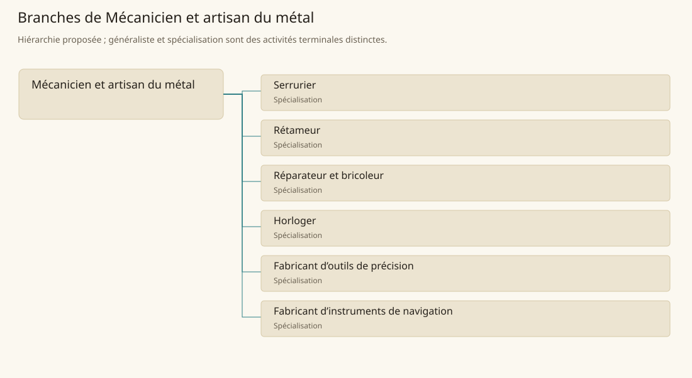

# Mécanicien et artisan du métal

[Accueil](../README.md) · [Arbre des métiers](../arbre-metiers.md)

Fabriquer et entretenir des objets métalliques dont l’assemblage, le mouvement ou la mesure demandent des ajustements.

**Métier de base proposé.** Cette famille rassemble les disciplines communes de ses branches ; elle n’ajoute pas une profession à chaque personne. Un généraliste est une feuille précise, distincte de la somme statistique de la base.

## Fonctions

- Examiner le fonctionnement et les défauts d’un objet
- Fabriquer ou ajuster ses pièces et assemblages
- Essayer le mécanisme et documenter ses limites

## Compétences nécessaires proposées

| Savoir-faire proposé | À quoi il sert | Acquisition |
|---|---|---|
| Diagnostic | Examiner le fonctionnement et les défauts d’un objet | Parcours proposé : Démonter un mécanisme simple déjà identifié |
| Ajustage | Fabriquer ou ajuster ses pièces et assemblages | Parcours proposé : Reproduire une pièce sur gabarit |
| Essais fonctionnels | Essayer le mécanisme et documenter ses limites | Parcours proposé : Comparer fonctionnement avant et après intervention |
| Organisation des réparations | Ordonner diagnostic, pièces, assemblage et essais avant remise. | Parcours proposé : Planifier pièces, essais et remise au client |

Parcours proposé : Commencer par assemblages simples, puis apprendre une famille de mécanismes avant les instruments de précision.

## Outils et chaînes de travail

Établi, Limes, Petits outils de mesure, Gabarits et pièces d’essai.

- Métal ouvré
- Outillage précis
- Utilisateurs et pièces de rechange

## Arbre de cette famille

| Branche | Nature | Fonction distinctive |
|---|---|---|
| [Serrurier](../Specialisations/mecanique/serrurier.md) | Spécialisation | Le métier n’équivaut pas à intrusion ou crochetage clandestin ; ce sont des usages et statuts distincts. |
| [Rétameur](../Specialisations/mecanique/retameur.md) | Spécialisation | Il restaure un objet existant ; fabriquer le récipient ou le métal brut est distinct. |
| [Réparateur et bricoleur](../Specialisations/mecanique/reparateur.md) | Spécialisation | La polyvalence de réparation ne donne pas automatiquement précision horlogère ou savoir de réacteur magique. |
| [Horloger](../Specialisations/mecanique/horloger.md) | Spécialisation | Les horloges de la culture taii’maku soutiennent la spécialisation déduite ; tout contrôle magique reste distinct. |
| [Fabricant d’outils de précision](../Specialisations/mecanique/precision.md) | Spécialisation | L’existence d’outils précis est sourcée ; aucune tolérance numérique nouvelle n’est fixée. |
| [Fabricant d’instruments de navigation](../Specialisations/mecanique/compas.md) | Spécialisation | La présence de compas soutient cette feuille déduite ; elle n’invente ni navigation parfaite ni propriété magnétique des objets magiques. |

## Implantation et parts de population

Les deux colonnes changent de dénominateur. Les effectifs régionaux proposés servent à dimensionner les filières ; ils ne prouvent pas une compétence individuelle. Les valeurs relatives ne donnent aucun effectif absolu.

| Région | % des habitants | % des actifs | Portée |
|---|---|---|---|
| [Empire central](../Regions/empire.md) | 0,160 % | 0,248 % | proportion proposée |
| [République des Freelands](../Regions/freelands.md) | 0,179 % | 0,279 % | proportion proposée |
| [Ben’net impérial](../Regions/bennet.md) | 0,084 % | 0,125 % | proportion proposée |
| [Royaume de Kolbjörn](../Regions/kolbjorn.md) | 0,067 % | 0,100 % | proportion proposée |
| [Magocratie de Mage Tower](../Regions/magocracy.md) | 0,052 % | 0,079 % | proportion proposée |
| [Seashores](../Regions/seashores.md) | 0,110 % | 0,166 % | proportion proposée |
| [Forêt de Sindile](../Regions/sindile.md) | 0,038 % | 0,056 % | proportion proposée |
| [Domaines stravians](../Regions/stravian.md) | 0,052 % | 0,079 % | proportion proposée |
| [Îles des Tempêtes](../Regions/storm.md) | 0,042 % | 0,058 % | proportion proposée |
| [Cités de Taii’Maku](../Regions/taiimaku.md) | 1,555 % | 3,569 % | proportion proposée |
| [Théocratie de Kepesh](../Regions/kepesh.md) | 0,078 % | 0,116 % | proportion proposée |
| [Tsvetan](../Regions/tsvetan.md) | 0,236 % | 0,353 % | proportion proposée |
| [Yama](../Regions/yama.md) | 0,038 % | 0,057 % | proportion proposée |
| [Undertanares](../Regions/undertanares.md) | 0,210 % | 0,328 % | scénario relatif |
| [Darkall](../Regions/darkall.md) | 0,315 % | 0,478 % | scénario relatif |
| [Mystical et Wasteland](../Regions/mystical.md) | non applicable | non applicable | absence de dénominateur civil |

## Choix et sources

Références du registre de base : MJ128, SB174. Leur portée concerne les activités, ressources et contextes des feuilles rattachées ; le regroupement en base, les fonctions détaillées, outils, compétences et formations sont proposés P, sans bonus ni nouvelle statistique.

La parenté entre branches et les savoir-faire de cette fiche sont des propositions de conception. Appui des activités : [Manuel des Joueurs p. 128](../Sources/mj.md#p-128), [Tanares Sourcebook p. 174](../Sources/sb.md#p-174).
