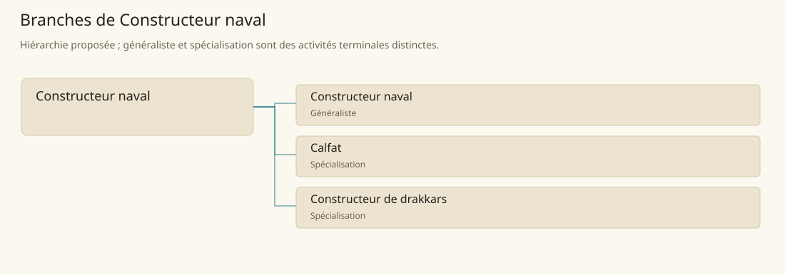

# Constructeur naval

[Accueil](../README.md) · [Arbre des métiers](../arbre-metiers.md)

Construire et entretenir des coques et équipements compatibles avec leur eau, leur cargaison et leur équipage.

**Métier de base proposé.** Cette famille rassemble les disciplines communes de ses branches ; elle n’ajoute pas une profession à chaque personne. Un généraliste est une feuille précise, distincte de la somme statistique de la base.

## Fonctions

- Définir coque, charge et usage du navire
- Coordonner charpente, bordage, étanchéité et gréement
- Organiser inspections, carénage et réparations

## Compétences nécessaires proposées

| Savoir-faire proposé | À quoi il sert | Acquisition |
|---|---|---|
| Lecture des formes de coque | Relier volume, stabilité et tirant d’eau | Comparer des maquettes et des retours de marins |
| Assemblage naval | Préparer des raccords qui supportent efforts et humidité | Monter des sections de coque à l’atelier |
| Planification du chantier | Ordonner les travaux avant fermeture des accès | Suivre construction et réparation d’une petite embarcation |
| Inspection d’étanchéité | Localiser infiltration et faiblesse du bordage | Assister des mises à l’eau et contrôles de carène |

P : formation au chantier naval et auprès des équipages, sans attribuer une propulsion magique à tout constructeur.

## Outils et chaînes de travail

Gabarits de coque, Scies, Herminettes, Bers, Matériel de levage.

- Bois et métallurgie
- Calfats
- Cordiers et voiliers
- Marins et installations portuaires

## Arbre de cette famille

| Branche | Nature | Fonction distinctive |
|---|---|---|
| [Constructeur naval](../Specialisations/navale/constructeur-naval.md) | Généraliste | Le généraliste exécute construction et entretien courants ; la base navale articule aussi calfatage et traditions de navires particuliers. |
| [Calfat](../Specialisations/navale/calfat.md) | Spécialisation | Il traite l’étanchéité du joint ; remplacer une membrure rompue demande un travail de construction navale. |
| [Constructeur de drakkars](../Specialisations/navale/drakkar.md) | Spécialisation | Spécialité navale régionale ; ses détails constructifs sont proposés, aucune vitesse universelle de drakkar n’est déduite du nom. |

## Implantation et parts de population

Les deux colonnes changent de dénominateur. Les effectifs régionaux proposés servent à dimensionner les filières ; ils ne prouvent pas une compétence individuelle. Les valeurs relatives ne donnent aucun effectif absolu.

| Région | % des habitants | % des actifs | Portée |
|---|---|---|---|
| [Empire central](../Regions/empire.md) | 0,076 % | 0,118 % | proportion proposée |
| [République des Freelands](../Regions/freelands.md) | 0,104 % | 0,163 % | proportion proposée |
| [Ben’net impérial](../Regions/bennet.md) | 0,005 % | 0,007 % | proportion proposée |
| [Royaume de Kolbjörn](../Regions/kolbjorn.md) | 0,267 % | 0,400 % | proportion proposée |
| [Magocratie de Mage Tower](../Regions/magocracy.md) | 0,031 % | 0,046 % | proportion proposée |
| [Seashores](../Regions/seashores.md) | 0,317 % | 0,479 % | proportion proposée |
| [Forêt de Sindile](../Regions/sindile.md) | 0,002 % | 0,003 % | proportion proposée |
| [Domaines stravians](../Regions/stravian.md) | 0,030 % | 0,046 % | proportion proposée |
| [Îles des Tempêtes](../Regions/storm.md) | 0,073 % | 0,101 % | proportion proposée |
| [Cités de Taii’Maku](../Regions/taiimaku.md) | 0,113 % | 0,260 % | proportion proposée |
| [Théocratie de Kepesh](../Regions/kepesh.md) | 0,045 % | 0,068 % | proportion proposée |
| [Tsvetan](../Regions/tsvetan.md) | 0,138 % | 0,206 % | proportion proposée |
| [Yama](../Regions/yama.md) | 0,022 % | 0,033 % | proportion proposée |
| [Undertanares](../Regions/undertanares.md) | 0,123 % | 0,191 % | scénario relatif |
| [Darkall](../Regions/darkall.md) | 0,799 % | 1,210 % | scénario relatif |
| [Mystical et Wasteland](../Regions/mystical.md) | non applicable | non applicable | absence de dénominateur civil |

## Choix et sources

Références des feuilles conservées : MJ128, SB130, SB148. Elles appuient activités, outillage ou contexte des filières selon le classement du modèle. Cette base et son regroupement sont une hiérarchie P ; les fonctions, savoir-faire, outils détaillés et apprentissages ci-dessous sont des propositions P, sans bonus chiffré ni certification par les sources.

La parenté entre branches et les savoir-faire de cette fiche sont des propositions de conception. Appui des activités : [Manuel des Joueurs p. 128](../Sources/mj.md#p-128), [Tanares Sourcebook p. 130](../Sources/sb.md#p-130), [Tanares Sourcebook p. 148](../Sources/sb.md#p-148).
