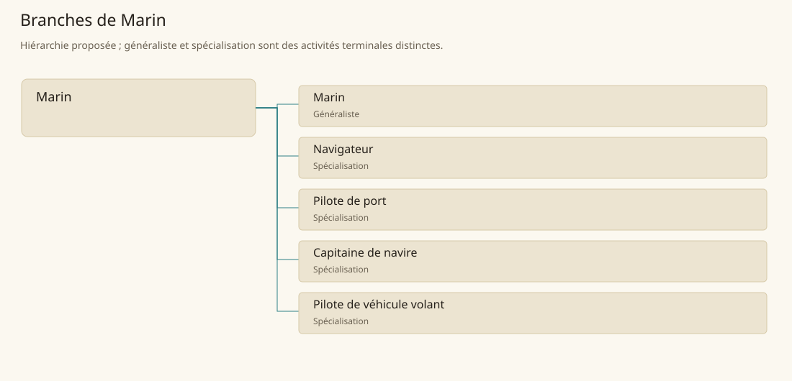

# Marin

[Accueil](../README.md) · [Arbre des métiers](../arbre-metiers.md)

Conduire et exploiter les embarcations, avec une branche distincte pour les véhicules volants du scénario.

**Métier de base proposé.** Cette famille rassemble les disciplines communes de ses branches ; elle n’ajoute pas une profession à chaque personne. Un généraliste est une feuille précise, distincte de la somme statistique de la base.

## Fonctions

- Préparer équipage, cargaison, route et état du véhicule
- Coordonner conduite, observation et manœuvres
- Organiser escales, entretien et réponse aux incidents

## Compétences nécessaires proposées

| Savoir-faire proposé | À quoi il sert | Acquisition |
|---|---|---|
| Lecture du milieu | Repérer météo, courants et obstacles | Observer le trajet avec un praticien expérimenté |
| Transmission des consignes | Donner ordres compréhensibles et vérifier leur exécution | Répéter des manœuvres en équipage |
| Répartition du chargement | Préserver stabilité et accès aux équipements | Comparer plans de chargement et essais encadrés |
| Conduite de veille | Maintenir observation et relèves documentées | Tenir un journal de quart supervisé |

P : expérience d’équipage puis responsabilités progressives, avec formation spécifique au véhicule pour la branche volante.

## Outils et chaînes de travail

Cartes disponibles, Compas ou repères locaux, Cordages, Journaux, Équipements propres au véhicule.

- Constructeurs navals ou fabricants du véhicule
- Ports et lieux d’escale
- Approvisionnements
- Pilotes et autorités d’accès

## Arbre de cette famille

| Branche | Nature | Fonction distinctive |
|---|---|---|
| [Marin](../Specialisations/navigation/marin.md) | Généraliste | Le généraliste travaille au pont ; la base navigation coordonne aussi route, commandement et pilotage spécialisé. |
| [Navigateur](../Specialisations/navigation/navigateur.md) | Spécialisation | Il conseille et suit la route ; le capitaine garde le commandement et le pilote de port la conduite locale spécialisée. |
| [Pilote de port](../Specialisations/navigation/pilote-port.md) | Spécialisation | Son expertise concerne un accès local ; elle ne vaut pas maîtrise générale de toute navigation. |
| [Capitaine de navire](../Specialisations/navigation/capitaine.md) | Spécialisation | Fonction professionnelle de commandement ; elle n’est pas un grade militaire universel ni un titre noble. |
| [Pilote de véhicule volant](../Specialisations/navigation/pilote-volant.md) | Spécialisation | Spécialité déduite en Mage Tower et Taii ; aucune propulsion, portée ou capacité illimitée n’est inventée. |

## Implantation et parts de population

Les deux colonnes changent de dénominateur. Les effectifs régionaux proposés servent à dimensionner les filières ; ils ne prouvent pas une compétence individuelle. Les valeurs relatives ne donnent aucun effectif absolu.

| Région | % des habitants | % des actifs | Portée |
|---|---|---|---|
| [Empire central](../Regions/empire.md) | 0,207 % | 0,320 % | proportion proposée |
| [République des Freelands](../Regions/freelands.md) | 0,535 % | 0,835 % | proportion proposée |
| [Ben’net impérial](../Regions/bennet.md) | 0,018 % | 0,026 % | proportion proposée |
| [Royaume de Kolbjörn](../Regions/kolbjorn.md) | 0,511 % | 0,766 % | proportion proposée |
| [Magocratie de Mage Tower](../Regions/magocracy.md) | 0,253 % | 0,382 % | proportion proposée |
| [Seashores](../Regions/seashores.md) | 0,674 % | 1,019 % | proportion proposée |
| [Forêt de Sindile](../Regions/sindile.md) | 0,102 % | 0,152 % | proportion proposée |
| [Domaines stravians](../Regions/stravian.md) | 0,201 % | 0,304 % | proportion proposée |
| [Îles des Tempêtes](../Regions/storm.md) | 0,595 % | 0,827 % | proportion proposée |
| [Cités de Taii’Maku](../Regions/taiimaku.md) | 0,199 % | 0,457 % | proportion proposée |
| [Théocratie de Kepesh](../Regions/kepesh.md) | 0,255 % | 0,381 % | proportion proposée |
| [Tsvetan](../Regions/tsvetan.md) | 0,119 % | 0,178 % | proportion proposée |
| [Yama](../Regions/yama.md) | 0,189 % | 0,284 % | proportion proposée |
| [Undertanares](../Regions/undertanares.md) | 0,011 % | 0,016 % | scénario relatif |
| [Darkall](../Regions/darkall.md) | 0,089 % | 0,134 % | scénario relatif |
| [Mystical et Wasteland](../Regions/mystical.md) | non applicable | non applicable | absence de dénominateur civil |

## Choix et sources

Références des feuilles conservées : MJ136, SB142, SB174. Elles appuient activités, outillage ou contexte des filières selon le classement du modèle. Cette base et son regroupement sont une hiérarchie P ; les fonctions, savoir-faire, outils détaillés et apprentissages ci-dessous sont des propositions P, sans bonus chiffré ni certification par les sources.

La parenté entre branches et les savoir-faire de cette fiche sont des propositions de conception. Appui des activités : [Manuel des Joueurs p. 136](../Sources/mj.md#p-136), [Tanares Sourcebook p. 142](../Sources/sb.md#p-142), [Tanares Sourcebook p. 174](../Sources/sb.md#p-174).
