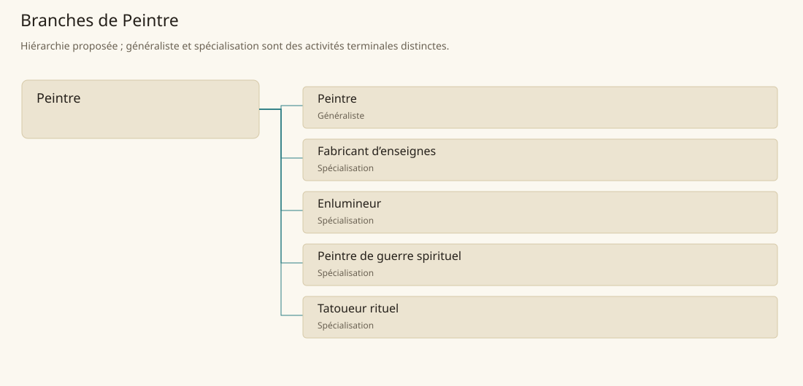

# Peintre

[Accueil](../README.md) · [Arbre des métiers](../arbre-metiers.md)

Produire images, décors et marques visuelles répondant à un usage civil, artistique ou autorisé par un rite.

**Métier de base proposé.** Cette famille rassemble les disciplines communes de ses branches ; elle n’ajoute pas une profession à chaque personne. Un généraliste est une feuille précise, distincte de la somme statistique de la base.

## Fonctions

- Recueillir thème, support et autorisations nécessaires
- Coordonner dessin, pigments et application
- Évaluer lisibilité, conservation et entretien

## Compétences nécessaires proposées

| Savoir-faire proposé | À quoi il sert | Acquisition |
|---|---|---|
| Préparation des supports | Éviter décollement et absorption irrégulière | Préparer panneaux et échantillons |
| Mélange des couleurs | Obtenir nuances reproductibles avec pigments disponibles | Tenir un carnet d’essais |
| Composition visuelle | Hiérarchiser signes et figures selon usage | Dessiner plusieurs maquettes commentées |
| Lecture des conventions | Distinguer décoration libre et symboles réservés | Consulter commanditaires et gardiens des rites |

P : atelier de dessin et matière, avec apprentissage religieux autorisé séparé quand une feuille l’exige.

## Outils et chaînes de travail

Pigments, Liants, Pinceaux, Panneaux d’essai, Carnets.

- Producteurs de pigments
- Papetiers et relieurs
- Bâtisseurs
- Commanditaires civils et cultuels

## Arbre de cette famille

| Branche | Nature | Fonction distinctive |
|---|---|---|
| [Peintre](../Specialisations/peinture/peintre.md) | Généraliste | Feuille généraliste d’exécution picturale ; la base coordonne aussi signes commerciaux, livres et marques rituelles autorisées. |
| [Fabricant d’enseignes](../Specialisations/peinture/enseignes.md) | Spécialisation | Il privilégie identification publique et tenue extérieure ; la réputation commerciale n’est pas fabriquée par le seul panneau. |
| [Enlumineur](../Specialisations/peinture/enlumineur.md) | Spécialisation | Il réalise le décor du livre ; copier, traduire et relier restent des tâches distinctes. |
| [Peintre de guerre spirituel](../Specialisations/peinture/peinture-sacree.md) | Spécialisation | Spécialisation rituelle de Tsvetan ; aucune recette libre ni effet magique supplémentaire n’est ajouté. |
| [Tatoueur rituel](../Specialisations/peinture/tatoueur.md) | Spécialisation | Spécialité déduite pour Yama ; elle ne reçoit pas automatiquement une maîtrise médicale ou une capacité magique. |

## Implantation et parts de population

Les deux colonnes changent de dénominateur. Les effectifs régionaux proposés servent à dimensionner les filières ; ils ne prouvent pas une compétence individuelle. Les valeurs relatives ne donnent aucun effectif absolu.

| Région | % des habitants | % des actifs | Portée |
|---|---|---|---|
| [Empire central](../Regions/empire.md) | 0,152 % | 0,235 % | proportion proposée |
| [République des Freelands](../Regions/freelands.md) | 0,179 % | 0,279 % | proportion proposée |
| [Ben’net impérial](../Regions/bennet.md) | 0,084 % | 0,125 % | proportion proposée |
| [Royaume de Kolbjörn](../Regions/kolbjorn.md) | 0,067 % | 0,100 % | proportion proposée |
| [Magocratie de Mage Tower](../Regions/magocracy.md) | 0,052 % | 0,079 % | proportion proposée |
| [Seashores](../Regions/seashores.md) | 0,245 % | 0,370 % | proportion proposée |
| [Forêt de Sindile](../Regions/sindile.md) | 0,038 % | 0,056 % | proportion proposée |
| [Domaines stravians](../Regions/stravian.md) | 0,052 % | 0,079 % | proportion proposée |
| [Îles des Tempêtes](../Regions/storm.md) | 0,042 % | 0,058 % | proportion proposée |
| [Cités de Taii’Maku](../Regions/taiimaku.md) | 0,194 % | 0,446 % | proportion proposée |
| [Théocratie de Kepesh](../Regions/kepesh.md) | 0,078 % | 0,116 % | proportion proposée |
| [Tsvetan](../Regions/tsvetan.md) | 0,262 % | 0,392 % | proportion proposée |
| [Yama](../Regions/yama.md) | 0,046 % | 0,070 % | proportion proposée |
| [Undertanares](../Regions/undertanares.md) | 0,210 % | 0,328 % | scénario relatif |
| [Darkall](../Regions/darkall.md) | 0,315 % | 0,478 % | scénario relatif |
| [Mystical et Wasteland](../Regions/mystical.md) | non applicable | non applicable | absence de dénominateur civil |

## Choix et sources

Références des feuilles conservées : MJ128, SB190, SB193, SB200, SB204. Elles appuient activités, outillage ou contexte des filières selon le classement du modèle. Cette base et son regroupement sont une hiérarchie P ; les fonctions, savoir-faire, outils détaillés et apprentissages ci-dessous sont des propositions P, sans bonus chiffré ni certification par les sources.

La parenté entre branches et les savoir-faire de cette fiche sont des propositions de conception. Appui des activités : [Manuel des Joueurs p. 128](../Sources/mj.md#p-128), [Tanares Sourcebook p. 190](../Sources/sb.md#p-190), [Tanares Sourcebook p. 193](../Sources/sb.md#p-193), [Tanares Sourcebook p. 200](../Sources/sb.md#p-200), [Tanares Sourcebook p. 204](../Sources/sb.md#p-204).
