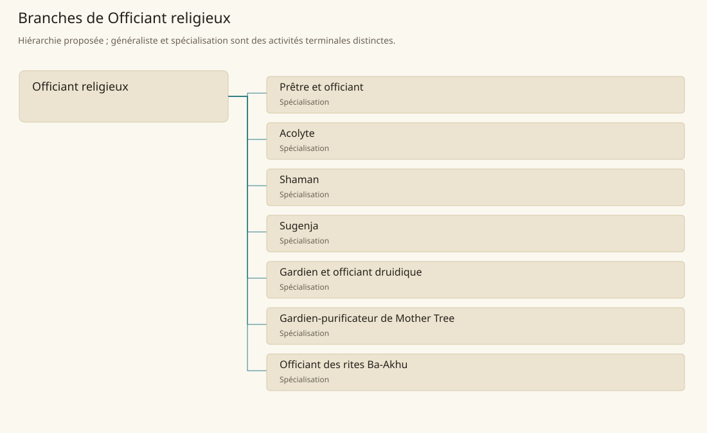

# Officiant religieux

[Accueil](../README.md) · [Arbre des métiers](../arbre-metiers.md)

Assurer les rites, l’accueil et la continuité d’une communauté religieuse locale.

**Métier de base proposé.** Cette famille rassemble les disciplines communes de ses branches ; elle n’ajoute pas une profession à chaque personne. Un généraliste est une feuille précise, distincte de la somme statistique de la base.

## Fonctions

- Préparer calendrier et matériel de culte
- Conduire ou assister les rites selon sa fonction reconnue
- Accompagner fidèles et entretenir les lieux sacrés

## Compétences nécessaires proposées

| Savoir-faire proposé | À quoi il sert | Acquisition |
|---|---|---|
| Connaissance du rite | Distinguer gestes prescrits et usages locaux | P : Transmission par les desservants |
| Parole cérémonielle | Faire entendre prières et explications | P : Répétitions avec un officiant |
| Accueil spirituel | Écouter une demande et orienter vers le bon rite | P : Accompagnement des fidèles |
| Entretien du sacré | Préserver objets et lieux sans altérer leur usage | P : Service supervisé du sanctuaire |

Transmission au sein du culte concerné ; aucune fonction religieuse ne confère automatiquement une classe ou un pouvoir.

## Outils et chaînes de travail

Textes du culte, Objets liturgiques locaux, Registres cérémoniels.

- Écriture
- Funéraire
- Artisanat
- Sécurité des sanctuaires

## Arbre de cette famille

| Branche | Nature | Fonction distinctive |
|---|---|---|
| [Prêtre et officiant](../Specialisations/religion/pretre.md) | Spécialisation | Fonction religieuse ; ne présume ni classe de clerc ni capacité à lancer des sorts. |
| [Acolyte](../Specialisations/religion/acolyte.md) | Spécialisation | Rôle d’assistance, sans présumer accès à tous les rites du culte. |
| [Shaman](../Specialisations/religion/shaman.md) | Spécialisation | Ne transforme pas une fonction attestée dans plusieurs contextes en tradition unique ni en pouvoir racial. |
| [Sugenja](../Specialisations/religion/sugenja.md) | Spécialisation | Intitulé culturel attesté ; n’ajoute ni liste de sorts ni voie automatique depuis un autre culte. |
| [Gardien et officiant druidique](../Specialisations/religion/druide.md) | Spécialisation | La fonction sociale ne se confond pas avec la classe de personnage druide. |
| [Gardien-purificateur de Mother Tree](../Specialisations/religion/mothertree.md) | Spécialisation | Ne confère ni production automatique d’Estelindea ni pouvoir sur tout arbre. |
| [Officiant des rites Ba-Akhu](../Specialisations/religion/ba-akhu.md) | Spécialisation | Rites culturels attestés, sans droit racial automatique ni assimilation au Renkhet-Netjer d’immortalisation. |

## Implantation et parts de population

Les deux colonnes changent de dénominateur. Les effectifs régionaux proposés servent à dimensionner les filières ; ils ne prouvent pas une compétence individuelle. Les valeurs relatives ne donnent aucun effectif absolu.

| Région | % des habitants | % des actifs | Portée |
|---|---|---|---|
| [Empire central](../Regions/empire.md) | 0,406 % | 0,629 % | proportion proposée |
| [République des Freelands](../Regions/freelands.md) | 0,656 % | 1,023 % | proportion proposée |
| [Ben’net impérial](../Regions/bennet.md) | 0,515 % | 0,766 % | proportion proposée |
| [Royaume de Kolbjörn](../Regions/kolbjorn.md) | 0,587 % | 0,879 % | proportion proposée |
| [Magocratie de Mage Tower](../Regions/magocracy.md) | 0,210 % | 0,317 % | proportion proposée |
| [Seashores](../Regions/seashores.md) | 0,296 % | 0,447 % | proportion proposée |
| [Forêt de Sindile](../Regions/sindile.md) | 0,904 % | 1,346 % | proportion proposée |
| [Domaines stravians](../Regions/stravian.md) | 0,355 % | 0,536 % | proportion proposée |
| [Îles des Tempêtes](../Regions/storm.md) | 2,310 % | 3,208 % | proportion proposée |
| [Cités de Taii’Maku](../Regions/taiimaku.md) | 0,491 % | 1,127 % | proportion proposée |
| [Théocratie de Kepesh](../Regions/kepesh.md) | 1,323 % | 1,977 % | proportion proposée |
| [Tsvetan](../Regions/tsvetan.md) | 0,656 % | 0,981 % | proportion proposée |
| [Yama](../Regions/yama.md) | 0,828 % | 1,242 % | proportion proposée |
| [Undertanares](../Regions/undertanares.md) | 0,746 % | 1,164 % | scénario relatif |
| [Darkall](../Regions/darkall.md) | 0,942 % | 1,427 % | scénario relatif |
| [Mystical et Wasteland](../Regions/mystical.md) | non applicable | non applicable | absence de dénominateur civil |

## Choix et sources

P : famille professionnelle, fonctions, compétences, outils et formation proposés. Les sources des feuilles appuient des activités ou contextes précis ; elles ne prouvent ni une organisation générale de cette famille, ni une maîtrise de toutes ses spécialités.

La parenté entre branches et les savoir-faire de cette fiche sont des propositions de conception. Appui des activités : [Manuel des Joueurs p. 127](../Sources/mj.md#p-127), [Tanares Sourcebook p. 129](../Sources/sb.md#p-129), [Tanares Sourcebook p. 153](../Sources/sb.md#p-153), [Tanares Sourcebook p. 182](../Sources/sb.md#p-182), [Tanares Sourcebook p. 184](../Sources/sb.md#p-184), [Tanares Sourcebook p. 191](../Sources/sb.md#p-191), [Tanares Sourcebook p. 198](../Sources/sb.md#p-198).
