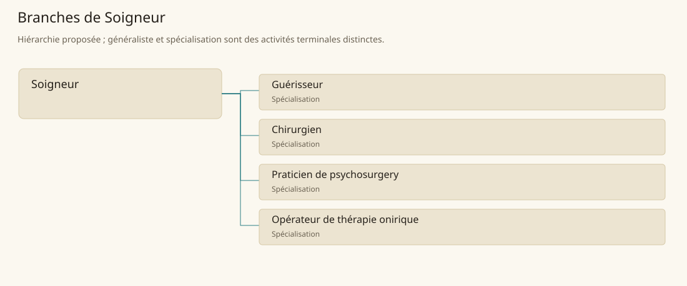

# Soigneur

[Accueil](../README.md) · [Arbre des métiers](../arbre-metiers.md)

Accueillir les personnes souffrantes, organiser leur prise en charge et suivre les interventions disponibles.

**Métier de base proposé.** Cette famille rassemble les disciplines communes de ses branches ; elle n’ajoute pas une profession à chaque personne. Un généraliste est une feuille précise, distincte de la somme statistique de la base.

## Fonctions

- Recueillir symptômes et besoins de la personne
- Préparer lieu, matériel et intervenant qualifié
- Suivre l’évolution et transmettre les observations

## Compétences nécessaires proposées

| Savoir-faire proposé | À quoi il sert | Acquisition |
|---|---|---|
| Observation de l’état | Décrire signes et changements sans surinterprétation | P : Cas commentés par un soigneur |
| Hygiène de prise en charge | Entretenir mains, linge et instruments | P : Démonstrations de nettoyage |
| Écoute du patient | Recueillir symptômes et inquiétudes | P : Entretiens accompagnés |
| Transmission des soins | Conserver dates, gestes et réponses observées | P : Dossiers relus en équipe |

Apprentissage auprès d’un soigneur ; chirurgie, pratiques oniriques et psychosurgery conservent des voies séparées.

## Outils et chaînes de travail

Linge propre, Registres de suivi, Matériel propre à l’intervention.

- Hygiène
- Apothicaires
- Religion
- Services arcaniques spécialisés

## Arbre de cette famille

| Branche | Nature | Fonction distinctive |
|---|---|---|
| [Guérisseur](../Specialisations/sante/guerisseur.md) | Spécialisation | La fonction de soin n’attribue pas automatiquement chirurgie, magie curative ou classe religieuse. |
| [Chirurgien](../Specialisations/sante/chirurgien.md) | Spécialisation | Métier proposé à partir de sources sur les soigneurs, sans procédure chirurgicale canonique déduite. |
| [Praticien de psychosurgery](../Specialisations/sante/psychosurgery.md) | Spécialisation | Rite de privation du libre arbitre à Phantom Fortress, pas thérapie générale ; l’inversion relève d’un savoir exceptionnel distinct. |
| [Opérateur de thérapie onirique](../Specialisations/sante/onirique.md) | Spécialisation | Fonction déduite à Asylum Eberek et Mustardseed ; ne fusionne pas leurs dispositifs en une thérapie universelle. |

## Implantation et parts de population

Les deux colonnes changent de dénominateur. Les effectifs régionaux proposés servent à dimensionner les filières ; ils ne prouvent pas une compétence individuelle. Les valeurs relatives ne donnent aucun effectif absolu.

| Région | % des habitants | % des actifs | Portée |
|---|---|---|---|
| [Empire central](../Regions/empire.md) | 0,113 % | 0,175 % | proportion proposée |
| [République des Freelands](../Regions/freelands.md) | 0,139 % | 0,216 % | proportion proposée |
| [Ben’net impérial](../Regions/bennet.md) | 0,042 % | 0,063 % | proportion proposée |
| [Royaume de Kolbjörn](../Regions/kolbjorn.md) | 0,057 % | 0,085 % | proportion proposée |
| [Magocratie de Mage Tower](../Regions/magocracy.md) | 0,103 % | 0,156 % | proportion proposée |
| [Seashores](../Regions/seashores.md) | 0,133 % | 0,201 % | proportion proposée |
| [Forêt de Sindile](../Regions/sindile.md) | 0,064 % | 0,096 % | proportion proposée |
| [Domaines stravians](../Regions/stravian.md) | 0,043 % | 0,065 % | proportion proposée |
| [Îles des Tempêtes](../Regions/storm.md) | 0,111 % | 0,155 % | proportion proposée |
| [Cités de Taii’Maku](../Regions/taiimaku.md) | 0,125 % | 0,286 % | proportion proposée |
| [Théocratie de Kepesh](../Regions/kepesh.md) | 0,039 % | 0,058 % | proportion proposée |
| [Tsvetan](../Regions/tsvetan.md) | 0,049 % | 0,073 % | proportion proposée |
| [Yama](../Regions/yama.md) | 0,035 % | 0,053 % | proportion proposée |
| [Undertanares](../Regions/undertanares.md) | 0,043 % | 0,066 % | scénario relatif |
| [Darkall](../Regions/darkall.md) | 0,105 % | 0,159 % | scénario relatif |
| [Mystical et Wasteland](../Regions/mystical.md) | non applicable | non applicable | absence de dénominateur civil |

## Choix et sources

P : famille professionnelle, fonctions, compétences, outils et formation proposés. Les sources des feuilles appuient des activités ou contextes précis ; elles ne prouvent ni une organisation générale de cette famille, ni une maîtrise de toutes ses spécialités. Le rattachement de psychosurgery à cette famille est une organisation P du modèle ; le rite impérial de conversion n’est pas un soin.

La parenté entre branches et les savoir-faire de cette fiche sont des propositions de conception. Appui des activités : [Manuel des Joueurs p. 141](../Sources/mj.md#p-141), [Player’s Guide to Tanares p. 36](../Sources/pg.md#p-36), [Tanares Sourcebook p. 141](../Sources/sb.md#p-141), [Tanares Sourcebook p. 228](../Sources/sb.md#p-228), [Tanares Sourcebook p. 94](../Sources/sb.md#p-94).
