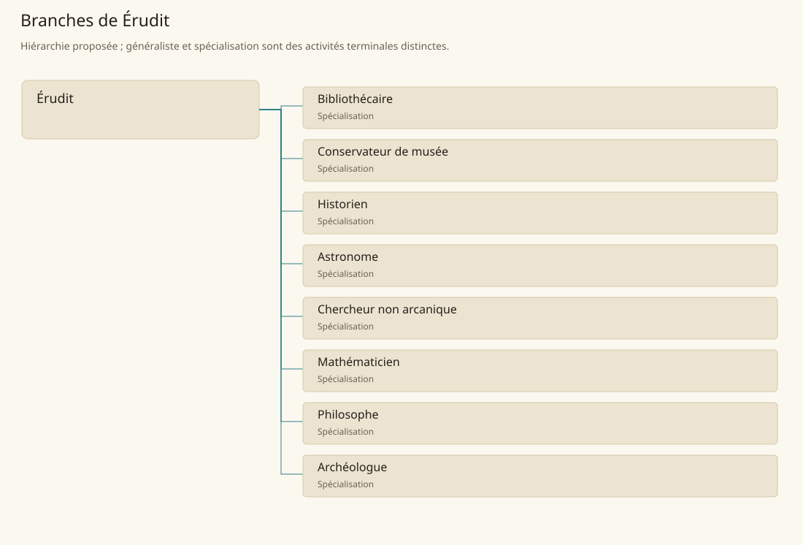

# Érudit

[Accueil](../README.md) · [Arbre des métiers](../arbre-metiers.md)

Conserver, examiner et expliquer des connaissances en séparant observations et interprétations.

**Métier de base proposé.** Cette famille rassemble les disciplines communes de ses branches ; elle n’ajoute pas une profession à chaque personne. Un généraliste est une feuille précise, distincte de la somme statistique de la base.

## Fonctions

- Rassembler sources, objets ou observations
- Éprouver une question par comparaison et examen
- Rendre les résultats accessibles avec leurs limites

## Compétences nécessaires proposées

| Savoir-faire proposé | À quoi il sert | Acquisition |
|---|---|---|
| Critique des sources | Évaluer origine, date et contradiction | P : Analyse de dossiers commentés |
| Classement | Retrouver ouvrages, objets et notes | P : Catalogues construits sous contrôle |
| Raisonnement | Relier conclusion et éléments disponibles | P : Discussions et exercices argumentés |
| Transmission du savoir | Expliquer une connaissance et son incertitude | P : Présentations relues par des pairs |

Lecture guidée, enquêtes documentaires et travaux examinés par un mentor savant.

## Outils et chaînes de travail

Catalogues, Ouvrages, Carnets d’observation.

- Écriture
- Enseignement
- Cartographie
- Conservation matérielle

## Arbre de cette famille

| Branche | Nature | Fonction distinctive |
|---|---|---|
| [Bibliothécaire](../Specialisations/savoir/bibliothecaire.md) | Spécialisation | Organise l’accès à une collection plutôt que la recherche dans une discipline unique. |
| [Conservateur de musée](../Specialisations/savoir/conservateur.md) | Spécialisation | Ne confond pas possession d’une pièce et certitude sur son interprétation. |
| [Historien](../Specialisations/savoir/historien.md) | Spécialisation | Analyse le passé plutôt que l’invention de récits ou la seule conservation des documents. |
| [Astronome](../Specialisations/savoir/astronome.md) | Spécialisation | L’observation du ciel n’attribue pas automatiquement des pouvoirs divinatoires. |
| [Chercheur non arcanique](../Specialisations/savoir/chercheur.md) | Spécialisation | Défini par sa méthode d’étude non arcanique, sans habilitation magique implicite. |
| [Mathématicien](../Specialisations/savoir/mathematicien.md) | Spécialisation | Raisonne sur les relations abstraites ; ne se limite pas à tenir des comptes. |
| [Philosophe](../Specialisations/savoir/philosophe.md) | Spécialisation | Examine concepts et justifications plutôt qu’une observation spécialisée seule. |
| [Archéologue](../Specialisations/savoir/archeologue.md) | Spécialisation | Métier déduit du contexte des vestiges ; se distingue de la seule récupération d’objets précieux. |

## Implantation et parts de population

Les deux colonnes changent de dénominateur. Les effectifs régionaux proposés servent à dimensionner les filières ; ils ne prouvent pas une compétence individuelle. Les valeurs relatives ne donnent aucun effectif absolu.

| Région | % des habitants | % des actifs | Portée |
|---|---|---|---|
| [Empire central](../Regions/empire.md) | 0,104 % | 0,161 % | proportion proposée |
| [République des Freelands](../Regions/freelands.md) | 0,171 % | 0,266 % | proportion proposée |
| [Ben’net impérial](../Regions/bennet.md) | 0,103 % | 0,153 % | proportion proposée |
| [Royaume de Kolbjörn](../Regions/kolbjorn.md) | 0,081 % | 0,121 % | proportion proposée |
| [Magocratie de Mage Tower](../Regions/magocracy.md) | 0,108 % | 0,163 % | proportion proposée |
| [Seashores](../Regions/seashores.md) | 0,112 % | 0,169 % | proportion proposée |
| [Forêt de Sindile](../Regions/sindile.md) | 0,043 % | 0,065 % | proportion proposée |
| [Domaines stravians](../Regions/stravian.md) | 0,058 % | 0,088 % | proportion proposée |
| [Îles des Tempêtes](../Regions/storm.md) | 0,079 % | 0,110 % | proportion proposée |
| [Cités de Taii’Maku](../Regions/taiimaku.md) | 4,020 % | 9,224 % | proportion proposée |
| [Théocratie de Kepesh](../Regions/kepesh.md) | 0,070 % | 0,105 % | proportion proposée |
| [Tsvetan](../Regions/tsvetan.md) | 0,080 % | 0,119 % | proportion proposée |
| [Yama](../Regions/yama.md) | 0,026 % | 0,039 % | proportion proposée |
| [Undertanares](../Regions/undertanares.md) | 0,340 % | 0,531 % | scénario relatif |
| [Darkall](../Regions/darkall.md) | 0,236 % | 0,358 % | scénario relatif |
| [Mystical et Wasteland](../Regions/mystical.md) | non applicable | non applicable | absence de dénominateur civil |

## Choix et sources

P : famille professionnelle, fonctions, compétences, outils et formation proposés. Les sources des feuilles appuient des activités ou contextes précis ; elles ne prouvent ni une organisation générale de cette famille, ni une maîtrise de toutes ses spécialités.

La parenté entre branches et les savoir-faire de cette fiche sont des propositions de conception. Appui des activités : [Manuel des Joueurs p. 138](../Sources/mj.md#p-138), [Player’s Guide to Tanares p. 46](../Sources/pg.md#p-46), [Player’s Guide to Tanares p. 48](../Sources/pg.md#p-48), [Tanares Sourcebook p. 174](../Sources/sb.md#p-174), [Tanares Sourcebook p. 178](../Sources/sb.md#p-178).
