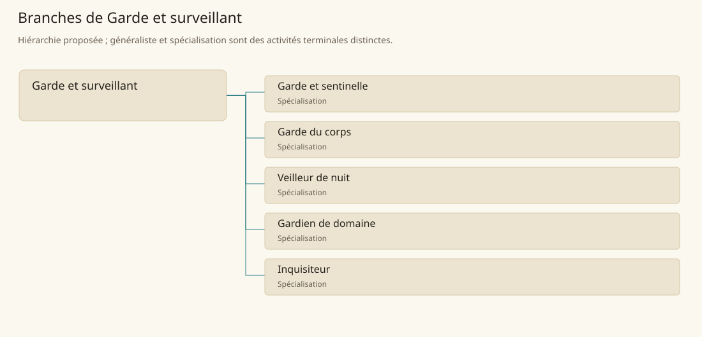

# Garde et surveillant

[Accueil](../README.md) · [Arbre des métiers](../arbre-metiers.md)

Surveiller personnes et lieux, prévenir les incidents et organiser une réponse proportionnée au mandat.

**Métier de base proposé.** Cette famille rassemble les disciplines communes de ses branches ; elle n’ajoute pas une profession à chaque personne. Un généraliste est une feuille précise, distincte de la somme statistique de la base.

## Fonctions

- Vérifier accès et effectuer les rondes prévues
- Repérer dangers et prévenir les personnes concernées
- Alerter, protéger et consigner les incidents

## Compétences nécessaires proposées

| Savoir-faire proposé | À quoi il sert | Acquisition |
|---|---|---|
| Observation vigilante | Repérer un changement dans un lieu connu | P : Rondes accompagnées |
| Contrôle d’accès | Comparer personne et autorisation | P : Situations d’accueil simulées |
| Désescalade | Donner des consignes claires avant l’intervention | P : Mises en situation commentées |
| Rapport d’incident | Séparer faits vus et déclarations recueillies | P : Rédaction après exercices |

Formation au site, aux consignes et à la chaîne d’alerte ; contrôle magique séparé.

## Outils et chaînes de travail

Registres d’accès, Signaux d’alerte, Équipement prévu par le mandat.

- Administration
- Équipement
- Renseignement
- Transport des secours

## Arbre de cette famille

| Branche | Nature | Fonction distinctive |
|---|---|---|
| [Garde et sentinelle](../Specialisations/securite/garde.md) | Spécialisation | Assure surveillance et réponse locale ; le combat militaire et le contrôle arcanique ont des formations distinctes. |
| [Garde du corps](../Specialisations/securite/garde-corps.md) | Spécialisation | Protège une personne identifiable plutôt qu’un accès fixe. |
| [Veilleur de nuit](../Specialisations/securite/veilleur.md) | Spécialisation | Spécialité proposée à partir des fonctions de garde ; aucun corps nocturne universel n’est établi. |
| [Gardien de domaine](../Specialisations/securite/gardien-domaine.md) | Spécialisation | Surveillance d’un patrimoine déterminé ; ne vaut pas fonction de garde forestier ou de magistrat. |
| [Inquisiteur](../Specialisations/securite/inquisiteur.md) | Spécialisation | Intitulé contextuel ; ne présume ni torture, ni compétence universelle, ni capacité magique. |

## Implantation et parts de population

Les deux colonnes changent de dénominateur. Les effectifs régionaux proposés servent à dimensionner les filières ; ils ne prouvent pas une compétence individuelle. Les valeurs relatives ne donnent aucun effectif absolu.

| Région | % des habitants | % des actifs | Portée |
|---|---|---|---|
| [Empire central](../Regions/empire.md) | 0,286 % | 0,444 % | proportion proposée |
| [République des Freelands](../Regions/freelands.md) | 0,912 % | 1,423 % | proportion proposée |
| [Ben’net impérial](../Regions/bennet.md) | 0,343 % | 0,510 % | proportion proposée |
| [Royaume de Kolbjörn](../Regions/kolbjorn.md) | 0,704 % | 1,055 % | proportion proposée |
| [Magocratie de Mage Tower](../Regions/magocracy.md) | 0,257 % | 0,389 % | proportion proposée |
| [Seashores](../Regions/seashores.md) | 0,398 % | 0,602 % | proportion proposée |
| [Forêt de Sindile](../Regions/sindile.md) | 0,560 % | 0,833 % | proportion proposée |
| [Domaines stravians](../Regions/stravian.md) | 0,298 % | 0,450 % | proportion proposée |
| [Îles des Tempêtes](../Regions/storm.md) | 0,574 % | 0,798 % | proportion proposée |
| [Cités de Taii’Maku](../Regions/taiimaku.md) | 0,705 % | 1,617 % | proportion proposée |
| [Théocratie de Kepesh](../Regions/kepesh.md) | 0,518 % | 0,774 % | proportion proposée |
| [Tsvetan](../Regions/tsvetan.md) | 0,464 % | 0,693 % | proportion proposée |
| [Yama](../Regions/yama.md) | 0,291 % | 0,437 % | proportion proposée |
| [Undertanares](../Regions/undertanares.md) | 1,502 % | 2,344 % | scénario relatif |
| [Darkall](../Regions/darkall.md) | 0,896 % | 1,357 % | scénario relatif |
| [Mystical et Wasteland](../Regions/mystical.md) | non applicable | non applicable | absence de dénominateur civil |

## Choix et sources

P : famille professionnelle, fonctions, compétences, outils et formation proposés. Les sources des feuilles appuient des activités ou contextes précis ; elles ne prouvent ni une organisation générale de cette famille, ni une maîtrise de toutes ses spécialités.

La parenté entre branches et les savoir-faire de cette fiche sont des propositions de conception. Appui des activités : [Manuel des Joueurs p. 140](../Sources/mj.md#p-140), [Tanares Sourcebook p. 29](../Sources/sb.md#p-29), [Tanares Sourcebook p. 90](../Sources/sb.md#p-90).
