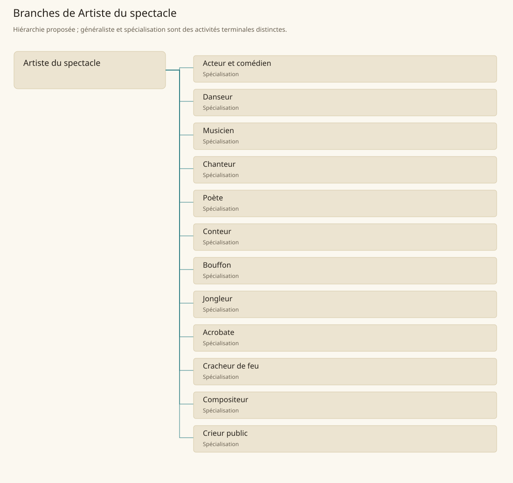

# Artiste du spectacle

[Accueil](../README.md) · [Arbre des métiers](../arbre-metiers.md)

Concevoir et présenter une œuvre ou une démonstration vivante devant un public.

**Métier de base proposé.** Cette famille rassemble les disciplines communes de ses branches ; elle n’ajoute pas une profession à chaque personne. Un généraliste est une feuille précise, distincte de la somme statistique de la base.

## Fonctions

- Préparer répertoire, espace et matériel
- Répéter avec les partenaires de scène
- Présenter la prestation et adapter rythme et présence au public

## Compétences nécessaires proposées

| Savoir-faire proposé | À quoi il sert | Acquisition |
|---|---|---|
| Interprétation | Donner intention et continuité à la prestation | P : Répétitions avec retours |
| Rythme | Coordonner durée, respiration et entrées | P : Exercices au tempo |
| Présence scénique | Rendre gestes ou voix lisibles au public | P : Présentation devant un petit auditoire |
| Coordination de troupe | Préparer signaux et changements de scène | P : Répétitions collectives |

Pratique régulière, répétition et présentations accompagnées ; chaque art conserve son instrument ou sa discipline.

## Outils et chaînes de travail

Accessoires de scène, Supports de répertoire, Équipement propre à la prestation.

- Textile
- Lutherie
- Écriture
- Accueil et salles

## Arbre de cette famille

| Branche | Nature | Fonction distinctive |
|---|---|---|
| [Acteur et comédien](../Specialisations/spectacle/acteur.md) | Spécialisation | Travaille un rôle ; aucune capacité magique n’est impliquée par l’interprétation. |
| [Danseur](../Specialisations/spectacle/danseur.md) | Spécialisation | L’expression par mouvement structure le travail, distinct du combat et de l’acrobatie. |
| [Musicien](../Specialisations/spectacle/musicien.md) | Spécialisation | La maîtrise concerne l’instrument appris, sans production magique implicite. |
| [Chanteur](../Specialisations/spectacle/chanteur.md) | Spécialisation | Travail de voix distinct de la composition et de toute classe de barde. |
| [Poète](../Specialisations/spectacle/poete.md) | Spécialisation | Spécialise la forme poétique plutôt que toute écriture ou toute prestation orale. |
| [Conteur](../Specialisations/spectacle/conteur.md) | Spécialisation | La transmission orale prime ; le récit ne constitue pas nécessairement une source historique. |
| [Bouffon](../Specialisations/spectacle/bouffon.md) | Spécialisation | Fonction de spectacle ; n’établit ni rang à la cour ni permission générale de satire. |
| [Jongleur](../Specialisations/spectacle/jongleur.md) | Spécialisation | Manipule des objets ; ce savoir-faire n’accorde pas de bonus de combat. |
| [Acrobate](../Specialisations/spectacle/acrobate.md) | Spécialisation | Discipline de scène spécialisée, sans équivalence automatique à une compétence chiffrée de jeu. |
| [Cracheur de feu](../Specialisations/spectacle/cracheur-feu.md) | Spécialisation | Spectacle attesté ; la fiche ne déduit ni souffle magique ni recette de produit combustible. |
| [Compositeur](../Specialisations/spectacle/compositeur.md) | Spécialisation | Conçoit l’œuvre ; sa représentation peut être confiée à d’autres musiciens. |
| [Crieur public](../Specialisations/spectacle/crieur.md) | Spécialisation | Métier proposé à partir des activités de spectacle ; ne confère pas autorité sur le contenu annoncé. |

## Implantation et parts de population

Les deux colonnes changent de dénominateur. Les effectifs régionaux proposés servent à dimensionner les filières ; ils ne prouvent pas une compétence individuelle. Les valeurs relatives ne donnent aucun effectif absolu.

| Région | % des habitants | % des actifs | Portée |
|---|---|---|---|
| [Empire central](../Regions/empire.md) | 0,227 % | 0,352 % | proportion proposée |
| [République des Freelands](../Regions/freelands.md) | 0,475 % | 0,742 % | proportion proposée |
| [Ben’net impérial](../Regions/bennet.md) | 0,042 % | 0,063 % | proportion proposée |
| [Royaume de Kolbjörn](../Regions/kolbjorn.md) | 0,135 % | 0,202 % | proportion proposée |
| [Magocratie de Mage Tower](../Regions/magocracy.md) | 0,051 % | 0,076 % | proportion proposée |
| [Seashores](../Regions/seashores.md) | 0,597 % | 0,902 % | proportion proposée |
| [Forêt de Sindile](../Regions/sindile.md) | 0,342 % | 0,509 % | proportion proposée |
| [Domaines stravians](../Regions/stravian.md) | 0,302 % | 0,457 % | proportion proposée |
| [Îles des Tempêtes](../Regions/storm.md) | 0,062 % | 0,086 % | proportion proposée |
| [Cités de Taii’Maku](../Regions/taiimaku.md) | 1,200 % | 2,754 % | proportion proposée |
| [Théocratie de Kepesh](../Regions/kepesh.md) | 0,057 % | 0,086 % | proportion proposée |
| [Tsvetan](../Regions/tsvetan.md) | 0,114 % | 0,170 % | proportion proposée |
| [Yama](../Regions/yama.md) | 0,034 % | 0,050 % | proportion proposée |
| [Undertanares](../Regions/undertanares.md) | 0,000 % | 0,000 % | scénario relatif |
| [Darkall](../Regions/darkall.md) | 0,214 % | 0,324 % | scénario relatif |
| [Mystical et Wasteland](../Regions/mystical.md) | non applicable | non applicable | absence de dénominateur civil |

## Choix et sources

P : famille professionnelle, fonctions, compétences, outils et formation proposés. Les sources des feuilles appuient des activités ou contextes précis ; elles ne prouvent ni une organisation générale de cette famille, ni une maîtrise de toutes ses spécialités.

La parenté entre branches et les savoir-faire de cette fiche sont des propositions de conception. Appui des activités : [Manuel des Joueurs p. 129](../Sources/mj.md#p-129), [Player’s Guide to Tanares p. 28](../Sources/pg.md#p-28).
