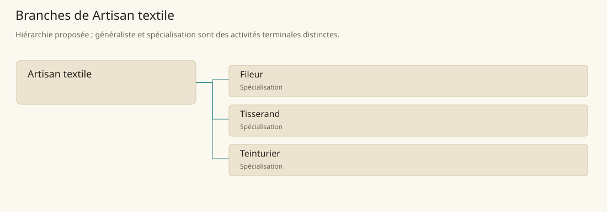

# Artisan textile

[Accueil](../README.md) · [Arbre des métiers](../arbre-metiers.md)

Transformer les fibres en fils, étoffes et tissus colorés adaptés aux usages locaux.

**Métier de base proposé.** Cette famille rassemble les disciplines communes de ses branches ; elle n’ajoute pas une profession à chaque personne. Un généraliste est une feuille précise, distincte de la somme statistique de la base.

## Fonctions

- Organiser la préparation des fibres et des fils
- Choisir une étoffe selon résistance, souplesse et usage
- Coordonner tissage, coloration et contrôle des pièces

## Compétences nécessaires proposées

| Savoir-faire proposé | À quoi il sert | Acquisition |
|---|---|---|
| Reconnaissance des fibres | Distinguer fibres fragiles et résistantes avant traitement | Comparer des échantillons et leurs réactions au lavage |
| Lecture de la structure textile | Repérer chaîne, trame et densité | Démonter des tissus simples puis retisser des essais |
| Contrôle de qualité | Déceler fils irréguliers et défauts de couleur | Comparer chaque lot à une pièce de référence |
| Planification des bains | Séparer traitements incompatibles et eaux souillées | Tenir un carnet de petits essais supervisés |

P : apprentissage en atelier, des fibres préparées à une petite pièce complète contrôlée par un artisan.

## Outils et chaînes de travail

Fuseaux, Métiers à tisser, Cuves, Balances et échantillons.

- Producteurs de fibres et élevages
- Eau et combustibles
- Tailleur de vêtements
- Cordier et fabricant de voiles

## Arbre de cette famille

| Branche | Nature | Fonction distinctive |
|---|---|---|
| [Fileur](../Specialisations/textile/fileur.md) | Spécialisation | Le fileur fournit le fil ; il ne compose pas l’étoffe ni sa coloration. |
| [Tisserand](../Specialisations/textile/tisserand.md) | Spécialisation | Il entrelace les fils déjà produits ; une maîtrise du métier ne vaut pas maîtrise de la teinture. |
| [Teinturier](../Specialisations/textile/teinturier.md) | Spécialisation | Sa responsabilité porte sur couleur et tenue, pas sur filage ou coupe du vêtement. |

## Implantation et parts de population

Les deux colonnes changent de dénominateur. Les effectifs régionaux proposés servent à dimensionner les filières ; ils ne prouvent pas une compétence individuelle. Les valeurs relatives ne donnent aucun effectif absolu.

| Région | % des habitants | % des actifs | Portée |
|---|---|---|---|
| [Empire central](../Regions/empire.md) | 0,565 % | 0,876 % | proportion proposée |
| [République des Freelands](../Regions/freelands.md) | 0,549 % | 0,857 % | proportion proposée |
| [Ben’net impérial](../Regions/bennet.md) | 0,720 % | 1,070 % | proportion proposée |
| [Royaume de Kolbjörn](../Regions/kolbjorn.md) | 0,487 % | 0,730 % | proportion proposée |
| [Magocratie de Mage Tower](../Regions/magocracy.md) | 0,747 % | 1,128 % | proportion proposée |
| [Seashores](../Regions/seashores.md) | 0,582 % | 0,879 % | proportion proposée |
| [Forêt de Sindile](../Regions/sindile.md) | 0,430 % | 0,640 % | proportion proposée |
| [Domaines stravians](../Regions/stravian.md) | 0,463 % | 0,699 % | proportion proposée |
| [Îles des Tempêtes](../Regions/storm.md) | 0,111 % | 0,154 % | proportion proposée |
| [Cités de Taii’Maku](../Regions/taiimaku.md) | 0,414 % | 0,949 % | proportion proposée |
| [Théocratie de Kepesh](../Regions/kepesh.md) | 0,552 % | 0,825 % | proportion proposée |
| [Tsvetan](../Regions/tsvetan.md) | 0,394 % | 0,589 % | proportion proposée |
| [Yama](../Regions/yama.md) | 1,084 % | 1,627 % | proportion proposée |
| [Undertanares](../Regions/undertanares.md) | 0,407 % | 0,635 % | scénario relatif |
| [Darkall](../Regions/darkall.md) | 0,526 % | 0,796 % | scénario relatif |
| [Mystical et Wasteland](../Regions/mystical.md) | non applicable | non applicable | absence de dénominateur civil |

## Choix et sources

Références des feuilles conservées : MJ128. Elles appuient activités, outillage ou contexte des filières selon le classement du modèle. Cette base et son regroupement sont une hiérarchie P ; les fonctions, savoir-faire, outils détaillés et apprentissages ci-dessous sont des propositions P, sans bonus chiffré ni certification par les sources.

La parenté entre branches et les savoir-faire de cette fiche sont des propositions de conception. Appui des activités : [Manuel des Joueurs p. 128](../Sources/mj.md#p-128).
