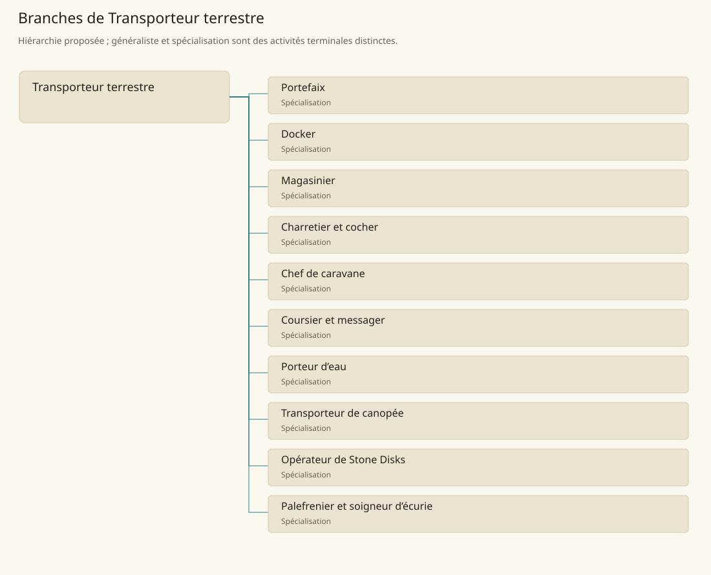

# Transporteur terrestre

[Accueil](../README.md) · [Arbre des métiers](../arbre-metiers.md)

Acheminer personnes, biens et eau entre leurs lieux d’origine, de dépôt et de consommation.

**Métier de base proposé.** Cette famille rassemble les disciplines communes de ses branches ; elle n’ajoute pas une profession à chaque personne. Un généraliste est une feuille précise, distincte de la somme statistique de la base.

## Fonctions

- Définir chaîne de manutention, stockage et livraison
- Répartir charges, équipements et responsabilités
- Suivre délais, pertes, état des biens et restrictions d’accès

## Compétences nécessaires proposées

| Savoir-faire proposé | À quoi il sert | Acquisition |
|---|---|---|
| Lecture des charges | Choisir emballage et moyen de déplacement | Comparer des chargements sous supervision |
| Traçabilité des lots | Éviter confusion et double attribution d’un stock | Tenir registres de réception et remise |
| Préparation des itinéraires | Prévoir accès, relais et difficultés du terrain | Accompagner des trajets puis les consigner |
| Coordination de manutention | Ordonner gestes et points de transfert | Participer à une livraison encadrée |

P : apprentissage par manutention et livraisons locales, puis conduite ou coordination selon la feuille. Les habilitations des Stone Disks restent distinctes.

## Outils et chaînes de travail

Registres, Balances, Cordages, Chariots, Emballages.

- Producteurs et négociants
- Charpentiers et charrons
- Gardes et gestionnaires de routes
- Sources d’eau et entrepôts

## Arbre de cette famille

| Branche | Nature | Fonction distinctive |
|---|---|---|
| [Portefaix](../Specialisations/transport/portefaix.md) | Spécialisation | Sa tâche est la manutention de proximité ; coordonner une route longue relève du chef de caravane. |
| [Docker](../Specialisations/transport/docker.md) | Spécialisation | Il assure le transfert portuaire ; conduire le bateau ou tenir le stock appartient à d’autres responsabilités. |
| [Magasinier](../Specialisations/transport/magasinier.md) | Spécialisation | Il gère le dépôt ; être gardien du stock ne signifie pas en être propriétaire ni producteur. |
| [Charretier et cocher](../Specialisations/transport/charretier.md) | Spécialisation | Il conduit le véhicule ; construire roues et essieux ou diagnostiquer une maladie animale relève d’autres métiers. |
| [Chef de caravane](../Specialisations/transport/chef-caravane.md) | Spécialisation | Il coordonne la route et l’équipe ; aucun droit de passage ou soutien militaire n’est supposé gratuit. |
| [Coursier et messager](../Specialisations/transport/messager.md) | Spécialisation | Il transmet une information ; négocier son contenu ou parler au nom de l’expéditeur exige un mandat distinct. |
| [Porteur d’eau](../Specialisations/transport/porteur-eau.md) | Spécialisation | Métier proposé de livraison ; transporter l’eau ne suffit pas à la rendre potable. |
| [Transporteur de canopée](../Specialisations/transport/canopée.md) | Spécialisation | Spécialité de transport déduite du milieu arboré ; ni coupe intensive ni vol gratuit ne sont ajoutés. |
| [Opérateur de Stone Disks](../Specialisations/transport/stone-disks.md) | Spécialisation | Cette feuille exige une habilitation explicite ; elle n’autorise pas tout prêtre, toute espèce ou un fret sans plafond. |
| [Palefrenier et soigneur d’écurie](../Specialisations/transport/palefrenier.md) | Spécialisation | Il entretient et prépare les animaux ; diagnostiquer une maladie ou conduire un convoi reste distinct. |

## Implantation et parts de population

Les deux colonnes changent de dénominateur. Les effectifs régionaux proposés servent à dimensionner les filières ; ils ne prouvent pas une compétence individuelle. Les valeurs relatives ne donnent aucun effectif absolu.

| Région | % des habitants | % des actifs | Portée |
|---|---|---|---|
| [Empire central](../Regions/empire.md) | 1,787 % | 2,771 % | proportion proposée |
| [République des Freelands](../Regions/freelands.md) | 2,056 % | 3,207 % | proportion proposée |
| [Ben’net impérial](../Regions/bennet.md) | 1,017 % | 1,513 % | proportion proposée |
| [Royaume de Kolbjörn](../Regions/kolbjorn.md) | 1,414 % | 2,119 % | proportion proposée |
| [Magocratie de Mage Tower](../Regions/magocracy.md) | 2,225 % | 3,361 % | proportion proposée |
| [Seashores](../Regions/seashores.md) | 1,554 % | 2,349 % | proportion proposée |
| [Forêt de Sindile](../Regions/sindile.md) | 1,318 % | 1,961 % | proportion proposée |
| [Domaines stravians](../Regions/stravian.md) | 1,916 % | 2,894 % | proportion proposée |
| [Îles des Tempêtes](../Regions/storm.md) | 1,701 % | 2,362 % | proportion proposée |
| [Cités de Taii’Maku](../Regions/taiimaku.md) | 1,491 % | 3,421 % | proportion proposée |
| [Théocratie de Kepesh](../Regions/kepesh.md) | 2,007 % | 3,000 % | proportion proposée |
| [Tsvetan](../Regions/tsvetan.md) | 1,121 % | 1,677 % | proportion proposée |
| [Yama](../Regions/yama.md) | 1,627 % | 2,441 % | proportion proposée |
| [Undertanares](../Regions/undertanares.md) | 1,837 % | 2,866 % | scénario relatif |
| [Darkall](../Regions/darkall.md) | 0,774 % | 1,173 % | scénario relatif |
| [Mystical et Wasteland](../Regions/mystical.md) | non applicable | non applicable | absence de dénominateur civil |

## Choix et sources

Références des feuilles conservées : MJ132, PG13, SB121, SB123, SB154. Elles appuient activités, outillage ou contexte des filières selon le classement du modèle. Cette base et son regroupement sont une hiérarchie P ; les fonctions, savoir-faire, outils détaillés et apprentissages ci-dessous sont des propositions P, sans bonus chiffré ni certification par les sources.

La parenté entre branches et les savoir-faire de cette fiche sont des propositions de conception. Appui des activités : [Manuel des Joueurs p. 132](../Sources/mj.md#p-132), [Player’s Guide to Tanares p. 13](../Sources/pg.md#p-13), [Tanares Sourcebook p. 121](../Sources/sb.md#p-121), [Tanares Sourcebook p. 123](../Sources/sb.md#p-123), [Tanares Sourcebook p. 154](../Sources/sb.md#p-154).
