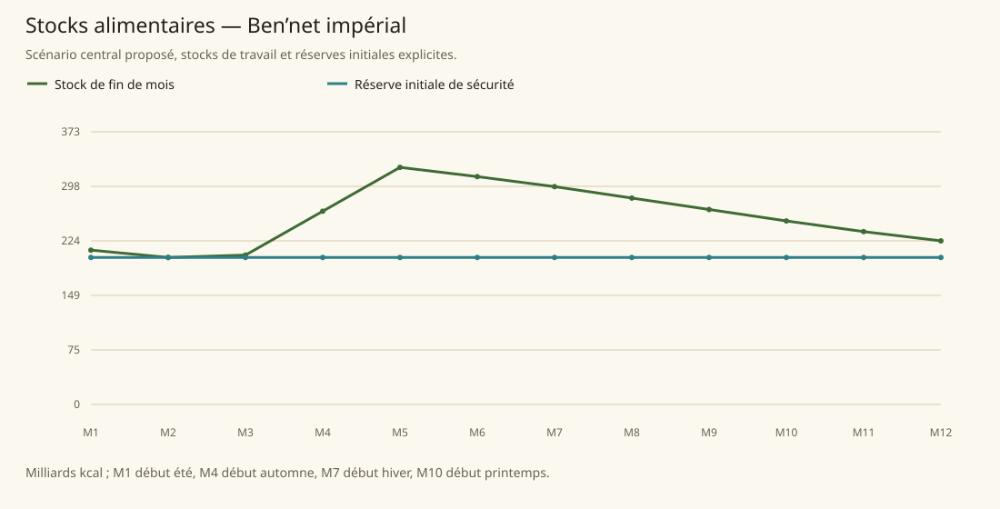

# Ben’net impérial

[Accueil](../README.md) · [Arbre des métiers](../arbre-metiers.md)

références du contexte régional, pas preuve individuelle de chaque fréquence

[Profil régional détaillé](../Localites/bennet.md) : 445 000 habitants au total régional.

## Activités communes

- La plupart habitants vivent comme éleveurs de moutons/yaks : lait, fromage, viande, peaux, laine ; agriculture tubercules ; textiles et distillation principaux exports.
- Colporteurs/petites caravanes assurent majorité du transport, grands groupes marchands n’atteignent que Begraense ; villages échangent contre huile/épices/sel/outils métalliques/céramique.
- Cirrus communautés autosuffisantes, tubercules/poissons, montures volantes, entraînement magique et physique.

## Activités caractéristiques

- Distillateurs Highlandtuber, herboristes/collecteurs et préparateurs de Frostcap Shimmerleaf, Skyward Blossom et Glaciermint.
- Éleveurs/dresseurs de montures aériennes, instructeurs et membres des Orders ; ne pas assimiler chaque cirrus à un combattant.
- Exploitation clandestine de cristaux Frostshroud et recherche militaire par Imperial Wizards ; activité secrète, rare, non filière générale régionale.
- Artisanat de coiffes fourrure et lin valorisé, produits textiles de froid.

## Usages et contraintes sociales

- Sud villes impériales, nord cirrus autonome, villages et nomades distinguer. Interdiction Highlandtuber + campagnes abstinence ; contrebande Bloodbound/Third Eye ; tous alcools pas encore interdits universellement.
- Windspeaker auparavant persécutée, maintenant autorisée ; Celestianist sud pénitence, abstinence, modestie, barbes masculines, dur labeur.
- Nomades taxes jugées abusives, ouverts aux cirrus ; recrutement des Orders ouvert aux autres espèces sous rites/tests.
- Pacte secret nomade Azilhada : enfants nés hiver cédés, tuer loups blancs grave péché ; conséquence chasse à nuancer selon groupes.

## Expertises et portée

- Paysans/distillateurs réputés produire les meilleurs et les plus forts alcools distillés de Tanares. [Tanares Sourcebook p. 120](../Sources/sb.md#p-120).
- Techniques traditionnelles des villages produisent boissons chères ; versions produites en masse au sud considérées inférieures. [Tanares Sourcebook p. 121](../Sources/sb.md#p-121).
- Production textile bien connue, élevage et handicraft respectés ; pas de phrase les meilleurs tisserands du continent. [Tanares Sourcebook p. 120](../Sources/sb.md#p-120), [Tanares Sourcebook p. 15](../Sources/sb.md#p-15).
- Herbes Crystal Mountains uniques à Tanares ; rareté endémique ne démontre pas les meilleurs alchimistes. [Tanares Sourcebook p. 124](../Sources/sb.md#p-124).

## Villes et communautés

| Profil | Population retenue | Portée |
|---|---|---|
| [Begraense](../Localites/bennet--begraense.md) | 18 000 | proposee |
| [Crystal Mountains communities](../Localites/bennet--crystal-mountains-communities.md) | 95 000 | proposee |
| [Ice Fortress](../Localites/bennet--ice-fortress.md) | 1 800 | proposee |
| [Plateaus of the Eternal Ice](../Localites/bennet--plateaus-of-the-eternal-ice.md) | 2 200 | proposee |
| [Temple of the Four Winds](../Localites/bennet--temple-of-the-four-winds.md) | 1 000 | proposee |
| [Autres villes, villages et campagnes (résiduel)](../Localites/bennet--autres-villes-villages-et-campagnes-residuel.md) | 327 000 | proposee |

## Raisonnement des répartitions

Les fréquences ne proviennent pas d’un recensement de métiers : elles sont distribuées selon filières locales, disponibilité de ressources, habilitations, demande urbaine et contraintes sociales. Les emplois vivriers sont recalibrés à effectifs, espèces et strates conservés ; les raisons et les deltas sont enregistrés, y compris les zéros.

[Tanares Sourcebook p. 120](../Sources/sb.md#p-120), [Tanares Sourcebook p. 121](../Sources/sb.md#p-121), [Tanares Sourcebook p. 122](../Sources/sb.md#p-122), [Tanares Sourcebook p. 123](../Sources/sb.md#p-123), [Tanares Sourcebook p. 124](../Sources/sb.md#p-124), [Tanares Sourcebook p. 125](../Sources/sb.md#p-125), [Tanares Sourcebook p. 15](../Sources/sb.md#p-15), [Tanares Sourcebook p. 82](../Sources/sb.md#p-82).

## Alimentation et échanges

| Indicateur proposé | Résultat |
|---|---|
| Besoin annuel | 402,338 milliards kcal |
| Production naturelle | 357,152 milliards kcal |
| Apport magique direct | 3,459 milliards kcal |
| Imports livrés | 41,727 milliards kcal |
| Exports chargés | 0,000 milliards kcal |
| Couverture énergétique | 100,000 % |
| Surface cultivée | 106 667 ha |
| Surface en rotation | 160 000 ha |
| Part des lipides | 31,721 % |
| Solde du budget public | 1 002 743 po/an |

Les coûts, rendements, bassins d’eau et infrastructures sont des paramètres proposés. Une couverture calorique ne valide pas tous les nutriments ni l’accès marchand de chaque habitant.

### Crises à stocks fixes

| Épreuve | Couverture annuelle | Déficit après stock initial |
|---|---|---|
| Récoltes −30 % | 74,026 % | 0,000 milliards kcal |
| Magie divisée par deux | 98,475 % | 0,000 milliards kcal |
| Route E7 fermée 90 jours | 100,000 % | 0,000 milliards kcal |
| Besoin géants énergie×16 | 100,000 % | 0,000 milliards kcal |

Un déficit nul après réserve initiale ne garantit pas une deuxième année identique : les stocks peuvent s’être réduits.
