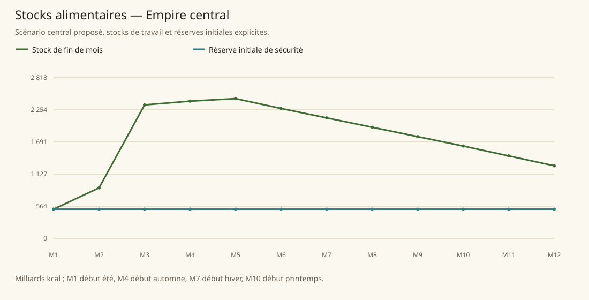

# Empire central

[Accueil](../README.md) · [Arbre des métiers](../arbre-metiers.md)

références du contexte régional, pas preuve individuelle de chaque fréquence

[Profil régional détaillé](../Localites/empire.md) : 2 300 000 habitants au total régional.

## Activités communes

- Commerce international, services et agriculture ; céréales blé/orge et viandes. Présence et importance attestées, parts professionnelles non chiffrées.
- Nombreux bureaucrates ; surplus de main-d’œuvre envoyé dans construction, routes et entretien des villes pour prévenir le chômage.
- Champions d’arène rémunérés par nobles et marchands ; mercenaires et aventuriers recrutés ; juges cléricaux ou nobles.
- Artisans exportateurs organisés en guildes, chercheurs et enseignants, marchands, production de bois, viande et métaux, fermiers explicitement présents dans la Capital.

## Activités caractéristiques

- Ironhand : soldats sous psychosurgery et officiers libres ; cinq branches guerre, renseignement, médical, naval, diplomatique.
- Imperial Wizards : contrôle de la magie, académie unique de l’Empire à Dweomer ; enseignement clandestin et biens magiques interdits à Bloomburgs.
- Garde des sépultures et gestion administrative des décès par Gravekeeper’s Guild à Oldtown.
- Activités financières de Hajal : évaluation, change, prêts, investissement, assurance, identité magique, sécurité djinn sous contrat.
- Skybell pèlerinage annuel, marché de pèlerins ; dons d’un huitième des gains annuels nécessaires à la bénédiction.

## Usages et contraintes sociales

- Répression des personnes refusant de travailler, jusqu’à prison/exécution/conversion Ironhand ; ne prouve pas absence de chômage réel ou de mendicité.
- Magie restreinte ; autorisations de vente magique à nobles à Downtown/Artisansquare ; propriété noble et résidence cléricale limitée aux temples à Downtown.
- Bloomburgs : réfugiés marginalisés, pauvreté, travail physique ou activités criminelles et marché noir ; communautés Ubelians, Kjörners et The Worst.
- Bak forêt protégée par décret ; accès aux lieux sacrés interdit aux étrangers, exploitation forestière libre non déductible.
- Hajal hiérarchie et vêtements de métier/employeur, salaire même des moins riches supérieur à la moyenne, chômage stigmatisé.

## Expertises et portée

- Agriculture de l’Empire dite domaine maîtrisé par comparaison économique avec Kolbjörn. [Tanares Sourcebook p. 128](../Sources/sb.md#p-128).
- Artisansquare : artisanat de premier ordre ; pas un classement absolu de tout artisan tanaréen. [Tanares Sourcebook p. 98](../Sources/sb.md#p-98).
- Hajal : principal centre et institution financière de Tanares ; Tiwilade réputé premier baron financier. [Tanares Sourcebook p. 212](../Sources/sb.md#p-212), [Tanares Sourcebook p. 213](../Sources/sb.md#p-213), [Tanares Sourcebook p. 93](../Sources/sb.md#p-93).
- Odraz célèbre pour son art martial propre et ses instructeurs ; Bak cercle druidique exceptionnel, pouvoirs uniques. [Tanares Sourcebook p. 93](../Sources/sb.md#p-93), [Tanares Sourcebook p. 94](../Sources/sb.md#p-94), [Tanares Sourcebook p. 95](../Sources/sb.md#p-95).

## Villes et communautés

| Profil | Population retenue | Portée |
|---|---|---|
| [Sloghood](../Localites/empire--sloghood.md) | 110 000 | proposee |
| [Uptown](../Localites/empire--uptown.md) | 55 000 | proposee |
| [Artisansquare](../Localites/empire--artisansquare.md) | 60 000 | proposee |
| [Scholarnest](../Localites/empire--scholarnest.md) | 40 000 | proposee |
| [Dweomer](../Localites/empire--dweomer.md) | 15 000 | proposee |
| [Martpart](../Localites/empire--martpart.md) | 67 000 | proposee |
| [Arenarea](../Localites/empire--arenarea.md) | 45 000 | proposee |
| [Oldtown](../Localites/empire--oldtown.md) | 45 000 | proposee |
| [Neckoffoods](../Localites/empire--neckoffoods.md) | 100 000 | proposee |
| [Bloomburgs](../Localites/empire--bloomburgs.md) | 127 000 | proposee |
| [Downtown](../Localites/empire--downtown.md) | 10 000 | proposee |
| [Palacedomain](../Localites/empire--palacedomain.md) | 6 000 | proposee |
| [Skybell City](../Localites/empire--skybell-city.md) | 25 000 | proposee |
| [Hajal City](../Localites/empire--hajal-city.md) | 35 000 | proposee |
| [Odraz Monastery](../Localites/empire--odraz-monastery.md) | 1 200 | proposee |
| [Phantom Fortress](../Localites/empire--phantom-fortress.md) | 2 200 | proposee |
| [Great Forest of Bak (communautés)](../Localites/empire--great-forest-of-bak-communautes.md) | 18 000 | proposee |
| [Autres villes, villages et campagnes (résiduel)](../Localites/empire--autres-villes-villages-et-campagnes-residuel.md) | 1 538 600 | proposee |
| [Capital City](../Localites/empire--capital-city.md) | 680 000 | environ_source |

## Raisonnement des répartitions

Les fréquences ne proviennent pas d’un recensement de métiers : elles sont distribuées selon filières locales, disponibilité de ressources, habilitations, demande urbaine et contraintes sociales. Les emplois vivriers sont recalibrés à effectifs, espèces et strates conservés ; les raisons et les deltas sont enregistrés, y compris les zéros.

[Tanares Sourcebook p. 128](../Sources/sb.md#p-128), [Tanares Sourcebook p. 212](../Sources/sb.md#p-212), [Tanares Sourcebook p. 213](../Sources/sb.md#p-213), [Tanares Sourcebook p. 90](../Sources/sb.md#p-90), [Tanares Sourcebook p. 91](../Sources/sb.md#p-91), [Tanares Sourcebook p. 92](../Sources/sb.md#p-92), [Tanares Sourcebook p. 93](../Sources/sb.md#p-93), [Tanares Sourcebook p. 94](../Sources/sb.md#p-94), [Tanares Sourcebook p. 95](../Sources/sb.md#p-95), [Tanares Sourcebook p. 98](../Sources/sb.md#p-98), [Tanares Sourcebook p. 99](../Sources/sb.md#p-99).

## Alimentation et échanges

| Indicateur proposé | Résultat |
|---|---|
| Besoin annuel | 2 045,819 milliards kcal |
| Production naturelle | 2 899,249 milliards kcal |
| Apport magique direct | 17,052 milliards kcal |
| Imports livrés | 3,150 milliards kcal |
| Exports chargés | 262,552 milliards kcal |
| Couverture énergétique | 129,870 % |
| Surface cultivée | 1 232 877 ha |
| Surface en rotation | 1 800 000 ha |
| Part des lipides | 17,220 % |
| Solde du budget public | 5 333 525 po/an |

Les coûts, rendements, bassins d’eau et infrastructures sont des paramètres proposés. Une couverture calorique ne valide pas tous les nutriments ni l’accès marchand de chaque habitant.

### Crises à stocks fixes

| Épreuve | Couverture annuelle | Déficit après stock initial |
|---|---|---|
| Récoltes −30 % | 96,674 % | 0,000 milliards kcal |
| Magie divisée par deux | 121,519 % | 0,000 milliards kcal |
| Route E7 fermée 90 jours | 125,705 % | 0,000 milliards kcal |
| Besoin géants énergie×16 | 125,705 % | 0,000 milliards kcal |

Un déficit nul après réserve initiale ne garantit pas une deuxième année identique : les stocks peuvent s’être réduits.
