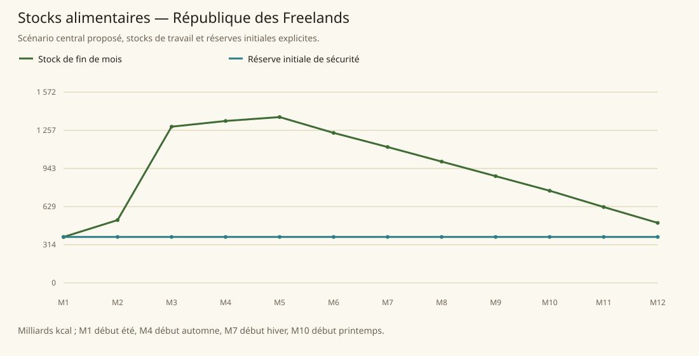

# République des Freelands

[Accueil](../README.md) · [Arbre des métiers](../arbre-metiers.md)

références du contexte régional, pas preuve individuelle de chaque fréquence

[Profil régional détaillé](../Localites/freelands.md) : 1 700 000 habitants au total régional.

## Activités communes

- Production/minerais fer, cuivre, étain ; bois des forêts ; pièces de monstres ; mercenariat et aventure sont des bases de l’économie.
- Fermiers isolés et nouvelles implantations proches des ressources ; produits sophistiqués et luxe souvent importés.
- Pêche maritime (poissons/calmar/pieuvre/huîtres), métiers marchands et artisans, hébergement/restauration attestés aux ports.

## Activités caractéristiques

- Adventurer’s Guild : enregistrement, mise en relation, grades, formation, sécurité et rémunération des missions ; rangs ne constituent pas des métiers différents.
- Aurindunnum cité flottante : illusion rendue matérielle, abjuration, élémentaires, énergie récoltée chaque mois dans Penumbral Plane.
- Winterhold : les morts-vivants font la plupart des travaux subalternes ; achat des droits post-mortem d’animation de cadavre contesté.
- Yellow Creek eau pour alchimie ; Outunmoor herbes rares attirant savants et guérisseurs ; collecte rémunérée de plantes via guildes.
- Relic Hunters HQ à Fisherman’s Wharf, collection muséale et récupération de textes/reliques ; Sara dirige une taverne prestigieuse à Heroes Rise.

## Usages et contraintes sociales

- Démocratie, diversité des religions, méfiance envers étiquette trop formelle, tabou Theft of Valor et critique des morts honorables.
- Arenas n’ont plus fonction judiciaire ; combats magiques non létaux à Arena of Future.
- Hope Square abrite manœuvres et familles agricoles pauvres, forte criminalité locale ; faible crime régional ne doit pas masquer le quartier.
- Heroes Rise pauvreté/criminalité rares ; Goldraft peste et évitement du port menacent commerce et approvisionnement.
- Winter elves ne sont pas tous Kemets ni espions : distinction explicite au Wallside District.

## Expertises et portée

- Freelanders reconnus pour courage, aventure, mercenaires, pionniers et chasseurs de monstres ; réputation attestée sans supériorité absolue universelle. [Tanares Sourcebook p. 104](../Sources/sb.md#p-104).
- Avelum nommé plus puissant archimage de Tanares, Sara propriétaire de la taverne la plus prestigieuse ; prestige individuel/établissement à Heroes Rise, pas métier régional universel. [Tanares Sourcebook p. 108](../Sources/sb.md#p-108).
- Musée ouvert de Relic Hunters le plus renommé à Fisherman’s Wharf. [Tanares Sourcebook p. 113](../Sources/sb.md#p-113).
- Aurindunnum possède magie d’illusion structurale unique ; savoir-faire attesté, pas superlatif sur tous illusionnistes. [Tanares Sourcebook p. 107](../Sources/sb.md#p-107).

## Villes et communautés

| Profil | Population retenue | Portée |
|---|---|---|
| [Seabreeze District](../Localites/freelands--seabreeze-district.md) | 90 000 | proposee |
| [The Six Quarters](../Localites/freelands--the-six-quarters.md) | 45 000 | proposee |
| [Wallside District](../Localites/freelands--wallside-district.md) | 100 000 | proposee |
| [Uptown](../Localites/freelands--uptown.md) | 95 000 | proposee |
| [Hope Square](../Localites/freelands--hope-square.md) | 150 000 | proposee |
| [The Cerulean Plaza](../Localites/freelands--the-cerulean-plaza.md) | 90 000 | proposee |
| [Aurindunnum](../Localites/freelands--aurindunnum.md) | 40 000 | proposee |
| [Aeyefall](../Localites/freelands--aeyefall.md) | 20 000 | proposee |
| [Heroes Rise](../Localites/freelands--heroes-rise.md) | 25 000 | proposee |
| [Winterhold](../Localites/freelands--winterhold.md) | 30 000 | proposee |
| [Goldraft](../Localites/freelands--goldraft.md) | 30 000 | proposee |
| [Autres villes, villages et campagnes (résiduel)](../Localites/freelands--autres-villes-villages-et-campagnes-residuel.md) | 985 000 | proposee |
| [Fisherman’s Wharf](../Localites/freelands--fishermans-wharf.md) | 570 000 | environ_source |

## Raisonnement des répartitions

Les fréquences ne proviennent pas d’un recensement de métiers : elles sont distribuées selon filières locales, disponibilité de ressources, habilitations, demande urbaine et contraintes sociales. Les emplois vivriers sont recalibrés à effectifs, espèces et strates conservés ; les raisons et les deltas sont enregistrés, y compris les zéros.

[Tanares Sourcebook p. 104](../Sources/sb.md#p-104), [Tanares Sourcebook p. 105](../Sources/sb.md#p-105), [Tanares Sourcebook p. 106](../Sources/sb.md#p-106), [Tanares Sourcebook p. 107](../Sources/sb.md#p-107), [Tanares Sourcebook p. 108](../Sources/sb.md#p-108), [Tanares Sourcebook p. 109](../Sources/sb.md#p-109), [Tanares Sourcebook p. 110](../Sources/sb.md#p-110), [Tanares Sourcebook p. 111](../Sources/sb.md#p-111), [Tanares Sourcebook p. 112](../Sources/sb.md#p-112), [Tanares Sourcebook p. 113](../Sources/sb.md#p-113), [Tanares Sourcebook p. 79](../Sources/sb.md#p-79).

## Alimentation et échanges

| Indicateur proposé | Résultat |
|---|---|
| Besoin annuel | 1 514,517 milliards kcal |
| Production naturelle | 1 785,084 milliards kcal |
| Apport magique direct | 20,468 milliards kcal |
| Imports livrés | 196,384 milliards kcal |
| Exports chargés | 487,420 milliards kcal |
| Couverture énergétique | 100,000 % |
| Surface cultivée | 760 549 ha |
| Surface en rotation | 1 106 599 ha |
| Part des lipides | 15,539 % |
| Solde du budget public | 4 231 493 po/an |

Les coûts, rendements, bassins d’eau et infrastructures sont des paramètres proposés. Une couverture calorique ne valide pas tous les nutriments ni l’accès marchand de chaque habitant.

### Crises à stocks fixes

| Épreuve | Couverture annuelle | Déficit après stock initial |
|---|---|---|
| Récoltes −30 % | 83,246 % | 0,000 milliards kcal |
| Magie divisée par deux | 100,000 % | 0,000 milliards kcal |
| Route E7 fermée 90 jours | 100,000 % | 0,000 milliards kcal |
| Besoin géants énergie×16 | 102,480 % | 0,000 milliards kcal |

Un déficit nul après réserve initiale ne garantit pas une deuxième année identique : les stocks peuvent s’être réduits.
