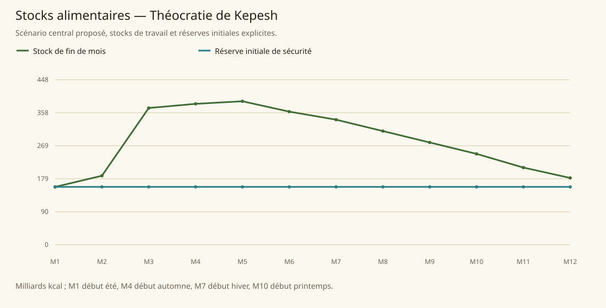

# Théocratie de Kepesh

[Accueil](../README.md) · [Arbre des métiers](../arbre-metiers.md)

références du contexte régional, pas preuve individuelle de chaque fréquence

[Profil régional détaillé](../Localites/kepesh.md) : 695 000 habitants au total régional.

## Activités communes

- épices désertiques
- agriculture irriguée/magique
- mines bauronite or fer gemmes
- bijouterie
- élevage chevaux/chameaux
- pêche côtière
- construction temples pyramides statues
- clercs mages savants

## Activités caractéristiques

- momification
- rituels funéraires
- communication ethérée Ba-Akhu
- immortalisation Renkhet-Netjer
- restauration culture/langue anciennes
- fabrication magique utilisant élémentaires liés

## Usages et contraintes sociales

- Les castes sont rigides ; l’aptitude magique peut élever une famille.
- L’accueil des réfugiés et des pauvres n’établit aucun taux de chômage.
- Les importations compensent les limites agricoles ; l’eau dépend aussi de la magie.
- Des élémentaires liés servent sous contrôle magique ; aucune économie générale de zombies manuels n’est attestée comme chez les kemets.

## Expertises et portée

- chevaux/chameaux Voir les sources et la méthode du modèle..
- bijouterie ancestrale Voir les sources et la méthode du modèle..
- rituels Ba-Ka Voir les sources et la méthode du modèle..

## Villes et communautés

| Profil | Population retenue | Portée |
|---|---|---|
| [Pakaitos](../Localites/kepesh--pakaitos.md) | 40 000 | proposee |
| [Bright Coast (villages résidents)](../Localites/kepesh--bright-coast-villages-residents.md) | 75 000 | proposee |
| [Brightlight — Sirocchi](../Localites/kepesh--brightlight-sirocchi.md) | 40 000 | proposee |
| [Brightlight — Zaphyrus](../Localites/kepesh--brightlight-zaphyrus.md) | 30 000 | proposee |
| [Brightlight — Verdani](../Localites/kepesh--brightlight-verdani.md) | 35 000 | proposee |
| [Autres villes, villages et campagnes (résiduel)](../Localites/kepesh--autres-villes-villages-et-campagnes-residuel.md) | 475 000 | proposee |

## Raisonnement des répartitions

Les fréquences ne proviennent pas d’un recensement de métiers : elles sont distribuées selon filières locales, disponibilité de ressources, habilitations, demande urbaine et contraintes sociales. Les emplois vivriers sont recalibrés à effectifs, espèces et strates conservés ; les raisons et les deltas sont enregistrés, y compris les zéros.

[Tanares Sourcebook p. 182](../Sources/sb.md#p-182), [Tanares Sourcebook p. 183](../Sources/sb.md#p-183), [Tanares Sourcebook p. 184](../Sources/sb.md#p-184), [Tanares Sourcebook p. 185](../Sources/sb.md#p-185), [Tanares Sourcebook p. 186](../Sources/sb.md#p-186), [Tanares Sourcebook p. 187](../Sources/sb.md#p-187), [Tanares Sourcebook p. 188](../Sources/sb.md#p-188), [Tanares Sourcebook p. 189](../Sources/sb.md#p-189).

## Alimentation et échanges

| Indicateur proposé | Résultat |
|---|---|
| Besoin annuel | 628,428 milliards kcal |
| Production naturelle | 501,465 milliards kcal |
| Apport magique direct | 6,132 milliards kcal |
| Imports livrés | 604,626 milliards kcal |
| Exports chargés | 483,283 milliards kcal |
| Couverture énergétique | 100,081 % |
| Surface cultivée | 344 828 ha |
| Surface en rotation | 500 000 ha |
| Part des lipides | 21,128 % |
| Solde du budget public | 864 919 po/an |

Les coûts, rendements, bassins d’eau et infrastructures sont des paramètres proposés. Une couverture calorique ne valide pas tous les nutriments ni l’accès marchand de chaque habitant.

### Crises à stocks fixes

| Épreuve | Couverture annuelle | Déficit après stock initial |
|---|---|---|
| Récoltes −30 % | 100,000 % | 0,000 milliards kcal |
| Magie divisée par deux | 100,000 % | 0,000 milliards kcal |
| Route E7 fermée 90 jours | 100,000 % | 0,000 milliards kcal |
| Besoin géants énergie×16 | 103,461 % | 0,000 milliards kcal |

Un déficit nul après réserve initiale ne garantit pas une deuxième année identique : les stocks peuvent s’être réduits.
