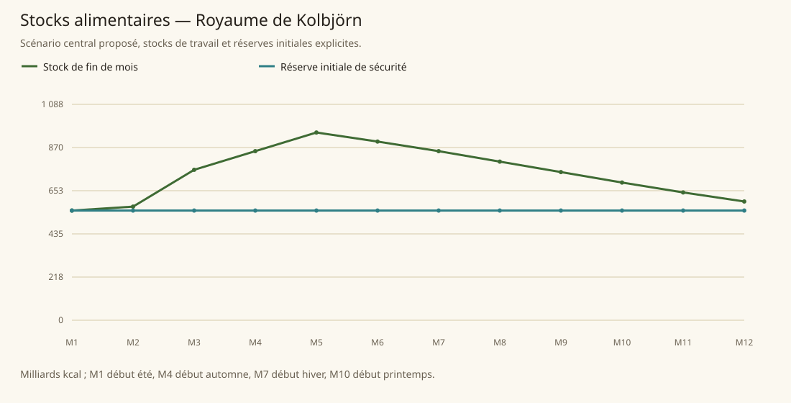

# Royaume de Kolbjörn

[Accueil](../README.md) · [Arbre des métiers](../arbre-metiers.md)

références du contexte régional, pas preuve individuelle de chaque fréquence

[Profil régional détaillé](../Localites/kolbjorn.md) : 720 000 habitants au total régional.

## Activités communes

- Pêche hauturière, construction navale, fourrures, cuirs et herbes exportés ; mercenaires fortement recherchés.
- Chasse, pêche et combat considérés plus nobles devoirs ; shamans/éclaireurs/bandes guerrières patrouillent côtes.
- Capitale : chantiers navals, forgerons célèbres, ateliers d’experts cuir ; Irongauntlet mineurs et forgerons ; Northharbor commerce maritime.

## Activités caractéristiques

- Fabrication de drakkars choisissant arbres en forêt avec shaman et rite courage ; Twin Heads Forest bois recherchés mais dangereuse.
- Shamans des esprits, traditions orales, bards/poètes des clans ; Jarls généalogie et bénédiction animale conditionnent pouvoir, pas métier imposé aux humains.
- Valkyries Falun : fabrication d’armes enchantées, poésie épique, entraînement, patrouilles de pégases, guidance héros.
- Géants Great Valley : stone géomancie/divination/runes et constructions, hill chasse/cueillette nomades, cloud philosophie/recherche magique, frost militaires, storm gardes du Pacte.

## Usages et contraintes sociales

- Honneur clan et famille prime roi/jarl, serments/devoirs, dette remboursée en actes plutôt qu’en pièces, hospitalité, prélever nature seulement besoins.
- Résidence Capital intérieure réservée aux personnes dont père et grand-père nés Kolbjörn ; autres quartier extérieur ou Imperial District.
- Hommes/humains surtout sud, géants nord ; dwarves historiquement souterrains ; % regional ne doit pas être copié ville par ville.
- Irongauntlet ancienne citadelle dwarven devenue ville humaine ; minerais en déclin et famine menaçante, fermeture mine ne peut créer prospérité manufacturière.
- Falun accès fermé sauf rares invités, géants vallée isolés ; guerre intérieure et temples Bás menacent pêche/agriculture.

## Expertises et portée

- Navigateurs et constructeurs navals renommés ; drakkars robustes convoités Republic/Kepesh ; pas expression meilleurs du continent. [Tanares Sourcebook p. 128](../Sources/sb.md#p-128), [Tanares Sourcebook p. 130](../Sources/sb.md#p-130).
- Mercenaires formidables et recherchés, notamment descendants bénis ; Northharbor décrits guerriers les plus endurants. [Tanares Sourcebook p. 128](../Sources/sb.md#p-128), [Tanares Sourcebook p. 133](../Sources/sb.md#p-133).
- Capitale forgerons célèbres et experts du cuir ; réputation locale explicite, rang continental absent. [Tanares Sourcebook p. 133](../Sources/sb.md#p-133).
- Bois supérieur envisagé pour export ; obstacle transport rentable ; pas export massif établi. [Tanares Sourcebook p. 128](../Sources/sb.md#p-128).

## Villes et communautés

| Profil | Population retenue | Portée |
|---|---|---|
| [Kolbjörn Capital](../Localites/kolbjorn--kolbjorn-capital.md) | 30 000 | proposee |
| [Irongauntlet](../Localites/kolbjorn--irongauntlet.md) | 12 000 | proposee |
| [Northharbor](../Localites/kolbjorn--northharbor.md) | 25 000 | proposee |
| [Falun](../Localites/kolbjorn--falun.md) | 4 000 | proposee |
| [Great Valley (communautés géantes)](../Localites/kolbjorn--great-valley-communautes-geantes.md) | 70 000 | proposee |
| [Autres Floating Islands](../Localites/kolbjorn--autres-floating-islands.md) | 6 000 | proposee |
| [Autres villes, villages et campagnes (résiduel)](../Localites/kolbjorn--autres-villes-villages-et-campagnes-residuel.md) | 573 000 | proposee |

## Raisonnement des répartitions

Les fréquences ne proviennent pas d’un recensement de métiers : elles sont distribuées selon filières locales, disponibilité de ressources, habilitations, demande urbaine et contraintes sociales. Les emplois vivriers sont recalibrés à effectifs, espèces et strates conservés ; les raisons et les deltas sont enregistrés, y compris les zéros.

[Tanares Sourcebook p. 128](../Sources/sb.md#p-128), [Tanares Sourcebook p. 129](../Sources/sb.md#p-129), [Tanares Sourcebook p. 130](../Sources/sb.md#p-130), [Tanares Sourcebook p. 131](../Sources/sb.md#p-131), [Tanares Sourcebook p. 132](../Sources/sb.md#p-132), [Tanares Sourcebook p. 133](../Sources/sb.md#p-133), [Tanares Sourcebook p. 134](../Sources/sb.md#p-134), [Tanares Sourcebook p. 135](../Sources/sb.md#p-135), [Tanares Sourcebook p. 14](../Sources/sb.md#p-14).

## Alimentation et échanges

| Indicateur proposé | Résultat |
|---|---|
| Besoin annuel | 1 105,636 milliards kcal |
| Production naturelle | 789,613 milliards kcal |
| Apport magique direct | 4,656 milliards kcal |
| Imports livrés | 311,367 milliards kcal |
| Exports chargés | 0,000 milliards kcal |
| Couverture énergétique | 100,000 % |
| Surface cultivée | 390 174 ha |
| Surface en rotation | 585 261 ha |
| Part des lipides | 16,594 % |
| Solde du budget public | 1 884 042 po/an |

Les coûts, rendements, bassins d’eau et infrastructures sont des paramètres proposés. Une couverture calorique ne valide pas tous les nutriments ni l’accès marchand de chaque habitant.

### Crises à stocks fixes

| Épreuve | Couverture annuelle | Déficit après stock initial |
|---|---|---|
| Récoltes −30 % | 51,723 % | 0,000 milliards kcal |
| Magie divisée par deux | 100,000 % | 0,000 milliards kcal |
| Route E7 fermée 90 jours | 100,000 % | 0,000 milliards kcal |
| Besoin géants énergie×16 | 69,055 % | 0,000 milliards kcal |

Un déficit nul après réserve initiale ne garantit pas une deuxième année identique : les stocks peuvent s’être réduits.
