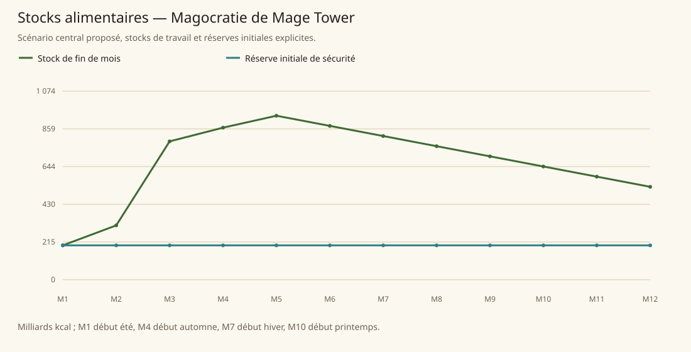

# Magocratie de Mage Tower

[Accueil](../README.md) · [Arbre des métiers](../arbre-metiers.md)

références du contexte régional, pas preuve individuelle de chaque fréquence

[Profil régional détaillé](../Localites/magocracy.md) : 867 000 habitants au total régional.

## Activités communes

- Pêcheur d'eau douce
- Papetier
- Marchand d'objets et composants magiques
- Enseignant
- Chercheur en magie
- Fabricant d'objets magiques
- Préparateur de potions
- Fabricant de parchemins magiques
- Expert en évaluation arcanique

## Activités caractéristiques

- Certificateur arcanique
- Inspecteur d'objets magiques
- Commissaire-priseur d'objets magiques
- Récupérateur de matières d'objets magiques épuisés
- Fabricant de souvenirs magiques
- Chasseur ou fournisseur de créatures et composants
- Warden des Arcane Enforcers
- Détective arcanique
- Spellshield
- Extracteur de mémoire
- Désenchanteur
- Chercheur en aethermancy
- Chercheur en biomancy

## Usages et contraintes sociales

- Non-lanceurs de sorts en bas de hiérarchie; lanceurs divins respectés hors hiérarchie mais exclus du sommet arcanique (SB15)
- Puissance/école par rune et taille de chapeau, habits 1-5000po (SB139)
- Universités payantes avec bourses exceptionnelles (SB15), chercheurs très concurrents, sabotage et trafic clandestin (SB138-140)
- Libertés importantes mais police sévère (SB138-140)

## Expertises et portée

- Enseignement de la magie arcanique Qualifie les établissements, pas chaque mage ni toute production magique. Voir les sources et la méthode du modèle..
- Arcane University près de Dawn of Light Campus sélectif et très cher, dix ans de cursus; un tiers termine. Voir les sources et la méthode du modèle..
- Fabrication d'objets, potions et parchemins Pas de classement général meilleur; plus de moitié des objets non certifiés, fonctionnement potentiellement irrégulier. Voir les sources et la méthode du modèle..

## Villes et communautés

| Profil | Population retenue | Portée |
|---|---|---|
| [Mesoriver](../Localites/magocracy--mesoriver.md) | 60 000 | proposee |
| [Dawn of Light et campus](../Localites/magocracy--dawn-of-light-et-campus.md) | 25 000 | proposee |
| [Crystal Tower et environs](../Localites/magocracy--crystal-tower-et-environs.md) | 2 000 | proposee |
| [Summer Island (résidents)](../Localites/magocracy--summer-island-residents.md) | 3 000 | proposee |
| [Asylum Eberek](../Localites/magocracy--asylum-eberek.md) | 1 500 | proposee |
| [Autres villes, villages et campagnes (résiduel)](../Localites/magocracy--autres-villes-villages-et-campagnes-residuel.md) | 775 500 | proposee |

## Raisonnement des répartitions

Les fréquences ne proviennent pas d’un recensement de métiers : elles sont distribuées selon filières locales, disponibilité de ressources, habilitations, demande urbaine et contraintes sociales. Les emplois vivriers sont recalibrés à effectifs, espèces et strates conservés ; les raisons et les deltas sont enregistrés, y compris les zéros.

[Tanares Sourcebook p. 138](../Sources/sb.md#p-138), [Tanares Sourcebook p. 139](../Sources/sb.md#p-139), [Tanares Sourcebook p. 140](../Sources/sb.md#p-140), [Tanares Sourcebook p. 141](../Sources/sb.md#p-141), [Tanares Sourcebook p. 142](../Sources/sb.md#p-142), [Tanares Sourcebook p. 15](../Sources/sb.md#p-15).

## Alimentation et échanges

| Indicateur proposé | Résultat |
|---|---|
| Besoin annuel | 782,741 milliards kcal |
| Production naturelle | 1 063,586 milliards kcal |
| Apport magique direct | 4,948 milliards kcal |
| Imports livrés | 0,000 milliards kcal |
| Exports chargés | 0,000 milliards kcal |
| Couverture énergétique | 136,512 % |
| Surface cultivée | 482 759 ha |
| Surface en rotation | 700 000 ha |
| Part des lipides | 15,591 % |
| Solde du budget public | 2 881 509 po/an |

Les coûts, rendements, bassins d’eau et infrastructures sont des paramètres proposés. Une couverture calorique ne valide pas tous les nutriments ni l’accès marchand de chaque habitant.

### Crises à stocks fixes

| Épreuve | Couverture annuelle | Déficit après stock initial |
|---|---|---|
| Récoltes −30 % | 92,203 % | 0,000 milliards kcal |
| Magie divisée par deux | 131,046 % | 0,000 milliards kcal |
| Route E7 fermée 90 jours | 136,512 % | 0,000 milliards kcal |
| Besoin géants énergie×16 | 136,512 % | 0,000 milliards kcal |

Un déficit nul après réserve initiale ne garantit pas une deuxième année identique : les stocks peuvent s’être réduits.
