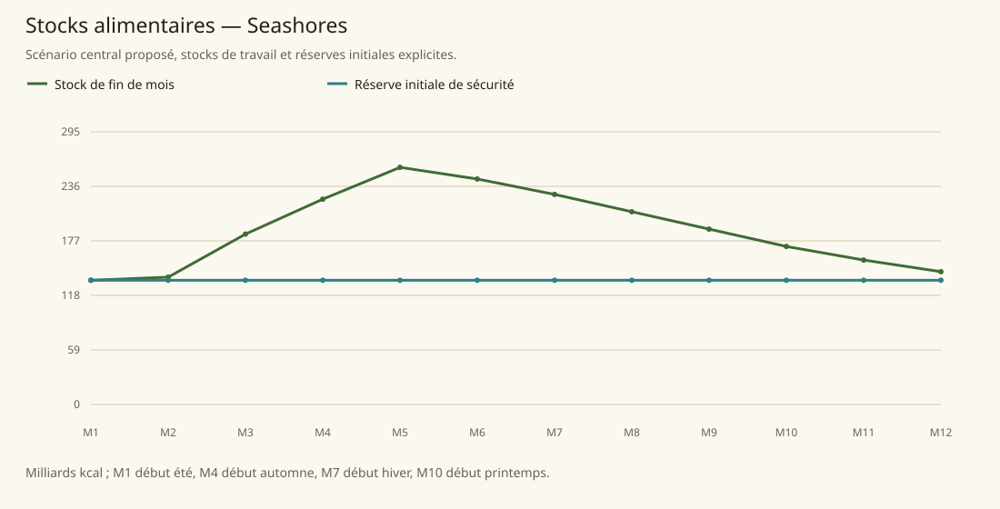

# Seashores

[Accueil](../README.md) · [Arbre des métiers](../arbre-metiers.md)

références du contexte régional, pas preuve individuelle de chaque fréquence

[Profil régional détaillé](../Localites/seashores.md) : 617 000 habitants au total régional.

## Activités communes

- Pêcheur
- Marchand de perles et produits marins
- Constructeur naval
- Marin
- Capitaine
- Tavernier
- Mercenaire
- Espion
- Bourreau
- Assassin
- Pirate
- Contrebandier
- Receleur

## Activités caractéristiques

- Courtier de navires et objets magiques
- Chercheur de reliques sous-marines
- Chasseur de monstres marins
- Enseignant des Academies of Light
- Musicien
- Compositeur
- Peintre
- Sculpteur
- Poète
- Cuisinier de haute cuisine gnome
- Opérateur de dreamscaping

## Usages et contraintes sociales

- Tributs lourds mensuels, pillage si défaut, dirigeants changent annuellement (SB146)
- Liberté économique avec insécurité, prospérité faible; pirates et marchés noirs première activité économique ne prouve pas majorité de population pirate (SB146-147)
- Mustardseed éducation et étiquette valorisées avec répression sociale; accès Academy sélectif au mérite (SB149; PG28-29)
- Pearl Town échange souvent contre faveurs et accueil respiratoire magique (SB149)

## Expertises et portée

- Construction navale Les maîtres insaisissables travaillent pour quelques clients liés au Parlement; bois de Sindile, minerais nains, cristaux de Mage Tower, acier impérial nécessaires. Voir les sources et la méthode du modèle..
- Écoles musicales de Mustardseed Réseau Academies of Light présent ailleurs; prestige d'institutions, pas de chaque musicien. Voir les sources et la méthode du modèle..
- Arts gnomes: peinture, composition et sculpture Concerne gnomes de Tanares, concentration à Mustardseed; ne pas transformer en exclusivité géographique. Voir les sources et la méthode du modèle..
- Haute cuisine gnome Phrase CC52 porte sur Gearot formé aux restaurants de Mustardseed, maintenant dans Capitale impériale. Pas affirmation que tout cuisinier local est meilleur. Voir les sources et la méthode du modèle..

## Villes et communautés

| Profil | Population retenue | Portée |
|---|---|---|
| [Bluhaven](../Localites/seashores--bluhaven.md) | 40 000 | proposee |
| [Mustardseed](../Localites/seashores--mustardseed.md) | 40 000 | proposee |
| [Pearl Town](../Localites/seashores--pearl-town.md) | 26 000 | proposee |
| [Fishtail City](../Localites/seashores--fishtail-city.md) | 15 000 | proposee |
| [Turtledragon Island](../Localites/seashores--turtledragon-island.md) | 4 000 | proposee |
| [Uncle Joe’s Tavern et île](../Localites/seashores--uncle-joes-tavern-et-ile.md) | 1 500 | proposee |
| [Autres villes, villages et campagnes (résiduel)](../Localites/seashores--autres-villes-villages-et-campagnes-residuel.md) | 490 500 | proposee |

## Raisonnement des répartitions

Les fréquences ne proviennent pas d’un recensement de métiers : elles sont distribuées selon filières locales, disponibilité de ressources, habilitations, demande urbaine et contraintes sociales. Les emplois vivriers sont recalibrés à effectifs, espèces et strates conservés ; les raisons et les deltas sont enregistrés, y compris les zéros.

[Character Compendium p. 52](../Sources/cc.md#p-52), [Tanares Sourcebook p. 146](../Sources/sb.md#p-146), [Tanares Sourcebook p. 147](../Sources/sb.md#p-147), [Tanares Sourcebook p. 148](../Sources/sb.md#p-148), [Tanares Sourcebook p. 149](../Sources/sb.md#p-149), [Tanares Sourcebook p. 150](../Sources/sb.md#p-150), [Tanares Sourcebook p. 151](../Sources/sb.md#p-151), [Tanares Sourcebook p. 16](../Sources/sb.md#p-16), [Tanares Sourcebook p. 228](../Sources/sb.md#p-228), [Tanares Sourcebook p. 229](../Sources/sb.md#p-229).

## Alimentation et échanges

| Indicateur proposé | Résultat |
|---|---|
| Besoin annuel | 537,157 milliards kcal |
| Production naturelle | 410,198 milliards kcal |
| Apport magique direct | 3,568 milliards kcal |
| Imports livrés | 123,391 milliards kcal |
| Exports chargés | 0,000 milliards kcal |
| Couverture énergétique | 100,000 % |
| Surface cultivée | 78 571 ha |
| Surface en rotation | 110 000 ha |
| Part des lipides | 25,232 % |
| Solde du budget public | 1 563 919 po/an |

Les coûts, rendements, bassins d’eau et infrastructures sont des paramètres proposés. Une couverture calorique ne valide pas tous les nutriments ni l’accès marchand de chaque habitant.

### Crises à stocks fixes

| Épreuve | Couverture annuelle | Déficit après stock initial |
|---|---|---|
| Récoltes −30 % | 65,805 % | 40,127 milliards kcal |
| Magie divisée par deux | 96,064 % | 0,000 milliards kcal |
| Route E7 fermée 90 jours | 100,000 % | 0,000 milliards kcal |
| Besoin géants énergie×16 | 100,000 % | 0,000 milliards kcal |

Un déficit nul après réserve initiale ne garantit pas une deuxième année identique : les stocks peuvent s’être réduits.
