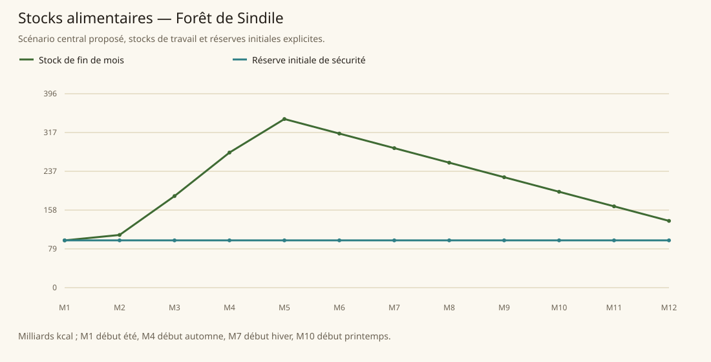

# Forêt de Sindile

[Accueil](../README.md) · [Arbre des métiers](../arbre-metiers.md)

références du contexte régional, pas preuve individuelle de chaque fréquence

[Profil régional détaillé](../Localites/sindile.md) : 432 000 habitants au total régional.

## Activités communes

- Collecteur d'herbes rares
- Marchand
- Artisan du bois
- Fabricant d'arcs et flèches magiques
- Musicien harpiste
- Gardien forestier
- Guide
- Prêtre
- Druide
- Élémentaliste

## Activités caractéristiques

- Préparateur d'Estelindea
- Gardien et purificateur des Mother Trees
- Jardinier de roses magiques
- Préparateur de potions curatives de Mirror Lake
- Archer Wood Hunter
- Formateur de tir à l'arc
- Juge et gardien de prisonniers kemets
- Espion

## Usages et contraintes sociales

- Végétarisme majoritaire, animaux souvent compagnons; réduire métier boucher/élevage à viande sans les interdire (SB152)
- Fonctions sociales et spirituelles imbriquées dans chemins hiérarchisés (SB152)
- Déficit métaux et import minerais magiques, autosuffisance alimentaire (SB152)
- Isolation, surveillance étrangers, Eternal Circle sabotages et restrictions d'accès (SB154-155)
- Hauts niveaux Sweetsprings réservés à Conseil/prêtres/élémentalistes; winter elves réfugiés sous surveillance et préjugés (SB154)
- Rites funéraires graines/arbres plutôt que fosses ordinaires (SB152,155)

## Expertises et portée

- Breithwood et artisanat de bois léger/résistant Qualités du matériau, pas classement des artisans. Voir les sources et la méthode du modèle..
- Estelindea Élixir de sève Mother Trees; renommée et rareté, pas titre meilleur apothicaire. Voir les sources et la méthode du modèle..
- Potions de roses et énergie druidique Mirror Lake Énergie du lieu et remèdes exceptionnels ne prouvent pas excellence universelle des herboristes de toute Sindile. Voir les sources et la méthode du modèle..
- Formation archers Hunter's Nest Niary réputée mais derniers concours gagnés par deux humains; ne pas déclarer elfes biologiquement meilleurs. Voir les sources et la méthode du modèle..

## Villes et communautés

| Profil | Population retenue | Portée |
|---|---|---|
| [Sweetsprings](../Localites/sindile--sweetsprings.md) | 35 000 | proposee |
| [Hunter’s Nest](../Localites/sindile--hunters-nest.md) | 16 000 | proposee |
| [Villages de Sindile Road](../Localites/sindile--villages-de-sindile-road.md) | 35 000 | proposee |
| [Mirror Lake / Mountain Gate (résidents)](../Localites/sindile--mirror-lake-mountain-gate-residents.md) | 1 800 | proposee |
| [Autres villes, villages et campagnes (résiduel)](../Localites/sindile--autres-villes-villages-et-campagnes-residuel.md) | 344 200 | proposee |

## Raisonnement des répartitions

Les fréquences ne proviennent pas d’un recensement de métiers : elles sont distribuées selon filières locales, disponibilité de ressources, habilitations, demande urbaine et contraintes sociales. Les emplois vivriers sont recalibrés à effectifs, espèces et strates conservés ; les raisons et les deltas sont enregistrés, y compris les zéros.

[Tanares Sourcebook p. 152](../Sources/sb.md#p-152), [Tanares Sourcebook p. 153](../Sources/sb.md#p-153), [Tanares Sourcebook p. 154](../Sources/sb.md#p-154), [Tanares Sourcebook p. 155](../Sources/sb.md#p-155), [Tanares Sourcebook p. 157](../Sources/sb.md#p-157), [Tanares Sourcebook p. 158](../Sources/sb.md#p-158), [Tanares Sourcebook p. 159](../Sources/sb.md#p-159).

## Alimentation et échanges

| Indicateur proposé | Résultat |
|---|---|
| Besoin annuel | 386,095 milliards kcal |
| Production naturelle | 408,939 milliards kcal |
| Apport magique direct | 7,563 milliards kcal |
| Imports livrés | 0,000 milliards kcal |
| Exports chargés | 0,000 milliards kcal |
| Couverture énergétique | 107,876 % |
| Surface cultivée | 179 592 ha |
| Surface en rotation | 220 000 ha |
| Part des lipides | 15,258 % |
| Solde du budget public | 1 353 397 po/an |

Les coûts, rendements, bassins d’eau et infrastructures sont des paramètres proposés. Une couverture calorique ne valide pas tous les nutriments ni l’accès marchand de chaque habitant.

### Crises à stocks fixes

| Épreuve | Couverture annuelle | Déficit après stock initial |
|---|---|---|
| Récoltes −30 % | 75,728 % | 0,000 milliards kcal |
| Magie divisée par deux | 106,896 % | 0,000 milliards kcal |
| Route E7 fermée 90 jours | 107,876 % | 0,000 milliards kcal |
| Besoin géants énergie×16 | 107,876 % | 0,000 milliards kcal |

Un déficit nul après réserve initiale ne garantit pas une deuxième année identique : les stocks peuvent s’être réduits.
