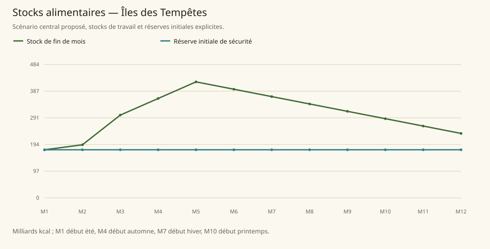

# Îles des Tempêtes

[Accueil](../README.md) · [Arbre des métiers](../arbre-metiers.md)

références du contexte régional, pas preuve individuelle de chaque fréquence

[Profil régional détaillé](../Localites/storm.md) : 386 000 habitants au total régional.

## Activités communes

- culture tubercules et céréales
- pêche avancée
- mines dont tameranium
- armée recrute majorité
- piraterie et navigation militaire
- prêtres Bás

## Activités caractéristiques

- nécromancie glaciale et recherche nouvelles formes morts-vivants
- élémentalisme de glace
- fabrication pylônes
- navires morts-vivants
- laboratoire réanimation

## Usages et contraintes sociales

- La majorité est recrutée dans les forces militaires ; des morts-vivants réalisent les travaux manuels, sans être ajoutés au dénominateur des actifs vivants.
- Le culte de Bás est obligatoire, y compris pour les rares résidents d’autres espèces.
- Aucun effectif de travailleurs morts-vivants ni pourcentage professionnel n’est publié.

## Expertises et portée

- flotte morts-vivants Voir les sources et la méthode du modèle..
- pêche Voir les sources et la méthode du modèle..
- astronomie et magie stellaire Cantala Voir les sources et la méthode du modèle..
- Cildroly archer Voir les sources et la méthode du modèle..

## Villes et communautés

| Profil | Population retenue | Portée |
|---|---|---|
| [Night Mansions](../Localites/storm--night-mansions.md) | 95 000 | proposee |
| [Autres villes, villages et campagnes (résiduel)](../Localites/storm--autres-villes-villages-et-campagnes-residuel.md) | 291 000 | proposee |

## Raisonnement des répartitions

Les fréquences ne proviennent pas d’un recensement de métiers : elles sont distribuées selon filières locales, disponibilité de ressources, habilitations, demande urbaine et contraintes sociales. Les emplois vivriers sont recalibrés à effectifs, espèces et strates conservés ; les raisons et les deltas sont enregistrés, y compris les zéros.

[Tanares Sourcebook p. 168](../Sources/sb.md#p-168), [Tanares Sourcebook p. 169](../Sources/sb.md#p-169), [Tanares Sourcebook p. 170](../Sources/sb.md#p-170), [Tanares Sourcebook p. 171](../Sources/sb.md#p-171), [Tanares Sourcebook p. 172](../Sources/sb.md#p-172), [Tanares Sourcebook p. 173](../Sources/sb.md#p-173).

## Alimentation et échanges

| Indicateur proposé | Résultat |
|---|---|
| Besoin annuel | 349,283 milliards kcal |
| Production naturelle | 378,570 milliards kcal |
| Apport magique direct | 3,335 milliards kcal |
| Imports livrés | 0,000 milliards kcal |
| Exports chargés | 0,000 milliards kcal |
| Couverture énergétique | 109,340 % |
| Surface cultivée | 418 821 ha |
| Surface en rotation | 628 231 ha |
| Part des lipides | 13,323 % |
| Solde du budget public | 2 096 938 po/an |

Les coûts, rendements, bassins d’eau et infrastructures sont des paramètres proposés. Une couverture calorique ne valide pas tous les nutriments ni l’accès marchand de chaque habitant.

### Crises à stocks fixes

| Épreuve | Couverture annuelle | Déficit après stock initial |
|---|---|---|
| Récoltes −30 % | 64,072 % | 0,000 milliards kcal |
| Magie divisée par deux | 108,862 % | 0,000 milliards kcal |
| Route E7 fermée 90 jours | 109,340 % | 0,000 milliards kcal |
| Besoin géants énergie×16 | 109,340 % | 0,000 milliards kcal |

Un déficit nul après réserve initiale ne garantit pas une deuxième année identique : les stocks peuvent s’être réduits.
