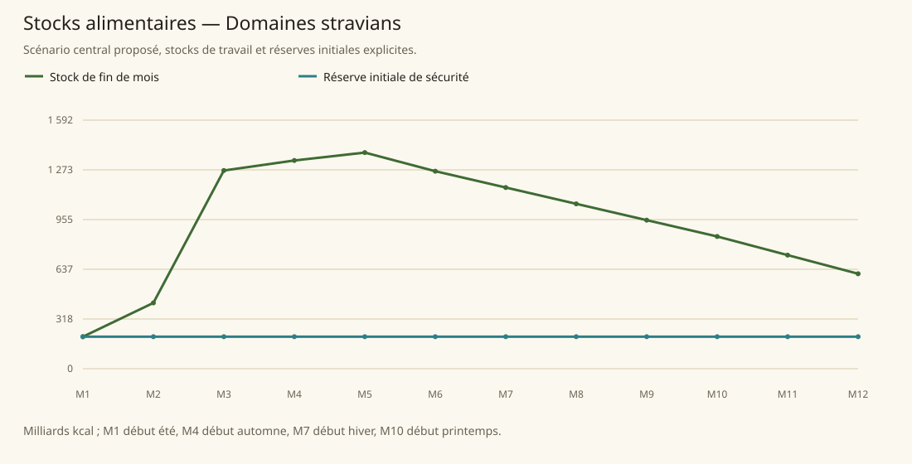

# Domaines stravians

[Accueil](../README.md) · [Arbre des métiers](../arbre-metiers.md)

références du contexte régional, pas preuve individuelle de chaque fréquence

[Profil régional détaillé](../Localites/stravian.md) : 960 000 habitants au total régional.

## Activités communes

- Mineur
- Forgeron
- Maçon
- Artisan de pierre
- Bijoutier
- Marchand
- Agriculteur
- Cultivateur d'épices
- Transporteur
- Mercenaire
- Prêtre
- Explorateur
- Soldat

## Activités caractéristiques

- Opérateur de Stone Disks: prêtre Dorsi spécialement formé
- Restaurateur de runes de tunnels
- Créateur de statues de Stone Spirits
- Prêtre protecteur des unités militaires
- Gardien de verger sacré
- Protecteur de ferme monté sur sanglier géant
- Fournisseur de minerais extraplanaires
- Mineur et forgeron ethérique à Moolooite

## Usages et contraintes sociales

- Recrutement all species, dignité/merit, partage savoir, salaires mines généreux mais danger élevé (SB160-161)
- Dwarf Lion: militaire/exploration; Goat: mines/forge/construction; Dragon: prêtres/savants/sentinelles, orientations culturelles non interdictions biologiques (PG12)
- Halflings travaillent comme nécessaire, banquets hebdomadaires pacte féerique; fruits géants par magie (SB160; PG20-21)
- Élevage et cuir déficitaires import Kolbjörn/Freelands (SB160); ne pas distribuer élevage dominant partout malgré animaux géants en tradition halfeline
- Routes bandits et escortes; mines gaz/éboulements/créatures; tensions anti-autres espèces Order Bringers (SB161-162,167)

## Expertises et portée

- Métal, pierre et extraction nains Ne signifie pas meilleurs du continent sur chaque métier; emplois ouverts à autres espèces. Voir les sources et la méthode du modèle..
- Maçonnerie, forge, commerce et bijoux de Stonelair Réputation ≠ classement universel. Voir les sources et la méthode du modèle..
- Forge Dorsienne Actuellement contrôlée par duergar, mode combiné non activé; ne pas l'attribuer à capacité actuelle de Stonelair. Voir les sources et la méthode du modèle..
- Agriculture halfeline et Mirare Grand grenier et techniques recherchées, pas meilleurs pour chaque culture; magie féerique et rendement, ne pas exiger majorité population agricole. Voir les sources et la méthode du modèle..
- Transport souterrain à disques Seuls prêtres spécialement formés savent opérer à présent; pas métier ouvert sans formation rituelle. Voir les sources et la méthode du modèle..

## Villes et communautés

| Profil | Population retenue | Portée |
|---|---|---|
| [Stonelair](../Localites/stravian--stonelair.md) | 65 000 | proposee |
| [Mirare](../Localites/stravian--mirare.md) | 25 000 | proposee |
| [Eclipse Village](../Localites/stravian--eclipse-village.md) | 4 000 | proposee |
| [Eb’boria](../Localites/stravian--ebboria.md) | 4 000 | proposee |
| [Autres villes minières](../Localites/stravian--autres-villes-minieres.md) | 90 000 | proposee |
| [Villages agricoles du Sud](../Localites/stravian--villages-agricoles-du-sud.md) | 350 000 | proposee |
| [Autres villes, villages et campagnes (résiduel)](../Localites/stravian--autres-villes-villages-et-campagnes-residuel.md) | 422 000 | proposee |

## Raisonnement des répartitions

Les fréquences ne proviennent pas d’un recensement de métiers : elles sont distribuées selon filières locales, disponibilité de ressources, habilitations, demande urbaine et contraintes sociales. Les emplois vivriers sont recalibrés à effectifs, espèces et strates conservés ; les raisons et les deltas sont enregistrés, y compris les zéros.

[Player’s Guide to Tanares p. 12](../Sources/pg.md#p-12), [Player’s Guide to Tanares p. 13](../Sources/pg.md#p-13), [Player’s Guide to Tanares p. 21](../Sources/pg.md#p-21), [Tanares Sourcebook p. 14](../Sources/sb.md#p-14), [Tanares Sourcebook p. 160](../Sources/sb.md#p-160), [Tanares Sourcebook p. 161](../Sources/sb.md#p-161), [Tanares Sourcebook p. 162](../Sources/sb.md#p-162), [Tanares Sourcebook p. 163](../Sources/sb.md#p-163), [Tanares Sourcebook p. 164](../Sources/sb.md#p-164), [Tanares Sourcebook p. 167](../Sources/sb.md#p-167).

## Alimentation et échanges

| Indicateur proposé | Résultat |
|---|---|
| Besoin annuel | 820,160 milliards kcal |
| Production naturelle | 1 765,796 milliards kcal |
| Apport magique direct | 7,456 milliards kcal |
| Imports livrés | 0,000 milliards kcal |
| Exports chargés | 655,989 milliards kcal |
| Couverture énergétique | 136,225 % |
| Surface cultivée | 664 617 ha |
| Surface en rotation | 970 340 ha |
| Part des lipides | 16,534 % |
| Solde du budget public | 1 342 887 po/an |

Les coûts, rendements, bassins d’eau et infrastructures sont des paramètres proposés. Une couverture calorique ne valide pas tous les nutriments ni l’accès marchand de chaque habitant.

### Crises à stocks fixes

| Épreuve | Couverture annuelle | Déficit après stock initial |
|---|---|---|
| Récoltes −30 % | 100,000 % | 0,000 milliards kcal |
| Magie divisée par deux | 109,493 % | 0,000 milliards kcal |
| Route E7 fermée 90 jours | 152,047 % | 0,000 milliards kcal |
| Besoin géants énergie×16 | 136,305 % | 0,000 milliards kcal |

Un déficit nul après réserve initiale ne garantit pas une deuxième année identique : les stocks peuvent s’être réduits.
