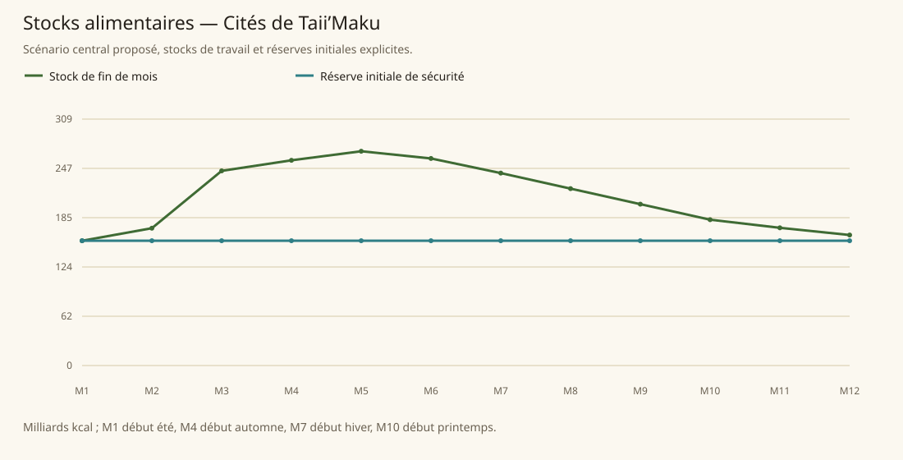

# Cités de Taii’Maku

[Accueil](../README.md) · [Arbre des métiers](../arbre-metiers.md)

références du contexte régional, pas preuve individuelle de chaque fréquence

[Profil régional détaillé](../Localites/taiimaku.md) : 698 000 habitants au total régional.

## Activités communes

- mathématiciens
- ingénieurs
- architectes
- enseignants
- chercheurs et mages
- inventeurs
- artistes et philosophes
- mine extraction or purchase metals
- émissaires

## Activités caractéristiques

- golemiciens
- réacteurs bauronite
- outils précision
- horloges et compas
- lentilles longues-vues lunettes vitraux
- communications runiques
- aqueducs et climat mystiques
- transport lévitation et aérien
- extraction bauronite alchimique/antimagique/résonance

## Usages et contraintes sociales

- À G’bagede, seuls les enseignants et chercheurs en golems travaillent parmi les vivants ; les golems assurent les autres tâches.
- La contemplation volontaire est distincte de la pauvreté et du chômage.
- Les constructions sont une capacité séparée, sans être ajoutées à la part d’espèce taii’maku.
- Des villages humains existent : la région n’est pas entièrement urbaine.

## Expertises et portée

- mathématiques ingénierie métiers techniques Voir les sources et la méthode du modèle..
- compas horloges outils précision mécanismes Voir les sources et la méthode du modèle..
- architecture Voir les sources et la méthode du modèle..
- réacteurs Voir les sources et la méthode du modèle..
- U’Tibam Voir les sources et la méthode du modèle..
- A’Laafia production masse golems Voir les sources et la méthode du modèle..

## Villes et communautés

| Profil | Population retenue | Portée |
|---|---|---|
| [Awo Irin Illu](../Localites/taiimaku--awo-irin-illu.md) | 130 000 | proposee |
| [G’bagede Illu](../Localites/taiimaku--gbagede-illu.md) | 100 000 | proposee |
| [Ilaorun Illu](../Localites/taiimaku--ilaorun-illu.md) | 115 000 | proposee |
| [Maro’Si Illu](../Localites/taiimaku--marosi-illu.md) | 85 000 | proposee |
| [Autres Illus](../Localites/taiimaku--autres-illus.md) | 198 000 | proposee |
| [Villages humains et autres communautés](../Localites/taiimaku--villages-humains-et-autres-communautes.md) | 70 000 | proposee |

## Raisonnement des répartitions

Les fréquences ne proviennent pas d’un recensement de métiers : elles sont distribuées selon filières locales, disponibilité de ressources, habilitations, demande urbaine et contraintes sociales. Les emplois vivriers sont recalibrés à effectifs, espèces et strates conservés ; les raisons et les deltas sont enregistrés, y compris les zéros.

[Tanares Sourcebook p. 174](../Sources/sb.md#p-174), [Tanares Sourcebook p. 175](../Sources/sb.md#p-175), [Tanares Sourcebook p. 176](../Sources/sb.md#p-176), [Tanares Sourcebook p. 177](../Sources/sb.md#p-177), [Tanares Sourcebook p. 178](../Sources/sb.md#p-178), [Tanares Sourcebook p. 179](../Sources/sb.md#p-179), [Tanares Sourcebook p. 180](../Sources/sb.md#p-180), [Tanares Sourcebook p. 181](../Sources/sb.md#p-181).

## Alimentation et échanges

| Indicateur proposé | Résultat |
|---|---|
| Besoin annuel | 625,545 milliards kcal |
| Production naturelle | 159,247 milliards kcal |
| Apport magique direct | 7,180 milliards kcal |
| Imports livrés | 459,119 milliards kcal |
| Exports chargés | 0,000 milliards kcal |
| Couverture énergétique | 100,000 % |
| Surface cultivée | 168 718 ha |
| Surface en rotation | 244 641 ha |
| Part des lipides | 13,613 % |
| Solde du budget public | 1 217 175 po/an |

Les coûts, rendements, bassins d’eau et infrastructures sont des paramètres proposés. Une couverture calorique ne valide pas tous les nutriments ni l’accès marchand de chaque habitant.

### Crises à stocks fixes

| Épreuve | Couverture annuelle | Déficit après stock initial |
|---|---|---|
| Récoltes −30 % | 29,209 % | 279,277 milliards kcal |
| Magie divisée par deux | 100,000 % | 0,000 milliards kcal |
| Route E7 fermée 90 jours | 92,662 % | 0,000 milliards kcal |
| Besoin géants énergie×16 | 100,000 % | 0,000 milliards kcal |

Un déficit nul après réserve initiale ne garantit pas une deuxième année identique : les stocks peuvent s’être réduits.
